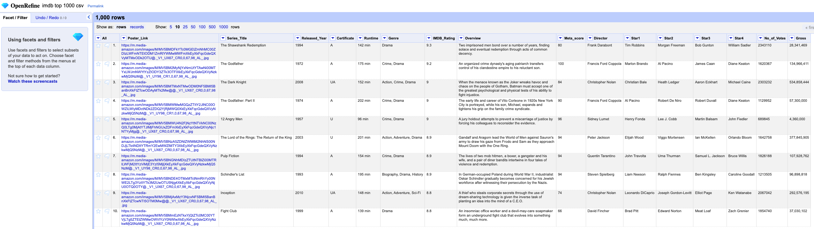
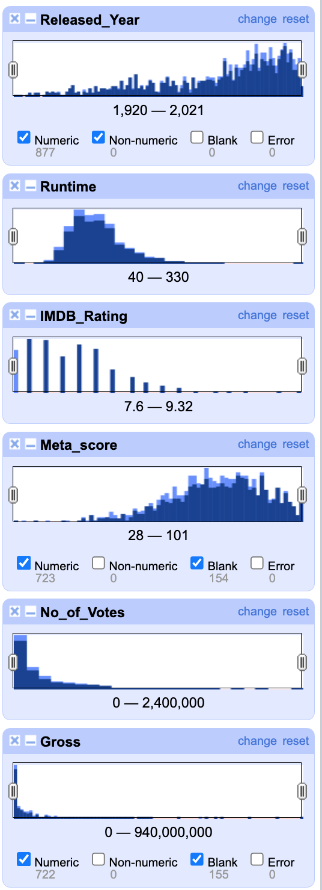
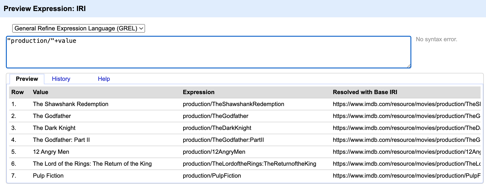
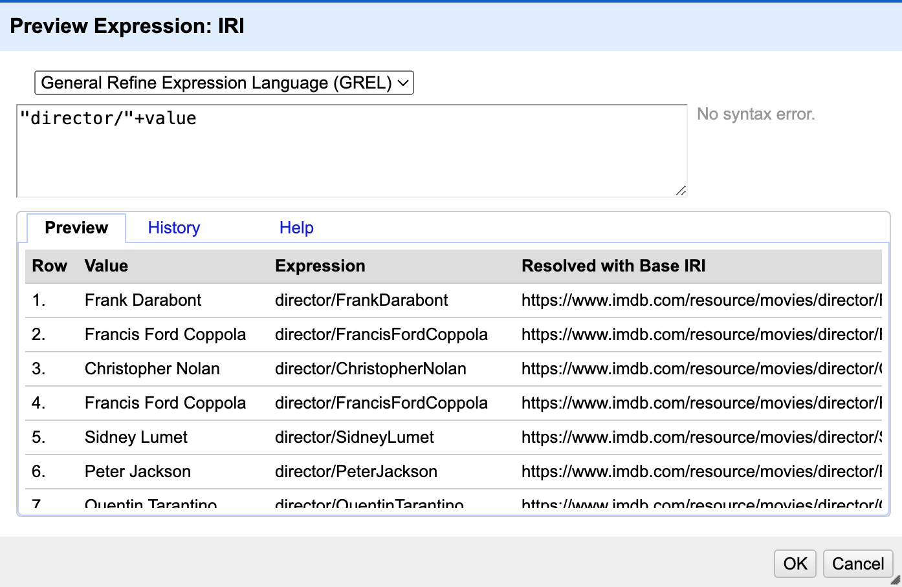
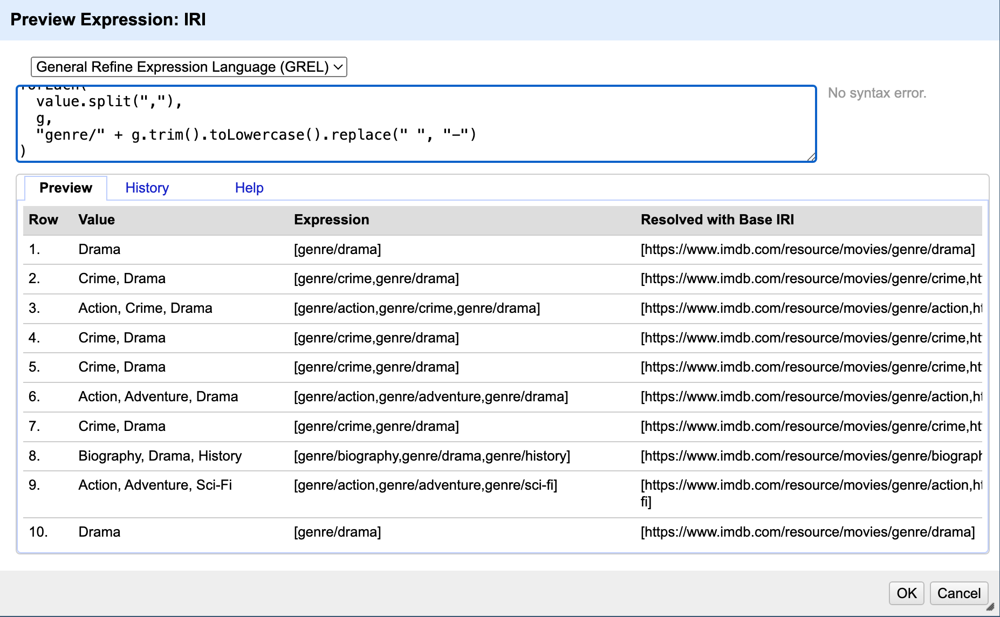
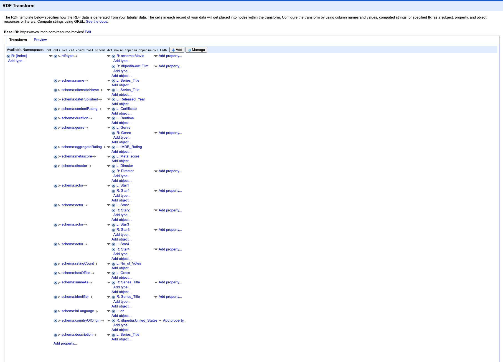
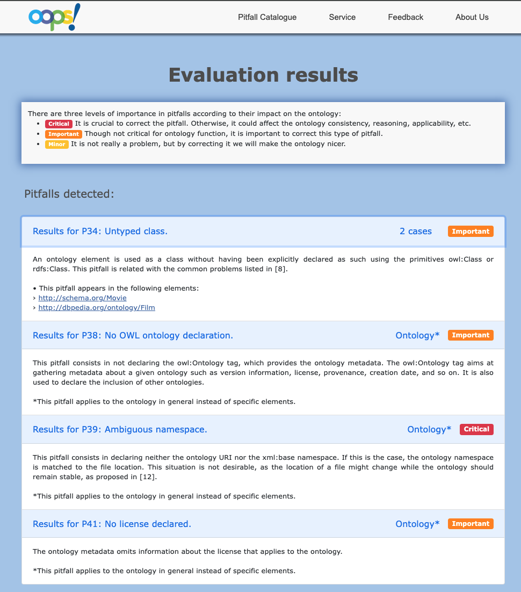
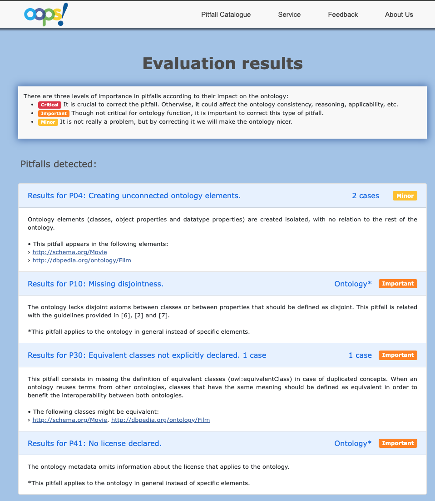
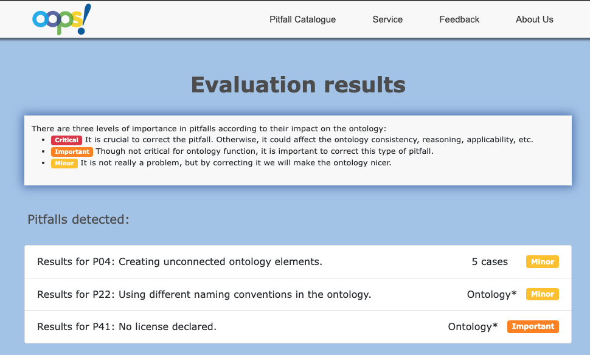

# Proyecto de Transformación de Datos Cinematográficos a la Web Semántica

## Información del Proyecto
- **Título:** Transformación de Datos de IMDB a Datos Enlazados
- **Asignatura:** Web Semántica y Datos Enlazados
- **Programa:** Máster en Investigación en Inteligencia Artificial
- **Autor:** Alberto Soto Gonzalez

## Índice

- [1. Introducción](#1-introducción)
  - [1.1. Requisitos Funcionales](#11-requisitos-funcionales)
  - [1.2. Requisitos No Funcionales](#12-requisitos-no-funcionales)
- [2. Proceso de transformación](#2-proceso-de-transformación)
  - [2.1. Selección de la fuente de datos](#21-selección-de-la-fuente-de-datos)
  - [2.2. Análisis de los datos](#22-análisis-de-los-datos)
  - [2.3. Estrategia de nombrado](#23-estrategia-de-nombrado)
  - [2.4. Desarrollo de la ontología](#24-desarrollo-de-la-ontología)
  - [2.5. Enlazado](#25-enlazado)
- [3. Evaluación de la ontología](#3-evaluación-de-la-ontología)
  - [3.1. Primera evaluación](#31-primera-evaluación)
  - [3.2. Segunda evaluación](#32-segunda-evaluación)
  - [3.3. Evaluación final](#33-evaluación-final)
- [4. Conclusiones](#4-conclusiones)
  - [4.1. Logros Técnicos](#41-logros-técnicos)
  - [4.2. Aprendizaje y Desafíos](#42-aprendizaje-y-desafíos)
- [5. Bibliografía](#5-bibliografía)

## 1. Introducción

Este proyecto se centra en la transformación de un conjunto de datos cinematográficos a formato de datos enlazados, siguiendo los principios y metodologías de la Web Semántica. El objetivo principal es crear una representación semántica rica de las 1000 producciones audiovisuales más destacadas según IMDB, permitiendo su integración en la Web de Datos.

### 1.1. Requisitos Funcionales

Los requisitos funcionales que guiarán este proyecto son los siguientes:

| ID | Descripción |
|----|-------------|
| FR1 | Devolver información detallada de películas y series específicas, incluyendo título, año, director y actores principales. |
| FR2 | Proporcionar listados de producciones filtrados por género, año, director o actores. |
| FR3 | Mostrar métricas de evaluación (IMDB Rating, Meta Score) junto con estadísticas adicionales como número de votos y recaudación. |

### 1.2. Requisitos No Funcionales

Los requisitos no funcionales que guiarán este proyecto son los siguientes:

| ID | Descripción |
|----|-------------|
| NF1 | La ontología utilizada para modelar los datos debe seguir los estándares abiertos de la Web Semántica (RDF, OWL). |
| NF2 | La ontología debe reutilizar vocabularios existentes como Schema.org y DBpedia siempre que sea posible. |
| NF3 | La ontología debe ser validada utilizando herramientas estándar de la industria (como Protégé). |

## 2. Proceso de transformación

### 2.1. Selección de la fuente de datos

La fuente principal de datos para este proyecto es el dataset [IMDB Top 1000 Movies and TV Shows](https://www.kaggle.com/datasets/harshitshankhdhar/imdb-dataset-of-top-1000-movies-and-tv-shows), disponible en la plataforma Kaggle. Este conjunto de datos se encuentra bajo la licencia [CC0: Public Domain](https://creativecommons.org/publicdomain/zero/1.0/), lo que permite su uso, modificación y distribución sin restricciones.

El dataset fue creado a partir de la información pública disponible en Internet Movie Database (IMDB), una de las bases de datos cinematográficas más completas y utilizadas a nivel mundial. La selección de las 1000 producciones se basa en su calificación y popularidad en la plataforma, lo que garantiza que estamos trabajando con un conjunto de datos que representa lo más destacado del cine y la televisión.

Esta selección se basa en varios factores clave:
- **Riqueza de información:** El dataset contiene datos detallados sobre películas y series, incluyendo información técnica, artística y comercial
- **Estructura relacional:** Presenta múltiples conexiones entre entidades (películas, directores, actores), lo que facilita la creación de relaciones semánticas
- **Actualidad:** Los datos representan el panorama cinematográfico actual, con producciones desde los inicios del cine hasta la actualidad
- **Accesibilidad:** Disponible en formato CSV, facilitando su procesamiento y transformación
- **Licencia permisiva:** La licencia CC0 permite su uso sin restricciones, ideal para proyectos académicos y de investigación
- **Calidad de datos:** La información proviene de IMDB, una fuente confiable y constantemente actualizada
- **Potencial semántico:** La naturaleza interconectada de los datos cinematográficos permite crear una red rica de relaciones semánticas

El dataset incluye producciones de diversos géneros, épocas y países, lo que proporciona una visión amplia y diversa del panorama cinematográfico. Esta diversidad es especialmente valiosa para la creación de una ontología que pueda representar adecuadamente las diferentes facetas del mundo del cine y la televisión. 

### 2.2. Análisis de los datos

El conjunto de datos, con un tamaño aproximado de 1.2 MB, contiene 1000 registros de producciones audiovisuales. Cada registro está compuesto por 16 columnas que contienen información detallada sobre cada producción:

1. **Poster_Link**: (Text) URL que enlaza con la imagen del póster oficial de la película o serie. Este enlace permite acceder a la imagen promocional de alta calidad de cada producción.
2. **Series_Title**: (Text) Título oficial de la película o serie. Este campo contiene el nombre completo de la producción tal como aparece en IMDB.
3. **Released_Year**: (Integer) Año de lanzamiento de la producción. Este campo numérico indica el año en que la película o serie fue estrenada oficialmente.
4. **Certificate**: (Text) Clasificación por edades o certificación de la producción (por ejemplo, PG-13, R, TV-MA). Este campo indica las restricciones de edad recomendadas para el contenido.
5. **Runtime**: (Text) Duración total de la producción en minutos. Este campo numérico representa la longitud exacta de la película o episodio.
6. **Genre**: (Text) Géneros cinematográficos de la producción, separados por comas. Una producción puede pertenecer a múltiples géneros (por ejemplo, "Action, Adventure, Sci-Fi").
7. **IMDB_Rating**: (Float) Calificación promedio en IMDB, en una escala de 0 a 10. Este valor se calcula a partir de las votaciones de los usuarios de la plataforma.
8. **Overview**: (Text) Sinopsis o resumen del argumento de la producción. Este campo de texto proporciona una descripción concisa de la trama.
9. **Meta_score**: (Integer) Puntuación de Metacritic, en una escala de 0 a 100. Este valor representa la evaluación crítica agregada de la producción.
10. **Director**: (Text) Nombre del director principal de la producción. Este campo identifica al responsable de la dirección de la película o serie.
11. **Star1, Star2, Star3, Star4**: (Text) Nombres de los cuatro actores principales de la producción, ordenados por relevancia en el reparto. Estos campos identifican a los intérpretes más destacados.
12. **No_of_Votes**: (Integer) Número total de votos recibidos en IMDB. Este campo numérico indica la cantidad de usuarios que han calificado la producción.
13. **Gross**: (Integer) Ingresos brutos de la producción en dólares. Este campo numérico representa la recaudación total en taquilla.

A continuación se muestra una vista previa de los datos en OpenRefine, donde se pueden observar las diferentes columnas y sus valores:



Para asegurar la consistencia y calidad de los datos, se aplicaron las siguientes transformaciones:

1. **Released_Year**: Se convirtió a tipo entero utilizando la función de transformación numérica de OpenRefine, eliminando cualquier carácter no numérico y asegurando que todos los valores sean años válidos.

2. **Runtime**: Se transformó a tipo entero utilizando la expresión GREL `toNumber(value.replace(" min", ""))`, que elimina el sufijo " min" y convierte el resultado a número.

3. **IMDB_Rating**: Se transformó a tipo entero multiplicando los valores por 10 para preservar la precisión decimal (por ejemplo, 8.5 se convirtió en 85).

4. **Meta_score**: Se convirtió a tipo entero utilizando la función de transformación numérica estándar, manteniendo los valores en la escala original de 0-100.

5. **No_of_Votes**: Se transformó a tipo entero utilizando la función de transformación numérica, eliminando cualquier formato de separación de miles.

6. **Gross**: Para esta columna, se requirió una transformación más compleja debido a la presencia de valores monetarios con formato de moneda y separadores de miles. Se desarrolló una transformación personalizada en OpenRefine que:
   - Elimina las comas que separan los miles
   - Convierte el resultado a tipo entero

Las siguientes imagenes muestran las transformaciones personalizadas aplicadas a las columnas `Gross` y `Runtime`:


Estas transformaciones aseguran que los datos numéricos estén en un formato consistente y adecuado para su posterior procesamiento y transformación a RDF.

Para analizar la distribución de los datos numéricos, se utilizaron las facetas numéricas de OpenRefine, que permiten visualizar la distribución de valores a través de histogramas interactivos. Esta visualización fue particularmente útil para identificar posibles valores atípicos y entender mejor la distribución de los datos en campos como `IMDB_Rating`, `Runtime`, `Meta_score`, `No_of_Votes` y `Gross`.



### 2.3. Estrategia de Nombrado

Para este proyecto, se utilizará el hash (#) como separador para los términos de la ontología, ya que la ontología incluirá un número limitado de elementos que raramente cambiarán.

Se utilizará la barra (/) para publicar los datos de las producciones cinematográficas individuales. Esta decisión sigue las recomendaciones de los materiales del curso y se basa en que el número de datos individuales que publicaremos es significativo (1000 producciones), y es más eficiente obtener diferentes documentos que descargar un único documento con todo el conjunto de datos.

Para este proyecto, utilizaremos el dominio de IMDB (https://www.imdb.com/); por lo tanto, utilizaremos los siguientes prefijos:

- `https://www.imdb.com/ontology/movies#` para los términos de la ontología
- `https://www.imdb.com/resource/movies/production/` para las producciones cinematográficas
- `https://www.imdb.com/resource/movies/director/` para los directores
- `https://www.imdb.com/resource/movies/actor/` para los actores
- `https://www.imdb.com/resource/movies/genre/` para los géneros cinematográficos

Por lo tanto, generaremos las siguientes URIs:

- `https://www.imdb.com/ontology/movies#<term>` para los términos de la ontología
- `https://www.imdb.com/resource/movies/production/<id>` para las producciones individuales
- `https://www.imdb.com/resource/movies/director/<id>` para los directores
- `https://www.imdb.com/resource/movies/actor/<id>` para los actores
- `https://www.imdb.com/resource/movies/genre/<id>` para los géneros

Donde `<id>` será un identificador único generado a partir del título de la producción, nombre de la persona o género, respectivamente, siguiendo las convenciones de URL (minúsculas, sin espacios, caracteres especiales reemplazados por guiones).

Esta estructura de nombrado está diseñada para satisfacer los requisitos funcionales FR1 (información detallada de películas), FR2 (listados filtrados) y FR3 (métricas de evaluación), permitiendo una organización clara y accesible de los datos cinematográficos.

## 2.4. Desarrollo de la ontología

Para la construcción de la ontología y la generación de URIs semánticas a partir de los datos originales, se ha utilizado OpenRefine junto con expresiones GREL y la extensión [RDF Transform](https://github.com/AtesComp/rdf-transform?tab=readme-ov-file). Estas expresiones permiten transformar y normalizar los valores de las columnas para ajustarse a la estrategia de nombrado definida en este proyecto, y con ayuda de la extensión será sumamente sencillo poder realizar la exportación directa de los datos transformados a formatos RDF estándar (como Turtle o RDF/XML).

De este modo, el flujo de trabajo consiste en:
- Limpiar y normalizar los datos con OpenRefine.
- Generar URIs semánticas mediante expresiones GREL personalizadas.
- Utilizar la extensión RDF Transform para mapear las columnas del dataset a las clases y propiedades de la ontología, y exportar el resultado en un formato interoperable y listo para su integración en la Web Semántica.


### Generación de URIs para producciones cinematográficas

Para cada producción, se ha generado una URI única basada en el título, normalizándolo a minúsculas y reemplazando espacios y caracteres especiales por guiones. La expresión GREL utilizada en OpenRefine es la siguiente:

```grel
"production/" + 
cells["Series_Title"].value.toLowercase().replace(" ", "-").replace(/[^a-z0-9\-]/, "")
```

Esta transformación garantiza que cada producción tenga una URI única y legible, facilitando su identificación y consulta en la web semántica.



### Generación de URIs para personas (directores y actores)

De manera similar, para los directores y actores principales se han generado URIs únicas a partir de sus nombres, aplicando el mismo proceso.

Esta expresión se ha aplicado a las columnas correspondientes a director y actores (`Director`, `Star1`, `Star2`, `Star3`, `Star4`).




### Generación de URIs para géneros

Para los géneros, que pueden estar separados por comas en una misma celda, se ha utilizado una expresión GREL que permite dividir los valores y generar una URI para cada género individual. El resultado es una lista de géneros por cada género.

```grel
forEach(
  value.split(","),
  g,
  "genre/" + g.trim().toLowercase().replace(" ", "-")
)
```



Estas transformaciones han permitido estructurar los datos de manera semántica y conforme a los estándares de la Web de Datos. Las imágenes incluidas documentan el proceso y sirven como referencia para futuras implementaciones o ampliaciones del proyecto.

## 2.5. Enlazado

El desarrollo de la plantilla RDF se ha realizado siguiendo las mejores prácticas de la Web Semántica y reutilizando vocabularios existentes. A continuación se detallan los aspectos fundamentales de la implementación:

### 2.5.1. Namespaces
La selección de namespaces se ha realizado considerando la interoperabilidad y el enlazado con otras fuentes de datos:

- `dbpedia` y `dbpedia-owl`: Para integración con [DBpedia](https://es.dbpedia.org/), permitiendo enlazar nuestras películas con una base de conocimiento más amplia.
- `tmdb`: Para enlaces a [The Movie Database](https://www.themoviedb.org/), facilitando la obtención de metadatos adicionales y recursos multimedia
- `schema`: Para propiedades estándar de [Schema.org](Schema.org), asegurando la compatibilidad con los motores de búsqueda y otras aplicaciones web
- `dct`: Para términos de Dublin Core, proporcionando metadatos básicos y descriptivos

Ejemplo de uso de namespaces:
```turtle
@prefix schema: <http://schema.org/> .
@prefix dbpedia: <http://dbpedia.org/resource/> .
@prefix tmdb: <https://www.themoviedb.org/movie/> .

<https://www.imdb.com/resource/movies/production/the-shawshank-redemption>
    a schema:Movie, dbpedia-owl:Film ;
    schema:sameAs dbpedia:The_Shawshank_Redemption ;
    schema:identifier tmdb:278 .
```

### 2.5.2. Tipos y Clases
La estructura de tipos y clases se ha diseñado para maximizar la interoperabilidad:

- Cada película se define como `schema:Movie` y `dbpedia-owl:Film`, permitiendo una doble clasificación que facilita la interoperabilidad
- La múltiple tipificación permite consultas más flexibles y enlaces más precisos

Ejemplo de tipificación múltiple:
```turtle
<https://www.imdb.com/resource/movies/production/the-godfather>
    a schema:Movie, dbpedia-owl:Film ;
    schema:name "The Godfather" ;
    schema:datePublished "1972"^^xsd:gYear .
```

### 2.5.3. Propiedades Semánticas
Se ha implementado un conjunto de propiedades semánticas que enriquecen los datos:

- `alternateName`: Nombre alternativo que incluye el año de lanzamiento, útil para búsquedas y referencias
  ```turtle
  schema:alternateName "The Godfather (1972)" .
  ```

- `sameAs`: Enlaces a recursos equivalentes en DBpedia, facilitando la integración
  ```turtle
  schema:sameAs dbpedia:The_Godfather .
  ```

- `identifier`: Enlaces a TMDb, permitiendo acceder a recursos adicionales
  ```turtle
  schema:identifier tmdb:238 .
  ```

- `inLanguage`: Idioma de la película (por defecto "en"), importante para búsquedas multilingües
  ```turtle
  schema:inLanguage "en" .
  ```

- `countryOfOrigin`: País de origen (por defecto Estados Unidos), útil para análisis geográficos
  ```turtle
  schema:countryOfOrigin dbpedia:United_States .
  ```

- `description`: Descripción generada automáticamente que incluye año, género, director y actores principales
  ```turtle
  schema:description "A 1972 Crime, Drama film directed by Francis Ford Coppola. Starring Marlon Brando, Al Pacino, James Caan, and Robert Duvall." .
  ```

### 2.5.4. Tipos de Datos
La implementación de tipos de datos sigue los estándares XSD para garantizar la precisión y consistencia:

- `duration`: Implementación de `xsd:duration` con formato ISO 8601
  ```turtle
  schema:duration "PT175M"^^xsd:duration .  # 175 minutos
  ```

- `boxOffice`: Implementación de `xsd:decimal` con normalización de valores monetarios
  ```turtle
  schema:boxOffice "245066411"^^xsd:decimal .  # $245,066,411
  ```

- `datePublished`: Implementación de `xsd:gYear` para años
  ```turtle
  schema:datePublished "1972"^^xsd:gYear .
  ```

- `aggregateRating`: Implementación de `xsd:decimal` para calificaciones
  ```turtle
  schema:aggregateRating "9.2"^^xsd:decimal .
  ```

- `metascore` y `ratingCount`: Implementación de `xsd:integer`
  ```turtle
  schema:metascore "100"^^xsd:integer .
  schema:ratingCount "2500000"^^xsd:integer .
  ```

### 2.5.5. Relaciones Semánticas
La estructura de relaciones se ha diseñado para crear una red semántica coherente:

- Géneros: Implementación de URIs normalizadas para géneros
  ```turtle
  schema:genre <https://www.imdb.com/resource/movies/genre/crime>,
              <https://www.imdb.com/resource/movies/genre/drama> .
  ```

- Actores y Directores: Implementación de enlaces semánticos usando el namespace `movie`
  ```turtle
  schema:director <https://www.imdb.com/resource/movies/director/francis-ford-coppola> .
  schema:actor <https://www.imdb.com/resource/movies/actor/marlon-brando>,
              <https://www.imdb.com/resource/movies/actor/al-pacino> .
  ```

- Descripciones: Implementación de descripciones semánticas
  ```turtle
  schema:description "A 1972 Crime, Drama film directed by Francis Ford Coppola. Starring Marlon Brando, Al Pacino, James Caan, and Robert Duvall." .
  ```

### 2.5.6. Características de la Implementación
La implementación proporciona las siguientes características:

- Interoperabilidad con otros conjuntos de datos:
  - Enlaces con DBpedia para información adicional
  - Integración con TMDb para recursos multimedia
  - Compatibilidad con Schema.org

- Estructuración semántica:
  - Tipos de datos precisos y estandarizados
  - Relaciones claras entre entidades
  - Metadatos enriquecidos

- Tipos de datos estandarizados:
  - Implementación de XSD para validación
  - Formato ISO 8601 para duraciones
  - Valores numéricos normalizados

- Descripciones semánticas:
  - Información contextual estructurada
  - Metadatos completos
  - Enlaces a recursos externos

- Integración con la Web de Datos:
  - URIs persistentes y accesibles
  - Enlaces bidireccionales
  - Vocabularios estándar

### 2.5.7. Ejemplo de Implementación
A continuación se muestra un ejemplo completo de una película:

```turtle
@prefix schema: <http://schema.org/> .
@prefix dbpedia: <http://dbpedia.org/resource/> .
@prefix xsd: <http://www.w3.org/2001/XMLSchema#> .

<https://www.imdb.com/resource/movies/production/the-godfather>
    a schema:Movie, dbpedia-owl:Film ;
    schema:name "The Godfather" ;
    schema:alternateName "The Godfather (1972)" ;
    schema:datePublished "1972"^^xsd:gYear ;
    schema:duration "PT175M"^^xsd:duration ;
    schema:contentRating "R" ;
    schema:genre <https://www.imdb.com/resource/movies/genre/crime>,
                <https://www.imdb.com/resource/movies/genre/drama> ;
    schema:aggregateRating "9.2"^^xsd:decimal ;
    schema:metascore "100"^^xsd:integer ;
    schema:director <https://www.imdb.com/resource/movies/director/francis-ford-coppola> ;
    schema:actor <https://www.imdb.com/resource/movies/actor/marlon-brando>,
                <https://www.imdb.com/resource/movies/actor/al-pacino>,
                <https://www.imdb.com/resource/movies/actor/james-caan>,
                <https://www.imdb.com/resource/movies/actor/robert-duvall> ;
    schema:ratingCount "2500000"^^xsd:integer ;
    schema:boxOffice "245066411"^^xsd:decimal ;
    schema:sameAs dbpedia:The_Godfather ;
    schema:identifier tmdb:238 ;
    schema:inLanguage "en" ;
    schema:countryOfOrigin dbpedia:United_States ;
    schema:description "A 1972 Crime, Drama film directed by Francis Ford Coppola. Starring Marlon Brando, Al Pacino, James Caan, and Robert Duvall." .
```

Se muestra a continuación una imagen del esquema RDF final:


El esquema en formato JSON se encuentra en la siguiente dirección: 

Se ha exportado, además, en formato Turtle

## 3. Evaluación de la ontología

Para evaluar la calidad de la ontología desarrollada, se ha utilizado la herramienta OOPS! (OntOlogy Pitfall Scanner!), que permite identificar posibles errores de diseño o implementación.

### 3.1. Primera evaluación

La primera evaluación identificó cuatro errores principales:

1. **P39: Ambiguous namespace (Crítico)** - La ontología carece de una declaración URI clara o un espacio de nombres xml:base, lo que significa que el espacio de nombres se vincula automáticamente a la ubicación del archivo. Esto es problemático porque si la ubicación del archivo cambia, el espacio de nombres también cambiará, mientras que idealmente la ontología debería mantenerse estable independientemente de su ubicación.

2. **P38: No OWL ontology declaration (Importante)** - Falta la etiqueta owl:Ontology que proporciona los metadatos fundamentales de la ontología. Esta etiqueta es crucial para incluir información como versión, licencia, procedencia y fecha de creación, así como para declarar la inclusión de otras ontologías.

3. **P34: Untyped class (Importante, 2 casos)** - Se están utilizando elementos como clases sin haberlos declarado explícitamente como tales mediante owl:Class o rdfs:Class. Esto puede causar problemas de interpretación y procesamiento de la ontología.

4. **P41: No license declared (Importante)** - Los metadatos de la ontología no incluyen información sobre la licencia aplicable, lo que puede generar incertidumbre sobre las condiciones de uso y distribución.

Estos errores son fundamentales y deben corregirse para garantizar que nuestra ontología cumpla con los estándares de la Web Semántica. La ausencia de declaraciones adecuadas puede afectar la interoperabilidad, reutilización y estabilidad a largo plazo de nuestra ontología.



### 3.2. Segunda evaluación

Tras aplicar algunas correcciones iniciales, se realizó una segunda evaluación que reveló los siguientes problemas:

1. **P04: Creating unconnected ontology elements (Menor, 2 casos)** - Se detectaron elementos en la ontología que no están conectados con el resto de la estructura. Estos elementos aislados reducen la cohesión de la ontología y podrían indicar un diseño incompleto o fragmentado.

2. **P10: Missing disjointness (Importante, Ontología)** - La ontología carece de axiomas de disyunción entre clases o propiedades que deberían definirse como disjuntas. Esta carencia puede permitir inconsistencias lógicas cuando se realizan inferencias sobre los datos.

3. **P30: Equivalent classes not explicitly declared (Importante, 1 caso)** - No se han declarado explícitamente clases equivalentes para conceptos duplicados. En concreto, se identificó que `http://schema.org/Movie` y `http://dbpedia.org/ontology/Film` podrían ser equivalentes. Al reutilizar términos de otras ontologías, las clases con el mismo significado deberían definirse como equivalentes para mejorar la interoperabilidad.

4. **P41: No license declared (Importante, Ontología)** - Persiste el problema de la falta de declaración de licencia en los metadatos de la ontología, lo que sigue generando incertidumbre sobre las condiciones de uso y distribución.

Estos resultados indican que, aunque se avanzó en la corrección de algunos problemas fundamentales detectados en la primera evaluación, aún quedan aspectos importantes por mejorar, especialmente en lo relacionado con la interconexión de elementos, la definición de relaciones de disyunción y equivalencia, y la inclusión de información de licencia.




### 3.3. Evaluación final

Tras implementar todas las correcciones identificadas en las evaluaciones anteriores, se realizó una evaluación final que mostró una mejora significativa en la calidad de la ontología. Los únicos errores que persistieron fueron de carácter menor:

1. **P04: Creating unconnected ontology elements (Menor, 5 casos)** - Se mantuvieron algunos elementos aislados en la ontología:
   - `https://www.imdb.com/resource/movies/actor`
   - `http://schema.org/Movie`
   - `https://www.imdb.com/resource/movies/director`
   - `http://dbpedia.org/ontology/Film`
   - `https://www.imdb.com/resource/movies/genre`
   
   Estos elementos, aunque aparecen como aislados en la estructura formal de la ontología, están funcionalmente conectados a través de las instancias de datos enlazados, por lo que no representan un problema crítico para el funcionamiento del sistema.

2. **P22: Using different naming conventions in the ontology (Menor, Ontología)** - Se detectó que no todos los elementos de la ontología siguen la misma convención de nomenclatura (como CamelCase o el uso de delimitadores como "-" o "_"). No afecta a la funcionalidad de la ontología.

Es importante destacar que ninguno de estos errores restantes se considera crítico o importante, lo que indica que la ontología desarrollada cumple con los estándares fundamentales y está lista para su implementación y uso en aplicaciones reales.



El fichero RDF final se puede encontrar [aquí](./data/movies.rdf). Se tuvo que reducir el tamaño del dataset por problemas de cómputo y memoria, tanto en el servidor local como en [Oops!](https://oops.linkeddata.es/index.jsp)

## 4. Conclusiones

Durante el proyecto se ha mostrado la viabilidad de transformar datos cinematográficos convencionales, obteniéndolos como un CSV en la plataforma Kaggle, a un conjunto de datos enlazados.

### 4.1. Logros Técnicos

La transformación de los datos de IMDB a formato RDF ha permitido:

1. **Enriquecimiento semántico**: Los datos originales, limitados a una estructura tabular, han sido transformados en una red rica de relaciones semánticas que capturan de manera más precisa la naturaleza interconectada del dominio cinematográfico.

2. **Interoperabilidad mejorada**: La integración con vocabularios estándar como Schema.org y DBpedia ha potenciado la capacidad de estos datos para interoperar con otros conjuntos de datos, ampliando su utilidad.

3. **Resolución de errores ontológicos**: A través de un proceso iterativo de evaluación con OOPS!, se han identificado y corregido problemas de diseño, mejorando la calidad general de la ontología hasta alcanzar un nivel donde solo persisten errores menores no críticos.

### 4.2. Aprendizaje y Desafíos

El desarrollo de este proyecto ha permitido identificar varios desafíos clave:

1. **Estrategia de nombrado**: El diseño de URIs persistentes y significativas es fundamental para la estabilidad a largo plazo del conjunto de datos. La estructura jerárquica implementada facilita tanto la organización como el acceso a los recursos.

2. **Conversión de datos**: La transformación de datos estructurados a RDF implica decisiones importantes sobre cómo representar relaciones complejas. Las expresiones GREL de OpenRefine demostraron ser una herramienta poderosa para esta tarea.

4. **Calidad ontológica**: La evaluación sistemática de la ontología con herramientas especializadas es esencial para garantizar su interoperabilidad y consistencia. El proceso iterativo de mejora permitió resolver problemas críticos e importantes.


## 5. Bibliografía

1. OntOlogy Pitfall Scanner! (OOPS!). (2024). Herramienta de evaluación de ontologías. Recuperado de https://oops.linkeddata.es/index.jsp

2. Kaggle. (2024). Plataforma de ciencia de datos y aprendizaje automático. Recuperado de https://www.kaggle.com/

3. AtesComp. (2023). RDF Transform: Extensión para OpenRefine. GitHub. Recuperado de https://github.com/AtesComp/rdf-transform

4. Kenny, S. (2023). grefine-rdf-extension: Extensión RDF para OpenRefine. GitHub. Recuperado de https://github.com/stkenny/grefine-rdf-extension

5. World Wide Web Consortium (W3C). (2024). Organización de estándares para la web. Recuperado de https://www.w3.org/

6. Schema.org. (2024). Vocabulario estructurado colaborativo para marcado semántico. Recuperado de https://schema.org

7. Creative Commons. (2024). Organización sin fines de lucro que facilita el intercambio y uso de la creatividad y el conocimiento. Recuperado de https://creativecommons.org

8. Harshit Shankhdhar. (2020). IMDB Top 1000 Movies and TV Shows [Conjunto de datos]. Kaggle. Recuperado de https://www.kaggle.com/datasets/harshitshankhdhar/imdb-dataset-of-top-1000-movies-and-tv-shows

9. OpenRefine. (2024). General Refine Expression Language (GREL). Documentación oficial. Recuperado de https://openrefine.org/docs/manual/grel
