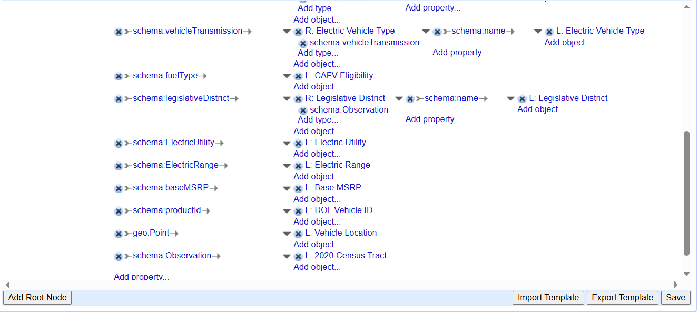

# Memoria Trabajo Web Semántica y Datos Enlazados

- **Asignatura:** Web Semántica y Datos Enlazados
- **Máster:** MÁSTER UNIVERSITARIO EN INVESTIGACIÓN EN INTELIGENCIA ARTIFICIAL
- **Autor:** Alejandro Carrasco Núñez
- **Curso:** 2024/2025

## Índice

- [1. Introducción](#1-introducción)
- [2. Proceso de transformación](#2-proceso-de-transformación)
  - [2.1. Selección de la fuente de datos](#21-selección-de-la-fuente-de-datos)
  - [2.2. Análisis de los datos](#22-análisis-de-los-datos)
  - [2.3. Estrategia de nombrado](#23-estrategia-de-nombrado)
  - [2.4. Desarrollo del vocabulario](#24-desarrollo-del-vocabulario)
  - [2.5. Desarrollo de la ontología](#25-desarrollo-de-la-ontología)
  - [2.6. Enlazado](#26-enlazado)
- [3. Aplicación y explotación](#3-aplicación-y-explotación)
- [4. Conclusión](#4-conclusión)
- [5. Bibliografía](#5-bibliografía)

## 1. Introducción

En esta memoria se describe el proyecto para la asignatura "Web Semántica y Datos Enlazados," que ha consistido en la transformación de un conjunto de datos de origen, en CSV, a datos enlazados.

Se ha tratado un dataset que contenía una población de vehículos eléctricos, obtenidos del portal de datos abiertos del gobierno de EE.UU. (Data.gov).

## 2. Proceso de transformación

### 2.1. Selección de la fuente de datos
Se ha escogido el conjunto de datos sobre la **población de vehículos eléctricos**, publicado en [el portal de datos abiertos del gobierno de EE.UU. (Data.gov)](https://catalog.data.gov/dataset/electric-vehicle-population-data). Este conjunto de datos proporciona información detallada sobre los vehículos eléctricos registrados, incluyendo características como el tipo de vehículo, el fabricante, el modelo, el año de fabricación y la ubicación geográfica.

El conjunto de datos está disponible en el portal de **Data.gov**, que es una iniciativa del gobierno de EE.UU. para proporcionar acceso a datos públicos. Los distintos conjuntos de datos disponibles en la página están disponibles para su uso y distribución bajo licencias abiertas.
El conjunto de datos elegido incluye información sobre miles de vehículos eléctricos registrados en diferentes regiones. Por eso, dichos datos se actualizan periódicamente.

El dataset fue descargado en formato CSV, desde la página web. Dicho archivo tiene un tamaño de 55.74 MB.

### 2.2. Análisis de los datos
Mediante la herramienta **OpenRefine**, aprendida durante el curso, se han analizado los datos contenidos en el archivo CSV.

Se creó un proyecto de nombre "**Electric Vehicle Population Data Proyect**" y se importó el CSV. El resultado fue una tabla de datos compuesta por 235.692 filas, siendo cada fila el registro de un vehículo eléctrico.

En las siguientes imágenes se pueden ver una parte de los registros y sus valores para cada columna.

En total para cada registro hay **18 columnas** (atributos), que son las siguientes:

*	**VIN (1-10)**: Campo de tipo texto que representa la matrícula del vehículo, como, 5YJ3E1EBXK. Sin embargo, no es única para cada vehículo, hay repeticiones en el CSV.
*	**County**: Campo de tipo texto que representa el condado donde se ubica el vehículo. Hay 212 valores, por ejemplo, King.
*	**City**: Campo de tipo texto que representa la ciudad donde se ubica el vehículo. Hay 788 valores, por ejemplo, Seattle.
*	**Stat**e: Campo de tipo texto que representa el estado donde se ubica el vehículo. Hay 48 valores, por ejemplo, WA.
*	**Postal Code**: Campo de tipo texto que representa el código postal, formado por un conjunto de dígitos, por ejemplo, 98178.
*	**Model Year**: Campo de tipo entero que representa el año del modelo. Su rango de valores comprende del 2000 al 2025.
*	**Make**: Campo de tipo texto que representa el fabricante. Hay 46 valores, por ejemplo, TESLA.
*	**Model**: Campo de tipo texto que representa el fabricante. Hay 171 valores, por ejemplo, MODEL 3.
*	**Electric Vehicle Type**: Campo de tipo texto que representa el tipo de vehículo eléctrico. Hay 2 valores: Battery Electric Vehicle (BEV) y Plug-in Hybrid Electric Vehicle (PHEV).
*	**Clean Alternative Fuel Vehicle (CAFV) Eligibility**: Campo de tipo texto que representa la eligibilidad de combustible alternativo para el vehículo. Hay 3 valores, por ejemplo, “Clean Alternative Fuel Vehicle Eligible”, “Eligibility unknown as battery range has not been researched” y “Not eligible due to low battery range”.
*	**Electric Range**: Campo de tipo entero que representa el rango eléctrico. El rango comprende de 0 a 337.
*	**Base MSRP**: Campo de tipo entero que representa el precio base del vehículo. El rango comprende de 0 a 845000.
*	**Legislative District**: Campo de tipo entero que representa el distrito legislativo. El rango comprende de 1 a 49.
*	**DOL Vehicle ID**: Campo de tipo texto que representa el id de cada vehículo. Es una ristra única de 9 dígitos aunque se ha mantenido como cadena de texto.
*	**Vehicle Location**: Campo de texto que representa la localización geográfica del vehículo. La representación viene dada por defecto por el CSV, y se representa de la siguiente manera: POINT (coordenadaX coordenadaY), que en un ejemplo real se vería: POINT (-122.23825 47.49461). Para este campo se ha realizado una transformación con el fin de separar las coordenadas x e y.
*	**Electric Utility**: Campo de tipo texto que representa la empresa de electricidad. Hay 76 valores.
*	**2020 Census Tract**: Campo de tipo entero que representa el tramo censal. Su rango va de 1 billón a 57 billones.

A los campos que se han considerado de tipo entero se les ha aplicado la transformación de celdas a tipo “**Number**”.

Por otro lado, para verificar los rangos y número de valores que cada campo puede tomar se han empleado distintas **Facets**. Se han generado tanto Facets de tipo “**Text**” para las cadenas, como “**Numeric**” para los campos de tipo entero. Algunas de esas Facets se pueden visualizar en las siguientes imágenes.

     

Para el campo **Vehicle Location** se ha aplicado una transformación. Se han generado dos columnas nuevas (**Coordinate X**, **Coordinate Y**) para separar las dos coordenadas que contiene la ubicación. Se han creado mediante la opción **Add column based on this column**, utilizando dos expresiones regulares **GREL** para extraer cada valor.
El uso de las expresiones se muestra en las siguientes imágenes.

     

Las dos columnas nuevas siguen siendo de tipo texto, por lo que se ha aplicado una transformación a tipo numérico.

**Licencia de los datos** El sitio web indica que el conjunto de datos se encuentra bajo la licencia **[Open Data Commons Open Database License (ODbL) 1.0](https://opendatacommons.org/licenses/odbl/1-0/)**. Esta licencia permite al usuario compartir, modificar y utilizar la base de datos, siempre que se cumpla lo siguiente:

*	Se debe dar crédito al publicador de este conjunto de datos, indicando un enlace a la licencia y si se han realizado cambios; además, cualquier redistribución de la base de datos debe realizarse bajo la misma licencia ODbL 1.0 (condición de **share-alike**).

Es importante destacar que la licencia se aplica tanto a los datos en sí como a la estructura de la base de datos, de modo que cualquier extracción o combinación que identifique la fuente original está sujeta a los términos de la licencia.

Dado que el CSV original está bajo la licenci ODbL 1.0, para la transformación a datos enlazados se debe mantener la **misma licencia**. De esta forma se cumple con las condiciones de atribución y de share-alike que se establecen. Esto implica que, aunque se haya cambiado el formato y la estructura (de CSV a datos enlazados), los términos de la licencia deben seguir siendo los mismos, y cualquier base de datos derivada o modificación futura se hará bajo ODbL 1.0.

### 2.3. Estrategia de nombrado
Se considera el dominio **http://catalog.data.gov/** para la consulta de los datos. Dada la naturaleza de nuestro conjunto de datos y su contenido se adoptarán las siguientes convenciones:

*	**Términos ontológicos**:
    *	Usaremos el hash (**#**) como separador para los términos de la ontología.
        *	Ruta para términos ontológicos: **http://catalog.data.gov/ontology/ElectricVehicle#**
        *	Patrón para términos ontológicos: **http://catalog.data.gov/ontology/ElectricVehicle#<term>**
*	**Individuos**:
    *	Usaremos la barra (/) para recuperar los datos de manera individual o en grupo.
        *	Ruta para individuos: **http://catalog.data.gov/resource**
        *	Patrón para individuos: **http://catalog.data.gov/resource/<resource_type>/<id>**

Ejemplos de URIs generadas:
*	Términos ontológicos: **http://catalog.data.gov/ontology/ElectricVehicle#electricVehicleType**
*	Individuos (por ejemplo vehículos): **http://catalog.data.gov/resource/Vehicle/477309682**

### 2.4. Desarrollo del vocabulario
Se han definido requisitos funcionales y no funcionales mediante preguntas de competencia:

**Requisitos Funcionales**:
*	Pregunta de competencia 1:
    *	Pregunta: ¿Cómo puede un usuario obtener información detallada de un vehículo específico?
    *	Respuesta: El usuario puede utilizar la matrícula (VIN) para obtener un vehículo específico, y toda su información asociada.
*	Pregunta de competencia 2:
    * Pregunta: ¿Por qué campos se puede filtrar los vehículos eléctricos?
    * Respuesta: Se puede filtrar los vehículos por fabricante, modelo, tipo de vehículo, año del modelo, rango eléctrico, precio base, distrito legislativo, ID del vehículo, eligibilidad CAFV, estado, ciudad, condado, código postal, ubicación, empresa de electricidad y tramo censal.

**Requisitos no Funcionales**:
* Pregunta de competencia 1:
  * Pregunta: ¿Qué herramientas y extensiones se utilizarán para trabajar con el esqueleto RDF?
  * Respuesta: Utilizar OpenRefine y extensiones que permitan trabajar con el esqueleto RDF, facilitando la transformación y limpieza de datos.

**Extracción de términos**:
*	VIN: Matrícula del vehículo.
*	County: Condado donde se ubica el vehículo.
*	City: Ciudad donde se ubica el vehículo.
*	State: Estado donde se ubica el vehículo.
*	Postal Code: Código postal del área donde se ubica el vehículo.
*	Model Year: Año del modelo del vehículo.
*	Make: Fabricante del vehículo.
*	Model: Modelo del vehículo.
*	Electric Vehicle Type: Tipo de vehículo eléctrico (BEV o PHEV).
*	CAFV Eligibility: Eligibilidad del vehículo para combustible alternativo limpio.
*	Electric Range: Rango eléctrico del vehículo.
*	Base MSRP: Precio base del vehículo.
*	Legislative District: Distrito legislativo donde se ubica el vehículo.
*	DOL Vehicle ID: Identificación del vehículo en el Departamento de Licencias, única para cada vehículo.
*	Vehicle Location (coordinate x, coordinate y): Localización geográfica.
*	Electric Utility: Empresa de electricidad que suministra energía al vehículo.
*	2020 Census Tract: Tramo censal del año 2020.

**Conceptualización**: La representación de las clases con sus atributos y las relaciones entre ellas, se muestra en el siguiente diagrama conceptual (realizado mediante la herramienta draw.io).

**Búsqueda de ontologías**: Se ha hecho una búsqueda de ontologías publicadas relativas al dominio de vehículos eléctricos o en su defecto, se ha generalizado a vehículos. Se ha empleado la herramienta de búsqueda **[LOV](https://lov.linkeddata.es/dataset/lov/)**. Algunas ontologías encontradas han sido:

* **[Ontología Schema de vehículo](https://schema.org/Vehicle)**: Ofrece muchas propiedades adecuadas a las clases y atributos definidos en el modelado.
* **[Ontología foaf](http://xmlns.com/foaf/spec/)**: Empleada para propiedades no encontradas en la ontología anterior.
* **[Ontología geo](http://www.w3.org/2003/01/geo/)**: Empleada para la propiedad de localización geográfica (representa coordenadas).

Además se incluirá la licencia original de los datos a través del prefijo añadido [odc](https://opendatacommons.org/licenses/odbl/1-0/).

Como resultado se muestra la siguiente tabla. En ella se asocia una ontología a cada elemento del glosario de términos, y se añade el concepto que se usará en la implementación.  

| Término | Ontología | Concepto |
|--------------|--------------|--------------|
| VIN | https://schema.org/vehicleIdentificationNumber | schema:vehicleIdentificationNumber |
| County | https://schema.org/Place | schema:Place |
| City | https://schema.org/City | schema:City |
| State | https://schema.org/State | schema:State |
| Postal Code | https://schema.org/postalCode | schema:postalCode |
| Model Year | https://schema.org/vehicleModelDate | schema:vehicleModelDate |
| Make | http://xmlns.com/foaf/spec/#term_maker | foaf:term_maker |
| Model | https://schema.org/model | schema:model |
| Electric Vehicle Type | https://schema.org/vehicleTransmission | schema:vehicleTransmission |
| CAFV Eligibility | https://schema.org/fuelType | schema:fuelType |
| Electric Range | https://schema.org/fuelCapacity | schema:fuelCapacity |
| Base MSRP | https://schema.org/price | schema:price |
| Legislative District | https://schema.org/Observation | schema:Observation |
| DOL Vehicle ID | https://schema.org/productID | schema:productID |
| Vehicle Location | http://www.w3.org/2003/01/geo/wgs84_pos#Point | geo:Point |
| Electric Utility | https://schema.org/Place | schema:Place |
| 2020 Census Tract | https://schema.org/Observation | schema:Observation |

### 2.5. Desarrollo de la ontología
Para implementar la ontología se ha empleado la herramienta OpenRefine (al igual que en los apartados anteriores), y la extensión **rdf-transform**. Dado que la versión más actualizada de OpenRefine no dispone de esa extensión, se ha descargado por separado de un [repositorio](https://github.com/AtesComp/rdf-transform) disponible desde la documentación de OpenRefine.

Se ha definido el esqueleto rdf siguiendo lo aprendido en los vídeos téoricos de la asignatura y teniendo como base el modelo conceptual implementado. En la URI base de RDF se ha definido la ruta para individuos indicada en la estrategia de nombrado.

La raíz del esquema rdf será la clase **Vehicle** identificada con su **DOL Vehicle ID** y a partir de la cual, se han creado tanto propiedades individuales como referencias a otras clases (por ej. **County**, **City**,...).

Se han transformado algunos datos, creando nuevas columnas o directamente mediante una expresión en el nodo RDF.

A partir de la columna "Clean Alternative ..." se ha creado "**CAFV Eligibility**", que se tratará como una columna **Boolean**. Sus valores se han transformado: "Clean Alternative Fuel Vehicle Eligible" es **true**, "Eligibility unknown as battery range has not been researched" es **null**, y "Not eligible due to ow battery range" es **false**.

Al definir algunas clases (recursos) o atributos en el esqueleto rdf, se han usado expresiones para transformar su rango de valores. Por ejemplo, el recurso "**Electric Vehicle Type**" que toma dos valores posibles y se han simplificado sus etiquetas.

Otro caso es el atributo "**geo:Point**" que representa las coordenadas y toma los valores del atributo "**Vehicle Location**". Aunque ya se había hecho una transformación previa y se habían creado dos columnas para cada coordenada, se ha considerado mejor un formato donde las dos coordenadas estén juntas.

El esquema rdf realizado es el siguiente:

El archivo JSON con el template del esquema se encuentra en la carpeta "**rdf_schema_template**". Por otro lado, se ha exportado la ontología en formato **ttl** en Turtle (Stream). Dado que el volumen del ttl con todos los registros es demasiado grande y ha supuesto problemas tanto en su descarga como en la subida al repositorio, se ha exportado el archivo pero filtrandolo para sacar solo 10 vehículos. Dicho ttl se puede encontrar en la carpeta "**ontology_open_refine**". También se ha generado la misma ontología en formato **RDF**, mediante Protege (OpenRefine no lo permite).

**Evaluación de la ontología**

En el apartado de evaluación de la ontología se ha empleado la herramienta **OOPS!**. Se ha introducido un archivo RDF con sólo una instancia de los datos. Las **Pitfalls** detectadas fueron las siguientes:

### 2.6. Enlazado

Se ha realizado el enlazado de los datos de algunas columnas. Para esto se ha usado el servicio de **Wikidata** disponible en el propio OpenRefine, y que realiza la reconciliación por columna.

Al principio se intentó hacer de todas las columnas, por ejemplo, de la columna VIN como se muestra a continuación.

Sin embargo, solo se ha hecho de cuatro columnas que representan recursos: **City**, **State**, **Make** y **Model**.

Cada columna se enlazó con una uri de Wikidata como se muestra aquí:

Para las cuatro columnas reconciliadas, se crearon **cuatro nuevas columnas** cuyos valores serán las uris de Wikidata. La expresión empleada fue la misma para las cuatro, tal y como se muestra en esta imagen:

En las siguientes imágenes se muestra cada columna reconciliada seguida de la nueva columna creada (para algunos valores no se ha encontrado equivalencia).

Por último, en el esquema RDF se ha definido el enlazado mediante la propiedad **owl:sameAs**. Se ha enlazado el recurso (propiedad del vehículo) con la columna creada correspondiente.

El esquema reconciliado se ha guardado en la carpeta "**rdf_schema_template**", mientras que la ontología en formato ttl reconciliada se ha guardado en "**ontology_open_refine**".

## 3. Aplicación y explotación

Se va a hacer uso del archivo RDF con los datos para su explotación. Para ello se ha empleado **Apache Jena Fuseki 5.4.0** que dispone de interfaz gráfica para lanzar queries en **SPARQL**.
Se han hecho las siguientes consultas:

* Búsqueda sobre la ciudad "**Seattle**" filtrando por los atributos correspondientes de ese recurso. En la tabla se muestra el sujeto de la consulta (el recurso) y su nombre (atributo schema:name).

* Búsqueda sobre los vehículos eléctricos de combustible alternativo limpio elegible, es decir, que el atributo **schema:fuelType** esté a **true**. En la tabla se ha mostrado el VIN del vehículo, acompañado de la marca (atributo foaf:term_maker) y la ciudad (atributo schema:city).

## 4. Conclusión

En este trabajo se ha logrado transformar y explotar un dataset utilizando herramientas como OpenRefine y Apache Jena. Los resultados obtenidos incluyen:

* **Limpiar** y **estructura**r un conjunto de datos CSV y **transformarlos** a un conjunto de **datos enlazados**.
* Consultas **SPARQL** sobre los datos transformados.

Se han aprendido varias **lecciones**:

* Uso de **herramientas** como OpenRefine, Oops y Apache Jena, que, aunque se habían usado durante las clases teóricas, en este proyecto se ha profundizado más.
* Se ha aprendido a manejar y solucionar **errores técnicos** en la transformación de datos, implementación de la ontología y explotación de los datos. Se han buscado alternativas cuando las soluciones iniciales no salían.

Se podrían haber realizado las siguientes **mejoras**:

* **Conceptualización del problema**: Se podría haber definido con mayor precisión qué clases y atributos incluir, basándose en la naturaleza del CSV. El modelo conceptual sufrió modificaciones durante la transformación de los datos, ya que se ajustaron clases y atributos para simplificar los procesos de transformación.
* **Evaluación**: Durante la evaluación de la ontología implementada, se podrían haber realizado cambios del esqueleto RDF para resolver algunos de los **pitfalls** indicados.
* **Enlazado**: No se ha realizado un enlazado de todas las columnas de datos.

## 5. Bibliografía

Se han empleado las siguientes fuentes:

* [Portal de datos abiertos del gobierno de EE.UU. (Data.gov)](https://catalog.data.gov/dataset/electric-vehicle-population-data)
* [Open Data Commons Open Database License (ODbL) 1.0](https://opendatacommons.org/licenses/odbl/1-0/)
* [LOV](https://lov.linkeddata.es/dataset/lov/)
* [OpenRefine y sus extensiones](https://openrefine.org/extensions)
* Material proporcionado en la asignatura de **Web Semántica y Datos Enlazados**
* Material proporcionado en la asignatura de **Tecnologías Semánticas Avanzadas**
