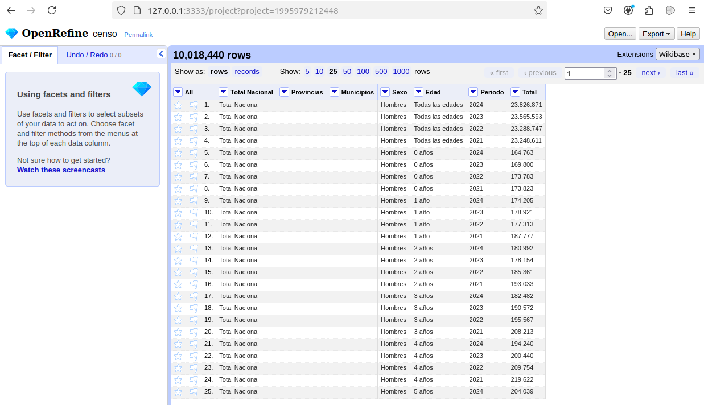
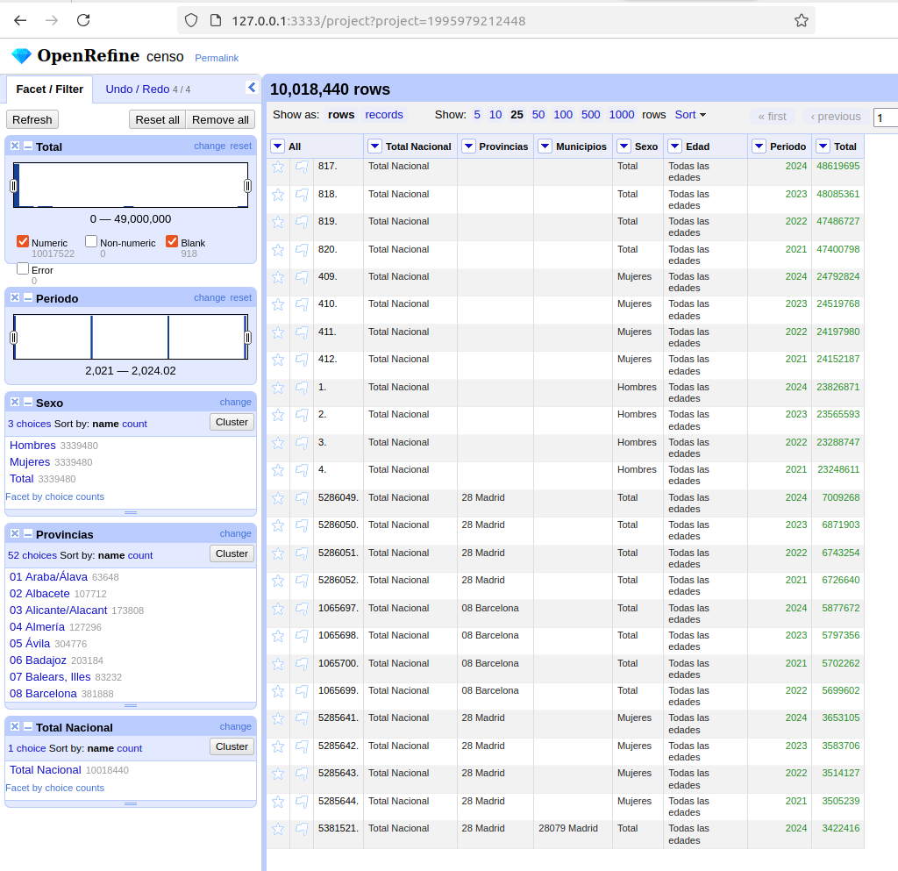

Nota: trabajo en proceso y no finalizado

# Trabajo final Web semántica y datos enlazados
## Ana Chacón Tanarro. Curso 2024-2025
- [1. Introducción](#1-introducción)
- [2. Proceso de transformación](#2-proceso-de-transformación)
  - [2.1. Selección de la fuente de datos](#21-selección-de-la-fuente-de-datos)
  - [2.2. Licencia](#22-licencia)
  - [2.3. Análisis de datos](#22-análisis-de-datos)

## 1. Introducción

Este trabajo se centra en transformar y crear un conjunto de datos enlazados a partir de la selección de un conjunto de datos publicado por el Instituto Nacional de Estadística (INE) y crear una aplicación que consiga mostrar los datos de manera sencilla.

## 2. Proceso de transformación
### 2.1. Preparación y análisis de datos
#### 2.1.1. Selección de la fuente de datos y acceso

Este trabajo se centra principalmente en la obtención y transformación de un conjunto de datos que represente el censo de la población española con la distribución de la población por edades y municipios. Los requisitos principales han sido:
- Que la fuente de datos fuese una institución pública, por asegurar la calidad de los datos. También se priorizaba que ésta fuese la generadora y propietaria de los datos.
- Que los datos estuviesen lo más actualizados posible.
- Que los datos estuviesen disponibles y bien estructurados. 

Así, se ha seleccionado como conjunto de datos el censo anual de población a nivel municipal, desagregado por sexo y edad (año a año) elaborado y publicado por el Instituto Nacional de Estadística (INE) el 19 de diciembre de 2024. El censo anual de población es una operación estadística que se publica siempre a finales de cada año ofreciendo las cifras oficiales y características demográficas de la población española a 1 de enero del mismo año. Así, los datos escogidos recogen información de la población residente en España a 1 de enero de cada año censado y se actualizan anualmente. Se pueden obtener los datos desde el siguiente enlace: [Censo anual, resultados por municipios](https://www.ine.es/dynt3/inebase/es/index.htm?padre=11555&capsel=11532). 

En particular, los datos provienen de la tabla [68542 - Población por sexo y edad (año a año)](https://www.ine.es/jaxiT3/dlgExport.htm?t=68542&L=0), la cual se descarga automáticamente en formato csv. Se comprueba que los datos descargados están bien estructurados y contienen la información mínima exigida: población censada por municipio y edad.

#### 2.1.2. Licencia

Como el propio INE informa en su [página web](https://www.ine.es/dyngs/AYU/index.htm?cid=125), la licencia de uso general es la Creative Commons Reconocimiento 4.0 [(CC BY 4.0)](https://creativecommons.org/licenses/by/4.0/deed.es). Esta licencia permite compartir (copiar y redistribuir el material en cualquier medio o formato para cualquier propósito) y adaptar (remezclar, transformar y construir a partir del material para cualquier propósito), siempre dando crédito de manera adecuada, brindando un enlace a la licencia e indicando si se han realizado cambios. 

Respecto a este último punto, el INE también indica lo siguiente: 
- La cita puede realizarse de la siguiente manera:* **Fuente: Sitio web del INE: www.ine.es** si no se realiza ningún tratamiento de los datos o bien: **Elaboración propia con datos extraídos del sitio web del INE: www.ine.es** en caso de que se realice tratamiento de los datos*
- Debe mencionarse la fecha de la última actualización de la información.
- No se debe indicar, insinuar o sugerir que el INE participa, patrocina o apoya la reutilización de la información.
- La utilización de los datos se realizará bajo la responsabilidad y riesgo del usuario, y el INE no se hace responsable de su uso. 
- Los agentes reutilizadores se hallan sometidos a la normativa aplicable en materia de reutilización de la información del sector público, incluyendo el régimen sancionador previsto en el artículo 11 de la Ley 37/2007, de 16 de noviembre, sobre reutilización de la información del sector público.

Debido a que la transformación de los datos no va a suponer una agregación de valor sustancial al conjunto de datos original, se mantiene la misma licencia para cumplir con la licencia de los datos originales. 

#### 2.1.3. Análisis de datos

A continuación, se muestra el proceso seguido para el análisis y procesamiento de los datos en [OpenRefine](https://openrefine.org/). 

Para cargar los datos en OpenRefine, se ha tenido que aumentar la memoria RAM dedidaca al software que venía por defecto a 8 GBs, debido al tamaño del conjunto de datos (716.4 MBs). Una vez cargado el proyecto, los datos tienen la siguiente apariencia:


Existen 10.018.440 filas, indicando los valores de población censada dependiendo del valor de otras 6 variables. Así, el conjunto de datos presenta 7 columnas:
- Total Nacional: esta columna solo presenta un valor, "Total Nacional". Se presenta en formato texto. 
- Provincias: desagrega los datos de población censada por provincias. La información que se da en esta tabla es el código de provincia seguido del nombre. Ejemplo: "01 Araba/Álava". Esta columna está vacía para los valores totales nacionales a nivel España como conjunto. Se presenta en formato texto. 
- Municipios: desagrega la información por municipio. Sigue la misma estructura que la anterior, se compone de un código identificativo del municipio y el nombre de éste. Ejemplo: "01001 Alegría-Dulantzi". También presenta valores vacíos cuando los valores de población se refieren a los totales nacionales o totales a nivel provincia. Se presenta en formato texto.  
- Sexo: desagrega la información entre "Hombres", "Mujeres" y "Total". Se presenta en formato texto. 
- Edad: desagrega la información entre "Todas las edades" y año por año (de 0 a 99 años y más de 100, como por ejemplo "0 años"). Se presenta en formato texto. 
- Periodo: Referido al año de referencia (desde 2021 a 2024). Se ha transformado a formato de fecha. 
- Total: valor de la población censada. Se ha transformado a formato de número y los valores van de 0 a 48.619.695.

No se encuentran valores fuera de rango o erróneos.

#### 2.1.4. Transformación de los datos

Se han transformado ligeramente los datos para una presentación más clara y con menor opción a cometer errores. Sin embargo, este proceso no ha sido posible realizarlo en OpenRefine: tras varios intentos, la memoria RAM era insuficiente para gestionar los datos. Por tanto, este paso se realiza en Python. 

Los pasos que se han seguido han sido:
- Se ha sustituido el valor "Total Nacional" por "España" y se ha renombrado dicha columna a "País", de tal manera que existe una jerarquía entre las columnas País, Provincia y Municipio. También se han modificado los nombres de estas columnas para que aparezcan en singular.
- Se han eliminado todas las filas en las cuales la columna Municipio estaba vacía. Los valores totales, mostrados en estas filas eliminadas, son cifras duplicadas con respecto a la suma total de los municipios y por tanto puede llevar a error de interpretación en las cifras.
- Por la misma razón, se han eliminado las filas con "Total" en la columna de Sexo, y de "Todas las edades" en la columna Edad. De esta manera, no existe ninguna duplicidad de datos poblacionales en nuestro conjunto de datos.


```python
import pandas as pd

# Cargar el archivo CSV
file_name = '68542.csv'
data = pd.read_csv(file_name, delimiter=';')

# Cambiar los valores de la columna "País" a "España"
data['Total Nacional'] = 'España'

# Cambiar nombres a las columnas
data = data.rename(columns={'Total Nacional': 'País'})
data = data.rename(columns={'Provincias': 'Provincia'})
data = data.rename(columns={'Municipios': 'Municipio'})

# Eliminar las filas que están vacías en la columna "Municipio"
data = data[data['Municipio'].notna()]

# Eliminar las filas con "Total" en la columna "Sexo"
data = data[data['Sexo'] != 'Total']

# Eliminar las filas con "Todas las Edades" en la columna "Edad"
data = data[data['Edad'] != 'Todas las edades']

# Separar la columna "Provincia" en "Código provincial" y "Provincia"
data[['Código provincial', 'Provincia']] = data['Provincia'].str.split(' ', n=1, expand=True)

# Separar la columna "Municipio" en "Código municipal" y "Municipio"
data[['Código municipal', 'Municipio']] = data['Municipio'].str.split(' ', n=1, expand=True)

# Guardar el archivo modificado
data.to_csv('68542_modificado.csv', index=False)
```

Tras estas modificaciones, podemos cargar de nuevo nuestros datos en OpenRefine. 

### 2.2. Estrategia de nombrado

Nos planteamos nuestro problema desde el punto de vista de los siguientes requisitos funcionales:
- Mostrar el valor de personas censadas en un municipio en un año determinado, pudiendo seleccionar sexo y edad.
- Mostrar la evolución del valor del censo con el tiempo.
- Mostrar valores totales según el país o la provincia.
  
Lo primero que se debe elegir, es el uso de # o /. Debido a que tenemos muchos datos y son modulares, se usará / para nuestros datos. Por otro lado, se usará # para la ontología, ya que se puede acceder a todos los términos del vocabulario de una sola vez. 

Asumiendo que tenemos control sobre el dominio datos.ine.es, tendríamos la siguiente estructura:
- Dominio: http://datos.ine.es/
- Ruta para los términos ontológicos: http://datos.ine.es/vocab#
  - Patrón para términos ontológicos: http://datos.ine.es/vocab#<term>
- Ruta para los individuos: http://datos.ine.es/resources/
  - Patrón para individuos:  http://datos.ine.es/resources/<resource>

Se han buscado ontologías publicadas relativas a censo de población o población empadronada. Se han encontrado ejemplos como https://lov.linkeddata.es/dataset/lov/vocabs/idemo o https://vocab.ciudadesabiertas.es/def/demografia/padron-municipal/index-es.html, pero en ningún caso han terminado de encajar con el esquema o resultaban muy difíciles de reutilizar. Existen también ontologías muy completas de censos de otros países como en [Canadá](https://ijpds.org/article/view/2378), pero los censos no siguen la misma estructura ni finalidad. Por otro lado, esos autores mencionan también un trabajo realizado con el censo español por Fernández et al. (2011). Sin embargo, no se ha encontrado la ontología publicada. Por ello, se ha optado por generar una propia enlazando cada elemento con ontologías ampliamente conocidas y usadas. 

