Nota: trabajo en proceso y no finalizado

# Trabajo final Web semántica y datos enlazados
## Ana Chacón Tanarro. Curso 2024-2025
- [1. Introducción](#1-introducción)
- [2. Proceso de transformación](#2-proceso-de-transformación)
  - [2.1. Preparación y análisis de datos](#21-preparación-y-análisis-de-datos)
  - [2.2. Estrategia de nombrado](#22-estrategia-de-nombrado)
  - [2.3. Desarrollo de la ontología](#23-desarrollo-de-la-ontología)
  - [2.4. Publicación](#24-publicación)
- [3. Aplicación y explotación](#3-aplicación-y-explotación)
- [4. Conclusiones](#4-conclusiones)
- [5. Bibliografía](#5-bibliografía)

## 1. Introducción

Este trabajo se centra en transformar y crear un conjunto de datos enlazados a partir de la selección de un conjunto de datos publicado por el Instituto Nacional de Estadística (INE) y crear una aplicación que consiga mostrar los datos de manera sencilla.

## 2. Proceso de transformación
### 2.1. Preparación y análisis de datos
#### 2.1.1. Selección de la fuente de datos y acceso

Este trabajo se centra principalmente en la obtención y transformación de un conjunto de datos que represente el censo de la población española con la distribución de la población por edades y municipios. Los requisitos principales han sido:
- Que la fuente de datos fuese una institución pública, por asegurar la calidad y veracidad de los datos. También se priorizaba que ésta fuese la generadora y propietaria de los datos.
- Que los datos estuviesen lo más actualizados posible.
- Que los datos estuviesen disponibles y bien estructurados. 

Así, se ha seleccionado como conjunto de datos el censo anual de población a nivel municipal, desagregado por sexo y edad (año a año) elaborado y publicado por el Instituto Nacional de Estadística (INE) el 19 de diciembre de 2024. El censo anual de población es una operación estadística que se publica siempre a finales de cada año ofreciendo las cifras oficiales y características demográficas de la población española a 1 de enero del mismo año. Por tanto, los datos escogidos recogen información de la población residente en España a 1 de enero de cada año censado y se actualizan anualmente. Se pueden obtener los datos desde el siguiente enlace: [Censo anual, resultados por municipios](https://www.ine.es/dynt3/inebase/es/index.htm?padre=11555&capsel=11532). 

En particular, los datos provienen de la tabla [68542 - Población por sexo y edad (año a año)](https://www.ine.es/jaxiT3/dlgExport.htm?t=68542&L=0), la cual se descarga automáticamente en formato csv. Se comprueba que los datos descargados están bien estructurados y contienen la información mínima exigida: población censada por municipio y edad.

#### 2.1.2. Licencia

Como el propio INE informa en su [página web](https://www.ine.es/dyngs/AYU/index.htm?cid=125), la licencia de uso general es la Creative Commons Reconocimiento 4.0 [(CC BY 4.0)](https://creativecommons.org/licenses/by/4.0/deed.es). Esta licencia permite compartir (copiar y redistribuir el material en cualquier medio o formato para cualquier propósito) y adaptar (remezclar, transformar y construir a partir del material para cualquier propósito), siempre dando crédito de manera adecuada, brindando un enlace a la licencia e indicando si se han realizado cambios. 

Respecto a este último punto, el INE también indica lo siguiente: 
- La cita puede realizarse de la siguiente manera:* **Fuente: Sitio web del INE: www.ine.es** si no se realiza ningún tratamiento de los datos o bien: **Elaboración propia con datos extraídos del sitio web del INE: www.ine.es** en caso de que se realice tratamiento de los datos*
- Debe mencionarse la fecha de la última actualización de la información.
- No se debe indicar, insinuar o sugerir que el INE participa, patrocina o apoya la reutilización de la información.
- La utilización de los datos se realizará bajo la responsabilidad y riesgo del usuario, y el INE no se hace responsable de su uso. 
- Los agentes reutilizadores se hallan sometidos a la normativa aplicable en materia de reutilización de la información del sector público, incluyendo el régimen sancionador previsto en el artículo 11 de la Ley 37/2007, de 16 de noviembre, sobre reutilización de la información del sector público.

Debido a que la transformación de los datos no va a suponer una agregación de valor sustancial al conjunto de datos original, se mantiene la misma licencia para cumplir con la licencia de los datos originales. 

#### 2.1.3. Análisis de los datos obtenidos

A continuación, se muestra el proceso seguido para el análisis y procesamiento previo de los datos en [OpenRefine](https://openrefine.org/). 

Para cargar los datos en OpenRefine, se ha tenido que aumentar la memoria RAM dedidaca al software que venía por defecto a 8 GBs, debido al tamaño del conjunto de datos (716.4 MBs). Una vez cargado el proyecto, los datos tienen la siguiente apariencia:


Existen 10.018.440 filas, indicando los valores de población censada dependiendo del valor de otras 6 variables. Así, el conjunto de datos presenta 7 columnas:
- Total Nacional: esta columna solo presenta un valor, "Total Nacional". Se presenta en formato texto. 
- Provincias: desagrega los datos de población censada por provincias. La información que se da en esta tabla es el código de provincia seguido del nombre. Ejemplo: "01 Araba/Álava". Esta columna está vacía para los valores totales nacionales a nivel España como conjunto. Se presenta en formato texto. 
- Municipios: desagrega la información por municipio. Sigue la misma estructura que la anterior, se compone de un código identificativo del municipio y el nombre de éste. Ejemplo: "01001 Alegría-Dulantzi". También presenta valores vacíos cuando los valores de población se refieren a los totales nacionales o totales a nivel provincia. Se presenta en formato texto.  
- Sexo: desagrega la información entre "Hombres", "Mujeres" y "Total". Se presenta en formato texto. 
- Edad: desagrega la información entre "Todas las edades" y año por año (de 0 a 99 años y más de 100, como por ejemplo "0 años"). Se presenta en formato texto. 
- Periodo: Referido al año de referencia (desde 2021 a 2024). Se ha transformado a formato de fecha. 
- Total: valor de la población censada. Se ha transformado a formato de número y los valores van de 0 a 48.619.695.

No se encuentran valores fuera de rango o erróneos.

#### 2.1.4. Transformación previa de los datos

Antes de continuar con el proyecto, se han transformado los datos para una presentación más clara y con menor opción a cometer errores. Sin embargo, este proceso no ha sido posible realizarlo en OpenRefine: tras varios intentos, la memoria RAM era insuficiente para gestionar los datos. Por tanto, este paso se realiza en Python. Por esta misma razón, además, finalmente se ha optado por restringir el estudio a los municipios de la provincia de Madrid.

Los pasos que se han seguido han sido:
- Se ha sustituido el valor "Total Nacional" por "España" y se ha renombrado dicha columna a "País", de tal manera que existe una jerarquía entre las columnas País, Provincia y Municipio. También se han modificado los nombres de estas columnas para que aparezcan en singular.
- Se han eliminado todas las filas en las cuales la columna Municipio estaba vacía. Los valores totales, mostrados en estas filas eliminadas, son cifras duplicadas con respecto a la suma total de los municipios y por tanto puede llevar a error de interpretación en las cifras.
- Por la misma razón, se han eliminado las filas con "Total" en la columna de Sexo, y de "Todas las edades" en la columna Edad. De esta manera, no existe ninguna duplicidad de datos poblacionales en nuestro conjunto de datos.
- Se han separado los códigos de las provincias y de los municipios de su nombre y creado dos nuevas columnas para estos códigos.
- Se han filtrado los municipios pertenecientes a la provincia de Madrid.


```python
import pandas as pd

# Cargar el archivo CSV
file_name = '68542.csv'
data = pd.read_csv(file_name, delimiter=';')

# Cambiar los valores de la columna "País" a "España"
data['Total Nacional'] = 'España'

# Cambiar nombres a las columnas
data = data.rename(columns={'Total Nacional': 'País'})
data = data.rename(columns={'Provincias': 'Provincia'})
data = data.rename(columns={'Municipios': 'Municipio'})

# Eliminar las filas que están vacías en la columna "Municipio"
data = data[data['Municipio'].notna()]

# Eliminar las filas con "Total" en la columna "Sexo"
data = data[data['Sexo'] != 'Total']

# Eliminar las filas con "Todas las Edades" en la columna "Edad"
data = data[data['Edad'] != 'Todas las edades']

# Separar la columna "Provincia" en "Código provincial" y "Provincia"
data[['Código provincial', 'Provincia']] = data['Provincia'].str.split(' ', n=1, expand=True)

# Separar la columna "Municipio" en "Código municipal" y "Municipio"
data[['Código municipal', 'Municipio']] = data['Municipio'].str.split(' ', n=1, expand=True)

# Filtrar municipios madrileños
data = data[data['Provincia'].str.contains('Madrid', na=False)]

# Guardar el archivo modificado
data.to_csv('68542_modificado.csv', index=False)
```

Tras estas modificaciones, podemos cargar de nuevo nuestros datos en OpenRefine. Finalmente tenemos 144.632 filas con 9 variables. Debido a que no existe ninguna columna que nos sirva como identificador único, se ha creado una nueva columna llamada "ID" que se compone del código del municipio, el sexo, la edad y el periodo de referencia, de tal manera que nuestra tabla muestra la siguiente estructura:

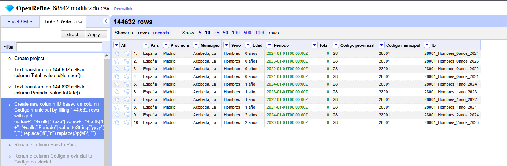
  
### 2.2. Estrategia de nombrado
  
Lo primero que se debe elegir, es el uso de # o /. Siguiendo las recomendaciones del curso, se usará / para nuestros datos y # para la ontología, ya que se puede acceder a todos los términos del vocabulario de una sola vez. 

Asumiendo que tenemos control sobre el dominio datos.ine.es, tendríamos la siguiente estructura:
- Dominio: http://datos.ine.es/
- Ruta para los términos ontológicos: http://datos.ine.es/vocab#
  - Patrón para términos ontológicos: http://datos.ine.es/vocab#<term>
- Ruta para los individuos: http://datos.ine.es/resources/
  - Patrón para individuos:  http://datos.ine.es/resources/<resource>

### 2.3. Desarrollo de la ontología
#### 2.3.1. Requisitos
Nos planteamos nuestro problema desde el punto de vista de los siguientes requisitos funcionales:
- Mostrar el valor de personas censadas en un municipio clasificando por año, sexo y edad.
- Mostrar la evolución del valor del censo con el tiempo.
- Mostrar valores totales según el país o la provincia.
- Comparación de valores entre dos o más municipios.

Como requisitos no funcionales, se han tenido en cuenta los siguientes:
- Capacidad de procesamiento con un ordenador con memoria RAM limitada (8-16 GBs).
- Uso de OpenRefine y de extensiones que permitan trabajar con el esqueleto RDF.
- Reutilizar al máximo ontologías ya existentes.
- Que sea fácil de reutilizar para todo el dataset nacional en el futuro.
  
#### 2.3.2. Glosario de términos
Se puede definir el siguiente glosario de términos:
| Término | Definición |
|--------------|--------------|
| País | País de referencia del valor de censo observado al cual pertenece una provincia y municipio |
| Provincia | Provincia de referencia del valor de censo observado al cual pertenece un municipio |
| Municipio | Municipio de referencia del valor de censo observado |
| Sexo | Sexo de la población censada |
| Edad | Edad de la población censada |
| Periodo | Periodo de referencia del valor de censo observado |
| Código provincial | Código INE de la provincia, código LAU |
| Código municipal | Código INE del municipio, código LAU |
| Total | Valor observado de la población censada |
| ID | Valor único identificativo de cada valor censal observado |

#### 2.3.3. Conceptualización
La representación de los términos definidos anteriormente y la base inicial de su representación sigue:


#### 2.3.4. Búsqueda de ontologías
Se han buscado ontologías publicadas relativas a censo de población o población empadronada. Se han encontrado ejemplos como https://lov.linkeddata.es/dataset/lov/vocabs/idemo o https://vocab.ciudadesabiertas.es/def/demografia/padron-municipal/index-es.html, pero en ningún caso han terminado de encajar con el esquema o resultaban muy difíciles de reutilizar. Existen también ontologías muy completas de censos de otros países como en [Canadá](https://ijpds.org/article/view/2378), pero los censos no siguen la misma estructura ni finalidad. Por otro lado, esos autores mencionan también un trabajo realizado con el censo español por Fernández et al. (2011). Sin embargo, no se ha encontrado la ontología publicada. Por ello, se ha optado por utilizar otras ontologías más generales. En particular se ha hecho mucho uso de las clases y propiedades de:
- http://schema.org/: ideal para definir entidades y relaciones entre entidades y acciones. 
- http://purl.org/linked-data/cube#: vocabulario que permite publicar datos multidimensionales, como los estadísticos, en formato RDF.
- http://purl.org/linked-data/sdmx/2009/dimension#: define dimensiones para los cubos estadísticos definidos por SDMX.
- http://purl.org/dc/terms/: usado para la definción de la licencia.

Se ha optado por la siguiente estructura:
| Término | Clase |
|--------------|--------------|
| ID | http://purl.org/linked-data/cube#Observation |
| País | http://schema.org/Place |
| Provincia |  http://schema.org/Place |
| Municipio |  http://schema.org/Place |
| Sexo | http://schema.org/Observation |
| Edad | http://schema.org/Observation |
| Periodo | http://schema.org/DateTime |
| Código provincial | http://schema.org/postalCode |
| Código municipal | http://schema.org/postalCode |

#### 2.3.5. Implementación de la ontología
Para implementar la ontología y la transformación de los datos al formato adecuado, se ha utilizado la herramienta OpenRefine, apoyado por la extensión [RDF Transform](https://github.com/AtesComp/rdf-transform). Se intentó también usar la extensión [RDF extension](https://github.com/stkenny/grefine-rdf-extension). Sin embargo, está desactualizada y daba errores de compatibilidad a la hora de exportar los datos. Las versiones utilizadas son:
- Open Refine 3.8.7
- RDF Transform 2.2.4

Para evitar errores y tener mayor generalización, se ha tenido especial cuidado con la presencia de espacios vacíos o caracteres especiales como la ñ o acentos a la hora de definir URIs. Esto era de especial relevancia a la hora de declarar la edad o los municipios:

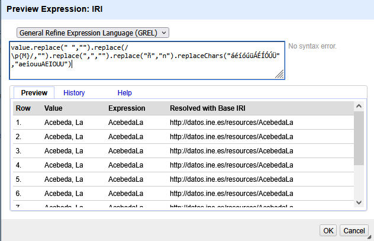
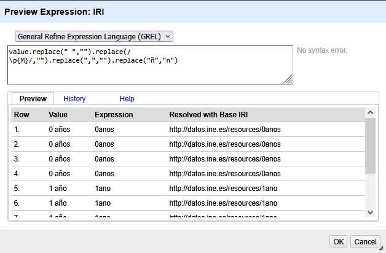

Una vez generado todo el esquema, también se ha procedido al *enlazado de los datos* usando el servicio de OpenRefine con Wikidata. Se ha conseguido la reconciliación de algunas de las columnas (País, Provincia, Municipio y Sexo) tal como se muestra en la imagen:

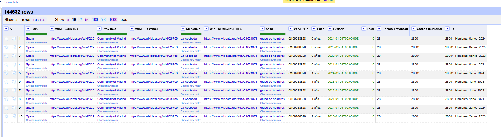

Para los municipios, se han tenido que revisar algunos de ellos ya que no conseguía enlazarlos correctamente de manera automática.

Desafortunadamente no se ha conseguido enlazar las columnas de los códigos LAU de los municipios y las provincias. Se ha intentado con otras herramientas disponibles en OpenRefine (como algunas herramientas apoyadas en Geonames), pero en ninguno de los casos conseguía encontrar bien los códigos a los que se refieren las columnas.

| Columna | Enlace |
|---------|--------|
| País | https://www.wikidata.org/wiki/Q29 |
| Provincia | https://www.wikidata.org/wiki/Q5756 |
| Municipio | Ejemplo de [municipality of Spain](https://www.wikidata.org/wiki/Q2074737): https://www.wikidata.org/wiki/Q1621071 |
| Sexo | Grupo de [hombres](https://www.wikidata.org/wiki/Q109288828)/[mujeres](https://www.wikidata.org/wiki/Q109288863) |

Finalmente, el esqueleto del rdf contiene la siguiente estructura: 

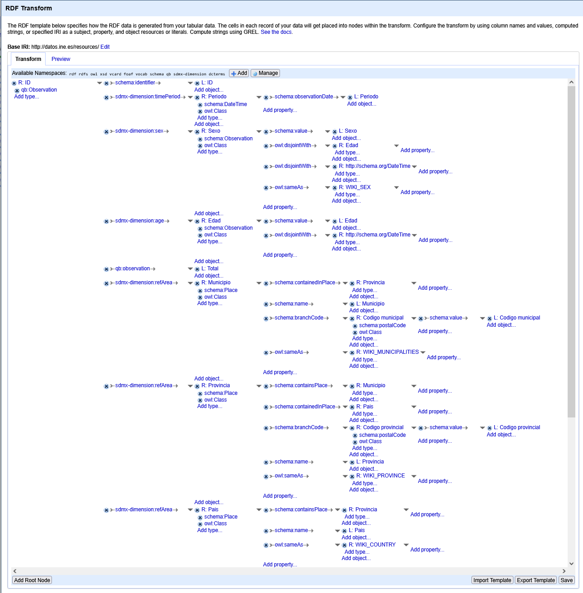

El archivo final, en formato rdf y ttl, así como el proyecto de OpenRefine, se puede encontrar aquí: 

#### 2.3.6. Evaluación

Para la evaluación se han estudiado 2 métodos distintos: los razonadores que vienen implementados dentro del software de Protege y
el servicio de [Oops!](https://oops.linkeddata.es/). Sin embargo, para hacerlo más eficiente, se ha hecho con los archivos rdf con solo 4 instancias de ejemplo. Así, se han elegido las primeras 4 filas en OpenRefine y se ha exportado el rdf que posteriormente sería evaluado.

En Protégé no salieron errores ni advertencias. Sin embargo, Oops! sí generó sugerencias de mejoras. En la primera iteracción nos salieron los siguientes Pitfalls:
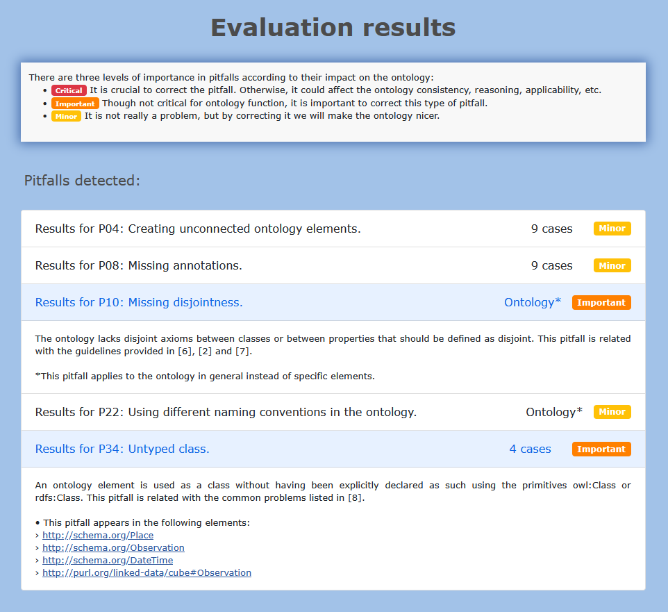

Los errores menores se consideraron suficientemente menores como para no preocuparnos por ellos. Sin embargo, los etiquetados como importantes se consideraron para la mejora del rdf. De este modo, fue como se crearon las relaciones de owl:disjoingWith que se muestran en la imagen como ejemplo:

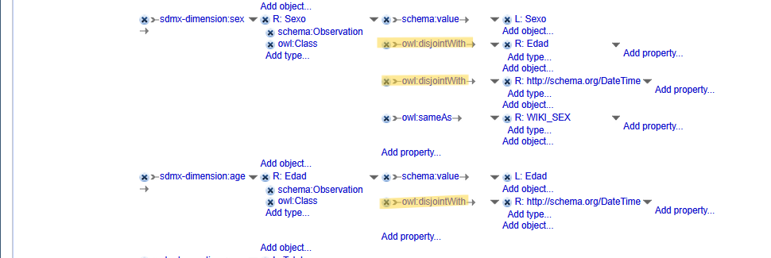

También se definieron las clases que faltaban, teniendo entonces en el rdf líneas como:
```
  <owl:Class rdf:about="http://schema.org/Observation"/>
  <owl:Class rdf:about="http://schema.org/DateTime"/>
```
Una vez realizadas las modificaciones, se procedió a comprobar que ya no salían las advertencias:
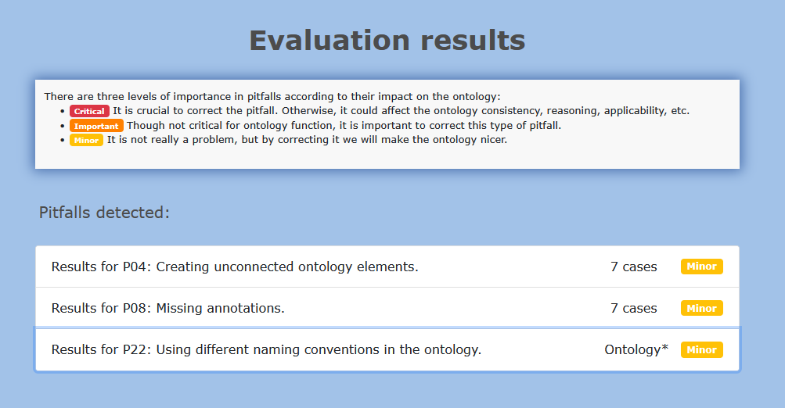

El archivo con sus mejoras ya implementadas es el que se puede encontrar en este repositorio.

#### 2.4. Publicación
No se ha podido proceder a su publicación. No se dispone de dominio. 

## 3. Aplicación y explotación
Finalmente ya podemos proceder a hacer uso de los datos y explotarlos. Para ello vamos a hacer uso de la herramienta [Apache Jena Fuseki](https://jena.apache.org/documentation/fuseki2/), versión 5.3.0, que nos permite realizar consultas SPARQL sobre nuestros datos.

Se hacen las siguientes consultas para comprobar que se han cubierto los requisitos funcionales:
1. Se comprueba que se puede obtener el número de personas censadas en un municipio para un determinado año, sexo y edad:
   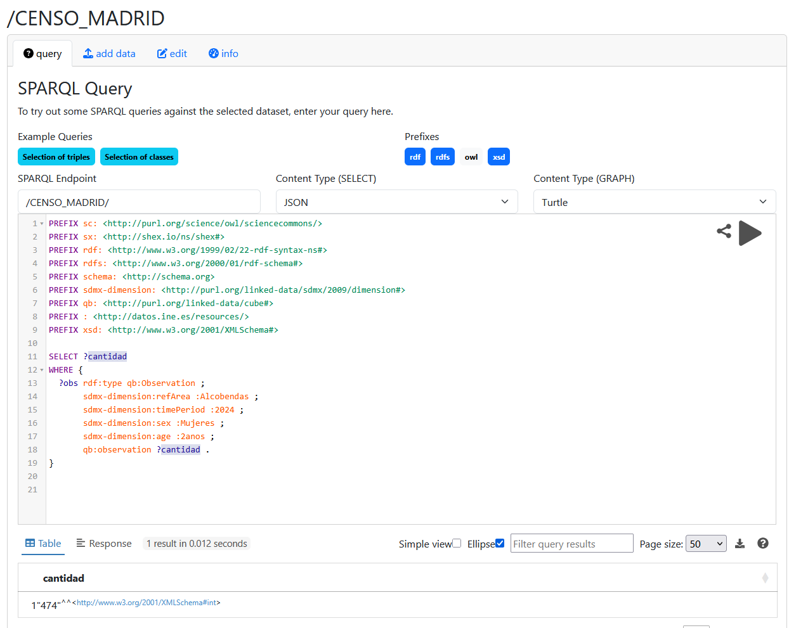
2. Se comprueba que se puede obtener el valor de personas censadas para distintos años:
   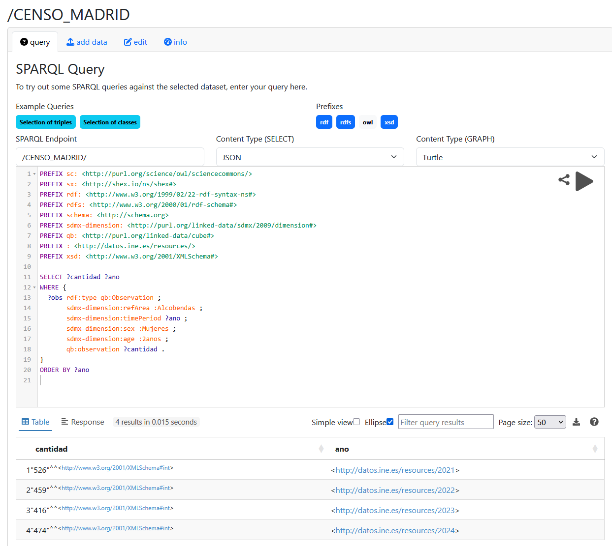
3. Se puede obtener la suma de los valores de censo cuando se selecciona el país:
   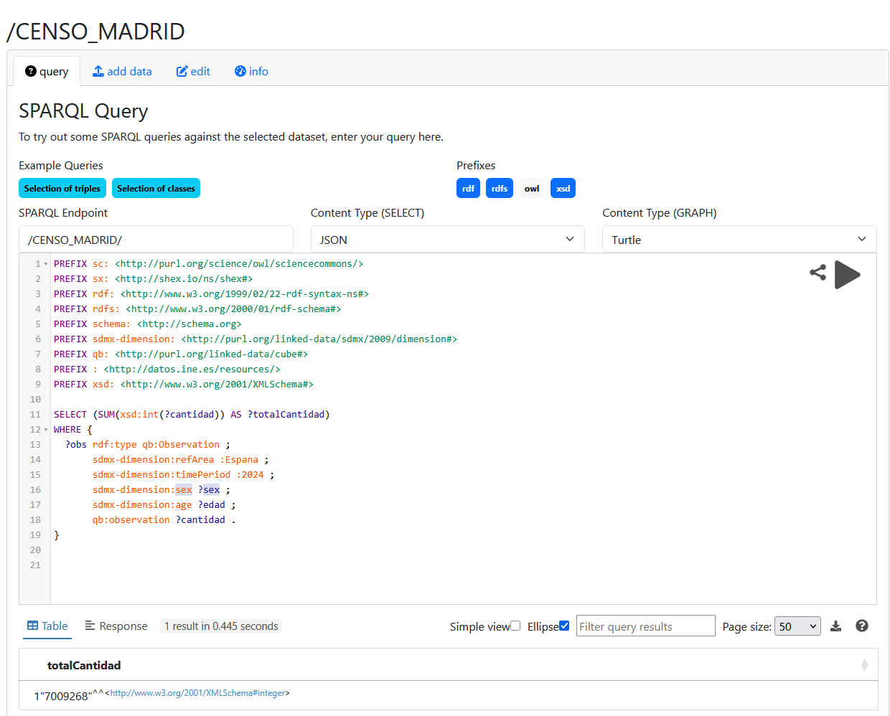
4. Se obtienen correctamente los valores de dos municipios simultáneamente:
   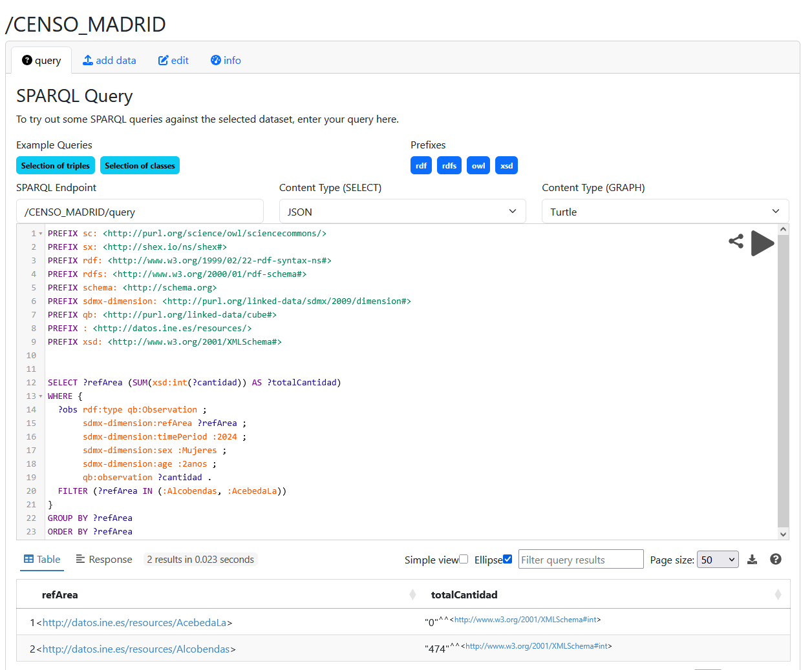

Se puede observar que hemos cubierto todos los requisitos funcionales y que las consultas SPARQL devuelven información satisfactoriamente. 

## 4. Conclusiones
En este trabajo hemos visto el proceso necesario para generar datos enlazados a partir de un CSV descargado del Instituto Nacional de Estadística con información básica de los habitantes censados en la Comunidad de Madrid, debido a restricciones computacionales.

Se han afrontado diferentes retos: transformación de los datos para aumentar su facilidad de uso y eficiencia, elección del vocabulario y creación de la ontología, con su respectiva creación del esqueleto RDF y muestra de explotación de los datos. Este proceso ha mostrado ser mucho más minucioso de lo que puede parecer al principio. Pequeños detalles pueden provocar que las consultas a la base de datos no funcionen. Por ejemplo, el INE refleja las cifras de población con separador de miles, y este detalle ha generado problemas en la creación del dataset final, ya que no conseguía leer bien las cifras. 

Sin embargo, hemos cubierto los requisitos que nos habíamos planteado al principio del trabajo: podemos consultar la información básica de personas censadas por cada municipio y generar consultas algo más complejas alrededor de este concepto, cubriendo también los requisitos no funcionales que nos habíamos planteado. 

## 5. Bibliografía

- [Oops!](https://oops.linkeddata.es/)
- [Wikidata](https://www.wikidata.org/)
- [RDF Transform](https://github.com/AtesComp/rdf-transform)
- [RDF extension](https://github.com/stkenny/grefine-rdf-extension)
- [Canadá](https://ijpds.org/article/view/2378)
- [OpenRefine](https://openrefine.org/)
- [Apache Jena Fuseki](https://jena.apache.org/documentation/fuseki2/)
- [Instituto Nacional de Estadística](https://www.ine.es/) 


