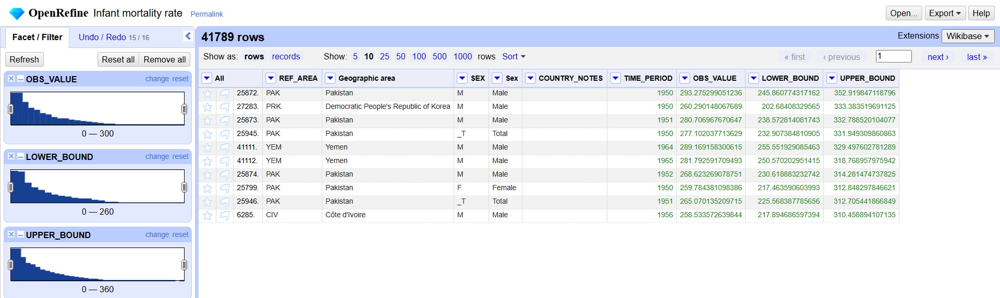
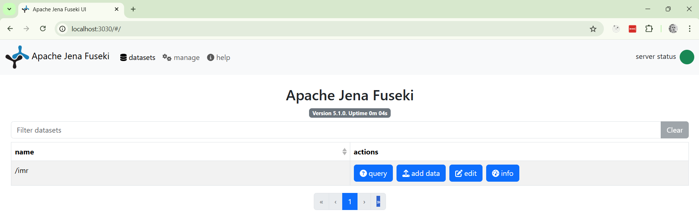

# Final Project Report

- **Subject:** Semantic web and linked data
- **Master program:** Research in Artificial Intelligence
- **University:** [Universidad Internacional Menéndez Pelayo](https://www.uimp.es)
- **Author:** Fabio Tranchitella, [fabio.tranchitella@gmail.com](mailto:fabio.tranchitella@gmail.com)
- **Date:** November, 2024
- **Version:** 1.0

## Tables of contents

- [1. Introduction](#1-introduction)
- [2. Transformation process](#2-transformation-process)
  - [2.1. Selection of the data set](#21-selection-of-the-data-set)
  - [2.2. Analysis of the data set](#22-analysis-of-the-data-set)
  - [2.3. Naming stratregy](#23-naming-strategy)
  - [2.4. Ontology development](#24-ontology-development)
  - [2.5. Data Reconcilation](#25-data-reconciliation)
  - [2.6. Data serialization to RDF/Turtle](#26-data-serialization-to-rdfturtle)
- [3. Application and consumption](#3-application-and-consumption)
  - [3.1. Apache Jena Fuseki](#31-apache-jena-fuseki)
  - [3.2. SPARQL Interface](#32-sparql-interface)
- [5. Bibliography](#5-bibliography)

## 1. Introduction

This document describes the final project for the subject "Semantic web and linked data," part of the University Master's "Research in Artificial Intelligence" from the Universidad Internacional Menéndez Pelayo.

In particular, this project consists of the selection, transformation, preparation, and publication of a data set for the `Infant mortality rate` indicator from [The United Nations Children's Fund (UNICEF)](https://www.unicef.org), one of the agencies of the United Nations.

It also includes a sample application exposing simple REST APIs that leverage the dataset, loaded in a triplestore, to answer queries that non-technical users cannot respond to directly because of the number of records contained in the dataset.

## 2. Transformation process

### 2.1. Selection of the data set

I selected the data set containing the `Infant mortality rate` indicator published by [The United Nations Children's Fund (UNICEF)](https://www.unicef.org). The data set is available in the [UNICEF Open Data portal](https://data.unicef.org/), also known as UNICEF Data Warehouse, which publishes many freely available and distributable datasets that are part of UNICEF's Open Data initiative. It is also available in the [Humanitarian Data Exchange Hub](https://data.humdata.org), a catalog of open humanitarian data.

The full dataset with all the indicators includes 41,789 data points, each representing the `Infant mortality rate` indicator value for a given country. The indicator data is drawn from inter-agency estimates and nationally representative household surveys such as Multiple Indicator Cluster Surveys (MICS) and Demographic and Health Surveys (DHS).

I downloaded the data in CSV format, encoded in UTF-8, from the [data set's web page](https://data.humdata.org/dataset/unicef-cme-mry0) in the Humanitarian Data Exchange Hub. The uncompressed CSV file size is 8,206 KB.

The data set is available in this repository at the path [./data/CME.csv.gz](/data/CME.csv.gz).

### 2.2. Analysis of the data set

#### License of the source data set used in the project

As stated on the website, the data set is licensed under the terms of the Creative Commons Attribution-NonCommercial 3.0 IGO ([CC BY-NC 3.0 IGO](https://creativecommons.org/licenses/by-nc/3.0/igo/deed.en)) license.

As explained in the legal terms of the licenes, the user is free to share the material, including adapt and transform it. However, the user must give appropriate credit to the publisher of the data set, provide a link to the license and indicate if changes were made. Additionally, the user cannot use this data set for commercial purposes.

For more details about the legal terms of the license, please refer to the creativecommons.org website linked in the [bibliography](#5-bibliography).

#### License of the transformed linked data set resulting from the project

Given that the original license of the data set is a well-known, standard, open license, I selected the Creative Commons Attribution-NonCommercial 4.0 International ([CC BY-NC 4.0](https://creativecommons.org/licenses/by-nc/4.0/)) one for the transformed and linked data. It is the same license as the one initially used by the publisher of the data set, therefore fully compatible, though a newer and updated version as suggested by the Creative Commons website.

For more details about the legal terms of the license, please refer to the creativecommons.org website linked in the [bibliography](#5-bibliography) and the [LICENSE](./LICENSE) file included in this repository.

#### Explorative Data Analysis of the data set

To analyze, prepare and transform the data to be published as linked data, I selected the open source [OpenRefine](https://openrefine.org) software, as suggested in the course's training materials.

After creating the project `Infant mortality rate` and importing the CSV into it, I proceeded with the schema and metadata analysis. 

Each line of the CSV contains a record representing the value of the `Infant mortality rate` for a specific country and subset population, if the information is available.

The columns available in the data set are:

* **REF_AREA**: (Text) ISO 3166-1 alpha-3 code of the country (e.g. `AFG`)
* **Geographic area**: (Text) English name of the country (e.g. `Afghanistan`)
* **INDICATOR**: (Text) Code of the indicator (e.g. `CME_MRY0`)
* **Indicator**: (Text) English name of the indicator (e.g. `Infant mortality rate`)
* **SEX**: (Text) Sex code for the subset of the population the indicator is referred to (e.g. `F`)
* **Sex**: (Text) Sex description for the subset of the population the indicator is referred to (e.g. `Female`)
* **WEALTH_QUINTILE**: (Text) Code of the wealth quintile the indicator is referred to (e.g. `_T`)
* **Wealth Quintile**: (Text) Description of the wealth quintile the indicator is referred to (e.g. `Total`)
* **DATA_SOURCE**: (Text) Code of the division/entity publishing the data (e.g. `UN_IGME`)
* **COUNTRY_NOTES**: (Text) Notes about the country
* **UNIT_MEASURE**: (Text) Code of the unit of measure (e.g. `D_PER_1000_B`)
* **Unit of measure**: (Text) Description of the unit of measure (e.g. `Deaths per 1,000 live births`)
* **TIME_PERIOD**: (Integer) Year the indicator is referred to (e.g. `1962`)
* **OBS_VALUE**: (Float) Observed value for the indicator (e.g. `219.62798095743`)
* **REF_PERIOD**: (Integer) Period of reference
* **LOWER_BOUND**: (Float) Lower bound of the value for the indicator (e.g. `188.139849017438`)
* **UPPER_BOUND**: (Float) Lower bound of the value for the indicator (e.g. `259.584247018356`)
* **OBS_STATUS**: (Text) Code of the status of the observation (e.g. `A`)
* **Observation Status**: (Text) Description of the status of the observation (e.g. `Normal value`)

I transformed the columns marked as Integer and Float from the list above to number using the function `Edit cells > Common transforms > To number`.

Using the Facets functionality, I verified the number of distinct values for the following columns: **INDICATOR**, **Indicator**, **WEALTH_QUINTILE**, **Wealth Quintile**, **DATA_SOURCE**, **UNIT_MEASURE**, **Unit of measure**, **REF_PERIOD**, **OBS_STATUS**, **Observation Status**. As all these columns contained precisely one value, they did not add any value to single records, so I dropped them.

Additionally, the **Sex** column does not add any value to the data set, as it contains the sex description, which always matches the sex code specified in the column **SEX**, as I verified using Facets.

Using the Facets functionality and a simple sort, I verified the data ranges of the numerical values **OBS_VALUE**, **LOWER_BOUND**, and **UPPER_BOUND** and looked for outliers or anomalies. The data set does not contain spurious or out-of-range data, with maximum values for the indicators 293, 245, and 352, respectively. Given that the indicator is the number of deaths per 1,000 live births, values below 1,000 are congruent.



As the data set's source are the United Nations, there are special observation records for non-country reference areas. In particular, the following `REF_AREA` are observed:

* AIA114
* AUS220
* DOM219
* MSR195
* MUS201
* NGA177
* SLV204
* TCA171
* UNICEF_EAP99
* UNICEF_EAPRO99
* UNICEF_ECA99
* UNICEF_ECARO99
* UNICEF_EECA99
* UNICEF_ESA99
* UNICEF_ESARO99
* UNICEF_LAC99
* UNICEF_LACRO99
* UNICEF_MENA99
* UNICEF_MENARO99
* UNICEF_NA99
* UNICEF_ROSA99
* UNICEF_SA99
* UNICEF_SSA99
* UNICEF_WCA99
* UNICEF_WCARO99
* UNICEF_WE99
* UNSDG_AUSTRALIANEWZEALAND99
* UNSDG_CENTRALASIA
* UNSDG_CENTRALASIASOUTHERNASIA99
* UNSDG_EASTERNASIA99
* UNSDG_EASTERNASIASOUTHEASTERNASIA99
* UNSDG_EUROPE99
* UNSDG_EUROPENORTHERNAMR99
* UNSDG_LAC99
* UNSDG_LDC99
* UNSDG_LLDC99
* UNSDG_NORTHAFR99
* UNSDG_NORTHERNAMR99
* UNSDG_OCEANIA99
* UNSDG_OCEANIAexAUSNZL99
* UNSDG_SIDS99
* UNSDG_SOUTHASIA99
* UNSDG_SOUTHEASTERNASIA99
* UNSDG_SUBSAHARANAFRICA99
* UNSDG_WESTERNASIA99
* UNSDG_WESTERNASIANORTHERNAFR99
* VGB204
* WB_HI99
* WB_LI99
* WB_LMI99
* WB_UMI99
* WORLD99

These reference areas are conglomereations of countries according to the UN operations and logistics. In the context of this exercise, I decided to remove these records (5,962) and focus on country-specific statistical data only.

### 2.3. Naming strategy

I will use the hash (`#`) as a separator for the ontology terms because the Ontology will include a limited number of items that will rarely change.

I will use the slash (`/`) to publish statistical data for the individuals in the data set. This decision follows the suggestions from the course's training materials. It is based on the fact that the number of individual data points we will publish is significant (several tens of thousands), and fetching different documents is more efficient than downloading a single document with the whole data set.

In this project I assume we control the unicef.org domain name; therefore, I will use the following prefixes:

* `http://data.unicef.org/ontology/imr#` for the ontology terms;
* `http://data.unicef.org/resource/imr/country/` for the countries (one of the dimensions).
* `http://data.unicef.org/resource/imr/obs/` for the individuals (observations).

These are the URIs I will therefore generate:

* `http://data.unicef.org/ontology/imr#<term>` for ontology terms;
* `http://data.unicef.org/resource/imr/country/<id>` for the individuals (countries);
* `http://data.unicef.org/resource/imr/obs/<id>` for the individuals (observations).

### 2.4. Ontology development

#### W3C Data Cube and SDMX

As we are using multi-dimensional statistical data, I will make use of the [RDF Data Cube Vocabulary](https://www.w3.org/TR/vocab-data-cube/) and the [Statistical Data and Metadata eXchange](https://sdmx.org/) standard.

#### Implementation

To implement the ontology, I've used the [Protégé](https://protege.stanford.edu/) software package.

I took advantage of the following ontologies and vocabularies:

* [cc](http://creativecommons.org/ns#): Creative Commons, used to define the license of the ontology and the data set;
* [qb](http://purl.org/linked-data/cube#): The W3C Data Cube vocabulary;
* [dbo](http://dbpedia.org/ontology/): The dbpedia ontology, because it defines `dbo:Country`;
* [geo](http://www.opengis.net/ont/geosparql#): The OpenGIS geospacial ontology, because it defines `geo:Feature`;
* [owl](http://www.w3.org/2002/07/owl#): The OWL vocabulary to define the ontology;
* [rdf](http://www.w3.org/1999/02/22-rdf-syntax-ns#): The RDF vocabulary to define the ontology;
* [xsd](http://www.w3.org/2001/XMLSchema#): The XSD vocabulary to use the standard XML types;
* [rdfs](http://www.w3.org/2000/01/rdf-schema#): The RDFS vocabulary to define the ontology;
* [unit](http://qudt.org/vocab/unit#): Unit vocabulary to define the unit of measure;
* [schema](http://schema.org/): The schema.org ontology, because it defines `schema:Country`;
* [dcterms](http://purl.org/dc/terms/): The Dublin Core Metadata do add descriptive terms to the ontology;
* [sdmx-concept](http://purl.org/linked-data/sdmx/2009/concept#): SDMX Concept, part fo the SDMX ontology, defines concepts;
* [sdmx-measure](http://purl.org/linked-data/sdmx/2009/measure#): SDMX Concept, part fo the SDMX ontology, defines measures;
* [sdmx-attribute](http://purl.org/linked-data/sdmx/2009/attribute#): SDMX Concept, part fo the SDMX ontology, defines attributes;
* [sdmx-dimension](http://purl.org/linked-data/sdmx/2009/dimension#): SDMX Concept, part fo the SDMX ontology, defines dimensions;

created the following individuals:

* <http://data.unicef.org/ontology/imr#InfantMortalityRateDataset>: the main data set of the Infant Mortality Rate;
* <http://data.unicef.org/ontology/imr#InfantMortalityRateDataStructure>: the data structure of the data set above.

The SDMX data structure I defined includes 3 dimensions:

* <http://data.unicef.org/ontology/imr#country>: subproperty of `sdmx-dimension:refArea`, it defines the country an observation is referring to using a `Country` individual;
* <http://data.unicef.org/ontology/imr#year>: subproperty of `sdmx-dimension:refPeriod`, it defines the year an observation is referring to using an `xsd:gYear` (year according to the gregorian calendar);
* <http://purl.org/linked-data/sdmx/2009/dimension#sex>: dimension expressing the sex an observation is referring to (Male, Female, Total).

#### Export

The resulting ontology is stored in the Turtle pretty format in the file [imrr.ttl](./ontology/imr.ttl).

### 2.5. Data Reconciliation

In our data set, one of the dimensions is the country the observation is referring to. As the country is a general concept which can be linked in the Open Data ecosystem, I performed a data reconciliation exercise using OpenRefine.

In particular, I reconciliated the `REF_AREA` column using the [Wikidata Reconciliation service](https://wikidata.reconci.link/en/api) which is available by default in OpenRefine selecting the `country` type (`Q6256`).

Once the reconciliation was over, after inspecting the results using Facets, I created a new column `REF_AREA_MATCH` with the URI of the matched resource.

Similarly, I converted the values in the `SEX` column (`M`, `F` and `_T`) to the sdmx codes for sex creating a new column `SEX_URI` and the following `GREL` expression:

```
if(value=='F','http://purl.org/linked-data/sdmx/2009/code#sex-F',if(value=='M','http://purl.org/linked-data/sdmx/2009/code#sex-M',(if(value=='_T','http://purl.org/linked-data/sdmx/2009/code#sex-T', ''))))
```

Once the transformation is completed, I verified that all the rows got assigned to the correct URI for sex using Facets.

### 2.6. Data serialization to RDF/Turtle

At this point, I exported the data using the RDFTransform plugin to a file in RDF/Turtle format. In the very same file, I exported both the countries and the observations. The [RDFTransform template](./rdf-transform/template.json) used for the export can be found in this repository.

## 3. Application and consumption

### 3.1. Apache Jena Fuseki

I will make use of [Apache Jena Fuseki](https://jena.apache.org/documentation/fuseki2/) to load and consume the linked data resulting from the steps above. Apache Jena Fuseki is a SPARQL server, and it includes a webapp with a User Interface for admin and query.

#### Run the server as a Docker container

I run the application using Docker Compose, where I configured the default password for the `admin` user (`pw`) and the automatic creation of a dataset named `imr`.

To start the Docker composition, I run the following command:

```bash
docker compose up -d
```

I can verify that the application is running with:

```bash
docker compose ps
```

The output of the command above is:

```
NAME                          IMAGE               COMMAND                  SERVICE   CREATED          STATUS          PORTS
fabio_tranchitella-fuseki-1   stain/jena-fuseki   "/sbin/tini -- sh /d…"   fuseki    29 seconds ago   Up 28 seconds   0.0.0.0:3030->3030/tcp
```

Finally, I can check the Fuseki logs running:

```bash
docker compose logs fuseki
```

The output of the command above is:

```
fuseki-1  | Waiting for Fuseki to finish starting up...
fuseki-1  | 19:48:16 INFO  Server          :: Apache Jena Fuseki 5.1.0
fuseki-1  | 19:48:16 INFO  Config          :: FUSEKI_HOME=/jena-fuseki
fuseki-1  | 19:48:16 INFO  Config          :: FUSEKI_BASE=/fuseki
fuseki-1  | 19:48:16 INFO  Config          :: Shiro file: file:///fuseki/shiro.ini
fuseki-1  | 19:48:17 INFO  Server          :: Configuration file: /fuseki/config.ttl
fuseki-1  | 19:48:17 INFO  Server          ::   Memory: 4.0 GiB
fuseki-1  | 19:48:17 INFO  Server          ::   Java:   21.0.4
fuseki-1  | 19:48:17 INFO  Server          ::   OS:     Linux 5.15.167.4-microsoft-standard-WSL2 amd64
fuseki-1  | 19:48:17 INFO  Server          ::   PID:    10
fuseki-1  | 19:48:17 INFO  Server          :: Started 2024/12/04 19:48:17 GMT on port 3030
fuseki-1  | Fuseki is available :-)
```

At this point, I can open my browser and point it to http://localhost:3030 to start the Apache Jena Fuseki's UI:



#### Load the data

To load the ontology and the data, you can run the following command:

```bash
docker compose exec -it fuseki /bin/bash -c './tdbloader2 --loc databases/imr /staging/{imr.ttl,data.ttl.gz}'
```

It will import the files [imr.ttl](./ontology/imr.ttl) and [data.ttl.gz](./ontology/data.ttl.gz), outputting:

```
16:15:23 INFO  loader          :: Loader = LoaderPhased
16:15:23 INFO  loader          :: Start: 2 files
16:15:23 INFO  loader          ::   End file: imr.ttl (triples/quads = 102)
16:15:24 INFO  loader          ::   End file: data.ttl.gz (triples/quads = 287,380)
16:15:24 INFO  loader          :: Finished: 2 files: 287,482 tuples in 1.65s (Avg: 174,442)
16:15:25 INFO  loader          :: Finish - index SPO
16:15:25 INFO  loader          :: Start replay index SPO
16:15:25 INFO  loader          :: Index set:  SPO => SPO->POS, SPO->OSP
16:15:25 INFO  loader          :: Index set:  SPO => SPO->POS, SPO->OSP [287,482 items, 0.1 seconds]
16:15:25 INFO  loader          :: Finish - index OSP
16:15:26 INFO  loader          :: Finish - index POS
16:15:26 INFO  loader          :: Time = 2.711 seconds : Triples = 287,482 : Rate = 106,043 /s
```

At this point, to let Apache Jena Fuseki to load the new data, restart the container:

```bash
docker compose restart fuseki
```

### 3.2 SPARQL interface

We can query the infant mortality rate data set using the [SPARQL interface offered by Apache Jena Fuseki](http://localhost:3030/#/dataset/imr/query).

For example, to get the IMR for males in Kenya (ISO ALPHA 3 code `KEN`) in 2000, we can use the following SPARQL query: 

```sparql
PREFIX xsd: <http://www.w3.org/2001/XMLSchema#>
PREFIX imr: <http://data.unicef.org/ontology/imr#>
PREFIX sdmx-dimension: <http://purl.org/linked-data/sdmx/2009/dimension#>

SELECT ?isoAlpha3Code ?countryName ?year ?sex ?val WHERE {
  ?sub imr:infantMortalityRate ?val .
  ?sub sdmx-dimension:sex ?sex .
  ?sub imr:country ?country .
  ?sub imr:year ?year .
  ?country imr:countryName ?countryName .
  ?country imr:isoAlpha3Code ?isoAlpha3Code .
  FILTER (?isoAlpha3Code = "KEN")
  FILTER (?year = "2000"^^xsd:gYear ) .
  FILTER (?sex = <http://purl.org/linked-data/sdmx/2009/code#sex-M>)
} LIMIT 10
```

To get the IMR for males, females and the total, we can slightly change the query:

```sparql
PREFIX xsd: <http://www.w3.org/2001/XMLSchema#>
PREFIX imr: <http://data.unicef.org/ontology/imr#>
PREFIX sdmx-dimension: <http://purl.org/linked-data/sdmx/2009/dimension#>

SELECT ?isoAlpha3Code ?countryName ?year ?sex ?val WHERE {
  ?sub imr:infantMortalityRate ?val .
  ?sub sdmx-dimension:sex ?sex .
  ?sub imr:country ?country .
  ?sub imr:year ?year .
  ?country imr:countryName ?countryName .
  ?country imr:isoAlpha3Code ?isoAlpha3Code .
  FILTER (?isoAlpha3Code = "KEN")
  FILTER (?year = "2000"^^xsd:gYear )
} LIMIT 10
```

## 5. Bibliography

This project leverages the following resources available in the Internet:

- [UNICEF Open Data portal](https://data.unicef.org/)
- [Humanitarian Data Exchange Hub](https://data.humdata.org)
- [Infant mortality rate data set's web page](https://data.humdata.org/dataset/unicef-cme-mry0)
- [CC BY-NC 3.0 IGO license](https://creativecommons.org/licenses/by-nc/3.0/igo/deed.en)
- [CC BY-NC 4.0 license](https://creativecommons.org/licenses/by-nc/4.0/)
- [OpenRefine](https://openrefine.org)
- [The RDF Data Cube Vocabulary](https://www.w3.org/TR/vocab-data-cube/)
- [Statistical Data and Metadata eXchange](https://sdmx.org/)
- [Protégé](https://protege.stanford.edu/)
- [Wikidata Reconciliation service](https://wikidata.reconci.link/en/api)
- [Apache Jena Fuseki](https://jena.apache.org/documentation/fuseki2/)
