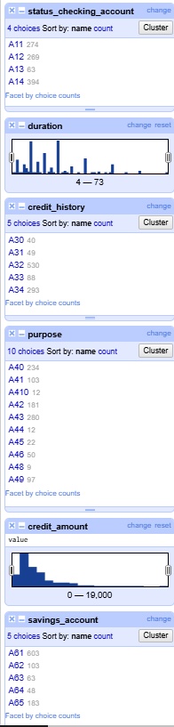
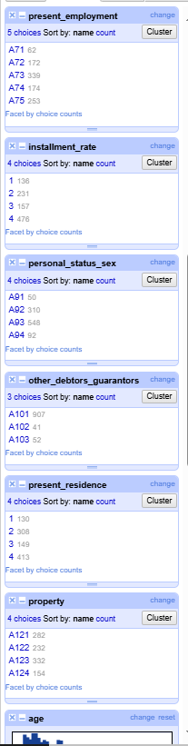
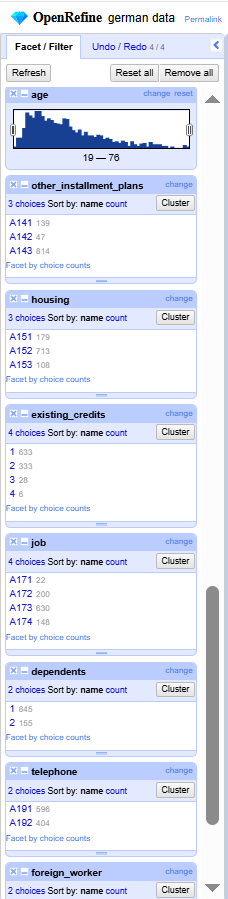
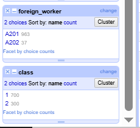
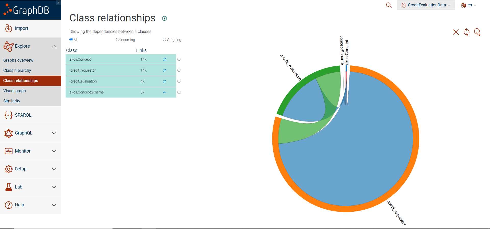

# Final Project Report

- **Subject:** Semantic web and linked data
- **Master program:** Research in Artificial Intelligence
- **University:** [Universidad Internacional Menéndez Pelayo](https://www.uimp.es)
- **Author:** Lorenzo del Río Trujillo, [lorenzo_del_rio@hotmail.com](mailto:lorenzo_del_rio@hotmail.com)
- **Date:** May, 2025
- **Version:** 1.0

## Table of contents

- [1. Introduction](#1-introduction)
  - [1.1. Input/outputs](#11-input-outputs)
  - [1.2. Process outline](#12-process-outline)
  - [1.3. Requirements](#13-requirements)
- [2. Transformation process](#2-transformation-process)
  - [2.1. Selection of the data set](#21-selection-of-the-data-set)
  - [2.2. Analysis of the data set](#22-analysis-of-the-data-set)
  - [2.3. Naming stratregy](#23-naming-strategy)
  - [2.4. Ontology development](#24-ontology-development)
  - [2.5. External links](#25-external-links)
  - [2.6. Data mapping from csv to rdf/xml](#26-data-mapping-from-csv-to-rdf-xml)
- [3. Publication & access ](#3-publication-and-access)
  - [3.1. GraphDB](#31-graph-db)
  - [3.2. Python/SPARQLWrapper Interface](#32-python-sparql-wrapper-interface)
- [4. Conclusions](#4-conclusions)
- [5. Bibliography](#5-bibliography)

## 1. Introduction

This document describes the final project for the subject "Semantic web and linked data," part of the University Master's "Research in Artificial Intelligence" from the Universidad Internacional Menéndez Pelayo.

In particular, this project consists of the selection, transformation, preparation, and publication in GraphDB of a dataset about german credit data taken from the "UC Irvine Machine Learning Repository" (https://archive.ics.uci.edu). 

As part of the project a python script will allow an user to extract data from the dataset using SPARQL queries.

### 1.1. Input/outputs

#### 1.1.1. Dataset
The dataset contains 1000 rows and includes some demographic data (gender, marital status, job level) and also bank related data (if has or not credits, salary range, installment plans...). The dataset does not reflect the current parameter values for any given client, as it is intended for developing classification algorithms to predict whether a debtor will be good or bad (i.e., whether they will repay the credit or not).The dataset reflect the values of the parameteres at the time of its creation.

#### 1.1.2. Results
The main outcomes are:
- Ontology (reusing when possible/appropriate standard vocabularies)
- Dataset in rdf format including references to external datasources
- Dataset published in GraphDB
- Python script to query the data

### 1.2. Process outline
To get the results the following steps have been followed:
- Selection and analysis of the dataset.
- Set naming strategy
- Develop the ontology 
- Link/reconcile data with external datasources
- Generate rdf output
- Publish GraphDB
- Creation of the python script with SPARQLwrapper to query the data

### 1.3. Requirements
### 1.3.1 Functional requirements
- FR1 Allow for any SPARQL query to be executed on the ontology/dataset once loaded in GraphDB
- FR2 Provide a query about the number of credits by credit risk evaluation (class) and purpose
- FR3 Provide a query that returns the loan term, credit risk evaluation (class) and employment status of credit requestor/credit evaluations for credits about an amount, foreing worker status and housing provided as input by the user
- FR4 Provide a query by purpose of the credit evaluation that return the number of credit evaluations for this purpose and retrieves info from the external links (if available) about the meaning of this specific purpose

### 1.3.2 Non Functional requirements
- NFR1 Use of linked data/semantic web tools
- NFR2 Maximize reuse of existing ontologies.
- NFR3 Ensure the ontology is easy to reuse and extend.

## 2. Transformation process

### 2.1. Selection of the data set and additional info on it
I selected this dataset as it has a moderate but significant number of records, some columns that are described in standard vocabularies and also some information that could be linked to external sources.

There is no mention of any particular bank. Also there is no explicit info that allows to link each record with any specific person. It's licensed by the owner, which is also the creator. The dataset is meant to be used in the development of credit classification of customers. For the purposes of the project is not essential if the data has been made up or if it's extracted from actual bank data so no further inquiries have been done on this respect.

The dataset has been downloaded from https://archive.ics.uci.edu/
[German Credit Data](https://archive.ics.uci.edu/dataset/144)
and can be found in this repository at [./data/statlog+german+credit+data.zip](/data/statlog+german+credit+data.zip)

The zip file includes two datasets, an index document and a word document with the description of the fields. The two datasets are equivalent, one is the original (german.data) and the other is derived, replacing non-numeric fields with numeric fields (german.data-numeric) for use in classification algorithms that do not support non-numeric data.

This dataset is made available under the Creative Commons Attribution 4.0 International License, so the user is free to share the material, including adapt and transform it. However, the user must give appropriate credit to the publisher of the data set, provide a link to the license and indicate if changes were made. All these info can be found in the archive LICENSE in the root folder of this repository. This work is licensed under the terms in the ./LICENSE file that can be found in the repo.


### 2.2. Analysis of the data set

#### 2.2.1. Explorative Data Analysis of the data set

I selected [OpenRefine](https://openrefine.org) to prepare and do an initial transform the data, as according to what was demonstrated in the course materials has all the features needed for this task.
The OpenRefine project is available in the repo (./openrefine/german-data.openrefine.tar.gz)

After creating the project `German credit` and importing the CSV into it, I proceeded with the schema and metadata analysis. 

Each row in the input dataset is a independent record that represent a credit evaluation. The data included seems to be the bare information needed for the evaluation and the result of the evaluation. Otherwise seemingly important data is not present (like customer personal info or credit additional info like date of the request or some specific credit conditions as if interest is fixed or not)
Each row has the following info (for coded fields note that not all code values are represented in the actual dataset):

- **status_checking_account**: Status of existing checking account  
        | code | meaning                                                       |
        |------|---------------------------------------------------------------|
        | A11  | x < 0 DM                                                      |
        | A12  | 0 <= x < 200 DM                                               |
        | A13  | x >= 200 DM / salary assignments for at least 1 year          |
        | A14  | no checking account                                           |

- **duration**: Duration of the requested loan in months.

- **credit_history**: Credit history  
        | code | meaning                                                      |
        |------|--------------------------------------------------------------|
        | A30  | no credits taken / all credits paid back duly                |
        | A31  | all credits at this bank paid back duly                      |
        | A32  | existing credits paid back duly till now                     |
        | A33  | delay in paying off in the past                              |
        | A34  | critical account / other credits existing (not at this bank) |

- **purpose**: Purpose of the loan  
        | code  | meaning                 |
        |-------|-------------------------|
        | A40   | car (new)               |
        | A41   | car (used)              |
        | A42   | furniture/equipment     |
        | A43   | radio/television        |
        | A44   | domestic appliances     |
        | A45   | repairs                 |
        | A46   | education               |
        | A47   | vacation                |
        | A48   | retraining              |
        | A49   | business                |
        | A410  | others                  |

- **credit_amount**: Credit amount requested. The currency is not explicitly defined in the dataset, could be DM (Deutsche Marks) but if relevant should be asked to the dataset owner/creator. It will be kept undefined in this work.

- **savings_account**: Savings account or bonds  
        | code | meaning  (x is the amount)     |
        |------|--------------------------------|
        | A61  | x < 100 DM                     |
        | A62  | 100 <= x < 500 DM              |
        | A63  | 500 <= x < 1000 DM             |
        | A64  | x >= 1000 DM                   |
        | A65  | unknown / no savings account   |

- **present_employment**: Present employment duration  
        | code | meaning (the duration refers to current employment)     |
        |------|---------------------------------------------------------|
        | A71  | unemployed                                              |
        | A72  | employed less than 1 year                               |
        | A73  | emmployed between 1 and 4 years                         |
        | A74  | employed between 4 and 7 years                          |
        | A75  | employed over 7 years                                   |

- **installment_rate**: Installment rate in percentage of disposable income.

- **personal_status_sex**: Personal status and sex  
        | code | meaning                                  |
        |------|------------------------------------------|
        | A91  | male : divorced/separated                |
        | A92  | female : divorced/separated/married      |
        | A93  | male : single                            |
        | A94  | male : married/widowed                   |
        | A95  | female : single                          |

- **other_debtors_guarantors**: Other debtors or guarantors  
        | code  | meaning        |
        |-------|----------------|
        | A101  | none           |
        | A102  | co-applicant   |
        | A103  | guarantor      |

- **present_residence**: Present residence duration. The unit is not explictly defined in the word document so we assume years. The found values (see below) are 1 to 4 so perhaps the meaning of this field described in the word as "numeric" and "Present residence since" has been misunderstood. As it's not essential for the purposes of this exercise it will described as 'Present residence duration' considering the unit 'years', but please note that perhaps is not the actual meaning. Should it be important the exact meaning should clarified with the dataset owner.

- **property**: Type of property  
        | code  | meaning                                                      |
        |-------|--------------------------------------------------------------|
        | A121  | real estate                                                  |
        | A122  | building society savings agreement / life insurance          |
        | A123  | car or other, not in attribute 6                             |
        | A124  | unknown / no property                                        |

- **age**: The age of the customer.

- **other_installment_plans**: Other installment plans  
        | code  | meaning |
        |-------|---------|
        | A141  | bank    |
        | A142  | stores  |
        | A143  | none    |

- **housing**: Housing situation  
        | code  | meaning |
        |-------|---------|
        | A151  | rent    |
        | A152  | own     |
        | A153  | for free|

- **existing_credits**: Number of existing credits at this bank.

- **job**: Occupation/job type  
        | code  | meaning                                                   |
        |-------|-----------------------------------------------------------|
        | A171  | unemployed / unskilled – non-resident                     |
        | A172  | unskilled – resident                                      |
        | A173  | skilled employee / official                               |
        | A174  | management / self-employed / highly qualified employee    |

- **dependents**: Number of people being liable to provide maintenance for.

- **telephone**: Telephone ownership  
        | code  | meaning                                      |
        |-------|----------------------------------------------|
        | A191  | none                                         |
        | A192  | yes, registered under the customer's name    |

- **foreign_worker**: Whether the customer is a foreign worker  
        | code  | meaning |
        |-------|---------|
        | A201  | yes     |
        | A202  | no      |

- **class**: If the risk is good or bad. The 'code' has only numeric values but should be considered as text code with represents the meaning in the table, it's not a numeric value.  
        | code | meaning                                      |
        |------|----------------------------------------------|
        | 1    | Good credit risk (will repay as agreed)      |
        | 2    | Bad credit risk (will default, pay late, etc)|


Using facets I have validated that the cualitative columns have the expected values and also that the numeric ones have values that make sense (for instance regarding age, number of dependants, etc). 
All fields are populated for all rows. Unless told otherwise for coded values all codes are represented:
- **status_checking_account**: Values follow the expected coding scheme
- **duration**: 4 to 73 monts.
- **credit_history**: Values follow the expected coding scheme
- **purpose**: Values follow the expected coding scheme. A47 (vacation) is not present.
- **credit_amount**: 250 - 18424. In this case the fact histogram shows 0-19000, I got the actual max/min by using the sort function.
- **savings_account**: Values follow the expected coding scheme
- **present_employment**: Values follow the expected coding scheme  
- **installment_rate**: 1% to 4% 
- **personal_status_sex**: Values follow the expected coding scheme. A95 (female:single) is not present
- **other_debtors_guarantors**: Values follow the expected coding scheme.
- **present_residence**: 1 to 4. 
- **property**: Values follow the expected coding scheme.
- **age**: 19 to 76.
- **other_installment_plans**: Values follow the expected coding scheme.
- **housing**: Values follow the expected coding scheme.
- **existing_credits**: 1 to 4.
- **job**: Values follow the expected coding scheme.
- **dependents**: 1-2.
- **telephone**: Values follow the expected coding scheme. 
- **foreign_worker**: Values follow the expected coding scheme. 
- **class**:  Values follow the expected coding scheme. 


Please find below images of the OpenRefine facets for the different fields of the dataset:






#### 2.2.2. Changes done to the dataset
##### 2.2.2.1 Columns added
As the columns have not unique identifier a row_number column is added (values 1-1000). Its done using Edit column -> Add column based on this column and typing
```
row.index + 1
```
in the GREL expression box.

As the assignment requires to link data we will derive a couple of columns to link to dbpedia. One will be a direct link and for the other we will keep a human readable label and the link will be done using owl same as. 

The columns will be derived from personal_status_sex and present_employment.

personal_status_sex has the following codes:
        | code | meaning                                  |
        |------|------------------------------------------|
        | A91  | male : divorced/separated                |
        | A92  | female : divorced/separated/married      |
        | A93  | male : single                            |
        | A94  | male : married/widowed                   |
        | A95  | female : single                          |
so the new column sex will contain
https://dbpedia.org/resource/Male if personal_status_sex has values A91, A93, A94
https://dbpedia.org/resource/Female if personal_status_sex has values A92, A95

To achieve it Python has been used instead of GREL, as OpenRefine also allows use of Python in the expression to transform  a column:
return "https://dbpedia.org/resource/Male" if value in ["A91", "A93", "A94"] else \
       "https://dbpedia.org/resource/Female" if value in ["A92", "A95"] else None


present_employment has the following codes:
        | code | meaning (the duration refers to current employment)     |
        |------|---------------------------------------------------------|
        | A71  | unemployed                                              |
        | A72  | employed less than 1 year                               |
        | A73  | emmployed between 1 and 4 years                         |
        | A74  | employed between 4 and 7 years                          |
        | A75  | employed over 7 years                                   |
a new column "employment_status" will be derived from this one, will contain:
unemployed if present_employment is A71
employed if present_employment is A72, A73, A74, A75
To achieve it Python has been used instead of GREL, as OpenRefine also allows use of Python in the expression to transform  a column:
return "unemployed" if value in ["A71"] else \
       "employed" if value in ["A72", "A73", "A74", "A75"] else None


#### 2.2.3. Final fields 
After the changes the fields of the datasets are:
- **row_number**
- **status_checking_account**
- **duration**
- **credit_history**
- **purpose**
- **credit_amount**
- **savings_account**
- **present_employment**
- **employment_status**
- **installment_rate**
- **personal_status_sex**
- **sex**
- **other_debtors_guarantors**
- **present_residence**
- **property**
- **age**
- **other_installment_plans**
- **housing**
- **existing_credits**
- **job**
- **dependents**
- **telephone**
- **foreign_worker**
- **class**

The dataset once transformed with OpenRefine to add these columns can be found in the repository:
german-data_transformed.csv

### 2.3. Naming strategy
As recommended in the training materials:
- For the individual objects the separator will be the slash (`/`)  (big amount of items that could change in data refresh)
- For the ontology the separator will be the hash ('#') (small amount of items with no or few expected changes). The codes "concept schemes/concepts" will be part of the ontology

There will be two main classes of individuals, credit_evaluation and credit_requestor, additional details on this can be found in section 2.4 Ontology Development

Let's assume that we own the domain creditclassification.biz . The following prefixes will be used (ccf -> credit classification):

* `http://data.creditclassification.biz/ontology/ccf#` for the ontology terms;
* `http://data.creditclassification.biz/resource/ccf/credit_evaluation/` for each individual credit classification.
* `http://data.creditclassification.biz/resource/ccf/credit_requestor` for each credit requestor.
* `http://data.creditclassification.biz/resource/ccf/<concept_category>#` for the concept categories (coded fields).


And so the generated URIs will be:

* `http://data.creditclassification.biz/ontology/ccf#<term>` for ontology terms;
* `http://data.creditclassification.biz/resource/ccf/credit_evaluation/<credit_evaluation_id>` for each credit classification.
* `http://data.creditclassification.biz/resource/ccf/credit_requestor/<credit_requestor_id>` for each credit requestor.
* `http://data.creditclassification.biz/resource/ccf/<concept_category>#<concept>` for the different code values .


The ids for credit evaluation and credit requestor will be generated from the row_id added to the dataset. E<row_id> for the credit evaluation and R<row_id> for the credit requestor. 

The URI naming cannot be enforced at ontology level using OWL alone (it's possible with additional tools like SHACL), but an annotation can be provided in each class explaining how URIs should be created. 

Initially for the code values the naming scheme was conceived as for the other ontolology terms:
* `http://data.creditclassification.biz/ontology/ccf#<term>`
This could be valid as of now because the code names, except for the class (credit class) have the following structure:
A<columNumber><codenumber>
So the code names do not overlap. But if in the future new code schemes are added with different coding rules they could overlap rendering insufficient the initial (simpler) approach. Hence a more scalable approach was followed:
* `http://data.creditclassification.biz/resource/ccf/<concept_category>#<concept>`

To transform the URIs in the ontology file from the 'plain' to the 'nested' approach the following python program was developed:
./codeAux/transformXml.py
It does not use any rdf library, takes advantage of the xml format in which the file is stored as I am familiar with xml processing.

### 2.4. Ontology development
#### 2.4.1. General approach/tools
Each row in the dataset represents the risk of a requested loan. Many of the info is related to the requestor and other part of the info is related to the loan, including the risk evaluation. 
We do not know any identification data for these customers but they are still banking customers and to represent them we can extend the 'Party' class of the FIBO (Financial Industry Business Ontology) to represent them. As the dataset does not explicitly tell that the requestors are people 'Party' was preferred to subclass, at the concept 'Party' would allow also for businesses. 
The class name will be credit_requestor and the identification will be based in the row_number column. 

Regarding the info of the credit FIBO could also be used as it has an extensive vocabulary for loans and credits but is very complex and also it seems interesting for the practice to include other estandar ontology. Then the class Loan or Credit of schema.org is used to derive the credit_evaluation class. The identification of each credit_evaluation individual will be based also in the row_number column. 

Descriptions and/or usage notes have been added for some classes and properties as demonstration of the capabilities of the model; as the ontology is not for real use I did not invest time in creating descriptions/annotations for all the classes/properties.

Regarding external linking different approaches were used to demonstrate in this work several ways in which this could be done. One has been used for "coded columns", other for column 'sex' and other for column 'unemployment'. A common approach would have been easier and also more consistent and should be the choice in an ontology for 'real world' use. 

##### 2.4.1.2 DataTypes in schema.org
When trying to use schema.org in Protégé the version that worked best was an experimental OWL version of schema.org. The problem with this version is that it enforces strict OWL and properties that in the original schema.org ontology are Data Properties (literals) end up being Object Properties which inherit from DataType. For instance "amount" is a property with range Number which is a subclass of DataType.
Then no property in the OWL schema.org ontology has domain 'Number' so it's not well defined the actual 'number' is represented as a property of the class 'Number'.

A custom property could have been defined having domain 'Number' (or 'Text' for the case of the loan duration), but for the sake of simplicity, and to follow how schema.org is commonly used, wherever an individual has a schema.org property whose range is a subclass of 'DataType' it's used as a data property (literal).

##### 2.4.1.3 Coded columns
The coded columns will be mapped as skos concept schemes, each code value being a skos concept. For some of the codes external references have been added. For some of the codes labels in several languages (Spanish, French and Esperanto have been added). Additional info on these columns is provided in section 2.4.3 Coded fields

##### 2.4.1.4 Tools
The ontology has been developed using the following tools:
- Protégé as main tool for the development of the ontology and exporting it to rdf/Turtle.
- Visual Code with the plugin Stardog for RDF Grammars to do some direct changes in the rdf/xml.
- Grok, to get the labels in several languages.
- chatGPT to get the wikidata and DBpedia references for the 'purpose' and 'foreing_worker' different values. A manual revision of all references has been needed so I do not recommend to use chatGPT for this purpose. 
- Python to transform code element URIs from 'plain' to 'nested' (as explained in section 2.3. Naming strategy)

In the following sections of this topic more info about the classes and properties will be provided.

#### 2.4.3. credit_requestor
credit_requestor represents the entity requesting the credit whose risk is being evaluated. 
It inherits from FIBO Party class as the info is finacial-related and also related to an actor which is not an automated agent but also we do not know if is a business or an individual customer so Party is a suitable superclass for credit_requestor.
The following fields (or some transformation of them) of the dataset will be mapped as properties of credit_requestor:

- **row_number**
- **status_checking_account**
- **credit_history**
- **savings_account**
- **present_employment**
- **employment_status**
- **personal_status_sex**
- **sex**
- **other_debtors_guarantors**
- **present_residence**
- **property**
- **other_installment_plans**
- **housing**
- **existing_credits**
- **job**
- **dependents**
- **telephone**
- **foreign_worker**


#### 2.4.4. credit_evaluation
credit_evaluation represents the loan requested and its evaluation ('class'). 
It inherits from schema.org 'LoanOrCredit', that has the main fields of the load (term and amount). 

The following fields (or some transformation of them) of the dataset will be mapped as properties of credit_evaluation:

- **row_number**
- **duration**
- **age**
- **purpose**
- **credit_amount**
- **class**
- **installment_rate**

'age' is included in the credit_evaluation as it is considered to be the age of the requestor in the moment the evaluation was done, so this property is bound to the evaluation (the actual age of the requestor will increase with time, consider that if we add further evaluations to a requestor 'age' will be different for each evaluation)

#### 2.4.3. Coded fields

The following fields are coded fields:
- **status_checking_account**
- **credit_history**
- **purpose**
- **savings_account**
- **present_employment**
- **personal_status_sex**
- **other_debtors_guarantors**
- **property**
- **other_installment_plans**
- **housing**
- **job**
- **telephone**
- **foreign_worker**
- **class**

The general approach to integrate those coded fields in the ontology has been:
- Each field is mapped as individual of skos:ConceptScheme, with the same name of the field (for instance foreign_worker)
- Each code in each field is mapped as an individual of skos:Concept, with the code being the identifier of the individual. A skos:altLabel in English contains the meaning of the code as provided by the dataset creator.
The property skos:inScheme is used to relate the codes with their ConceptScheme
- For each code field a subclass of OMG CodeElement has been created, so we can use it to describe the range in a property as the inviduals of the subclass (the list of codes of a code field). The class will be named as the field + '_code' (for instance foreing_worker_code)
- For each code field an object property has been created with domain 'credit_requestor' (or 'credit_evaluation' depending on the specific code), so it can be used in the credit_requestor (or 'credit_evaluation') individuals. The object property name is 'has_' + <name of the field>, for instance 'has_foreing_worker'.

An example, for the foreing worker status will be:

- Concept scheme
```
    <owl:NamedIndividual rdf:about="http://data.creditclassification.biz/ontology/ccf#foreign_worker">
        <rdf:type rdf:resource="http://www.w3.org/2004/02/skos/core#ConceptScheme"/>
        <terms:description>Foreign worker status</terms:description>
        <skos:prefLabel xml:lang="en">Foreign worker status</skos:prefLabel>
    </owl:NamedIndividual>
```

- Codes
```
    <!-- foreign_worker: yes -->
    <owl:NamedIndividual rdf:about="http://data.creditclassification.biz/ontology/ccf#A201">
        <rdf:type rdf:resource="http://www.w3.org/2004/02/skos/core#Concept"/>
        <skos:inScheme rdf:resource="http://data.creditclassification.biz/ontology/ccf#foreign_worker"/>
        <terms:description>yes</terms:description>
        <skos:altLabel xml:lang="en">yes</skos:altLabel>
    </owl:NamedIndividual>

    <!-- foreign_worker: no -->
    <owl:NamedIndividual rdf:about="http://data.creditclassification.biz/ontology/ccf#A202">
        <rdf:type rdf:resource="http://www.w3.org/2004/02/skos/core#Concept"/>
        <skos:inScheme rdf:resource="http://data.creditclassification.biz/ontology/ccf#foreign_worker"/>
        <terms:description>no</terms:description>
        <skos:altLabel xml:lang="en">no</skos:altLabel>
     </owl:NamedIndividual>
```
- Class that groups all the codes
```
   <owl:Class rdf:about="http://data.creditclassification.biz/ontology/ccf#foreign_worker_code">
        <rdfs:subClassOf rdf:resource="https://www.omg.org/spec/Commons/CodesAndCodeSets/CodeElement"/>
        <owl:equivalentClass>
            <owl:Class>
                <owl:intersectionOf rdf:parseType="Collection">
                    <rdf:Description rdf:about="http://www.w3.org/2004/02/skos/core#Concept"/>
                    <owl:Restriction>
                        <owl:onProperty rdf:resource="http://www.w3.org/2004/02/skos/core#inScheme"/>
                        <owl:hasValue rdf:resource="http://data.creditclassification.biz/ontology/ccf#foreign_worker"/>
                    </owl:Restriction>
                </owl:intersectionOf>
            </owl:Class>
        </owl:equivalentClass>
    </owl:Class>
```    

- Property that has domain credit_requestor and range the set of codes of the field (foreing_worker_code)
```
    <owl:ObjectProperty rdf:about="http://data.creditclassification.biz/ontology/ccf#has_foreign_worker">
        <rdfs:domain rdf:resource="http://data.creditclassification.biz/ontology/ccf#credit_requestor"/>
        <rdfs:range rdf:resource="http://data.creditclassification.biz/ontology/ccf#foreign_worker_code"/>
        <rdfs:label xml:lang="en">has foreign worker status</rdfs:label>
    </owl:ObjectProperty>
```

Besides for the following fields labels in Spanish, French and Esperanto have been added (they could have been added for more fields or in other languages, but for demonstration purposes these could be enough):
- **credit_history**
- **present_employment**
- **personal_status_sex**
- **other_debtors_guarantors**
- **property**
- **other_installment_plans**
- **job**
- **telephone**
- **foreign_worker**
- **class**

And for the following fields some external references for their codes have been added (some with skos:exactMatch and other with skos:closeMatch). Sometimes two references are included, one to Dbpedia and other to wikidata, but sometimes only one of them is included:
- **purpose**
- **foreign_worker**


#### 2.4.4. Fields representing a lenght of time (duration)
The following fields are time lenght fields:

- **duration**
- **present_residence**
- **age**

##### 2.4.4.1 Age
It seems that 'age' could be reused from another vocabulary but he concept of 'age' was deprecated in FOAF favoring 'birth date', which allows to compute the actual age at any time. The Person Core Ontology also allows only to map 'age' indirectly, using birth date.
In this case the birth date cannot be inferred and also has no sense as 'age' is the age at the moment when the credit class (good or bad risk) was decided and this is a difference with the general concept of 'age', so a specific property derived from schema.org duration is defined ('age_when_risk_evaluated').
Considering this specific mean of 'age' this property has 'credit_evaluation' and not 'credit_requestor' as its domain (refer also to section 2.4.4. credit_evaluation)

##### 2.4.4.2 Duration
The duration will be represented using the 'LoanTerm' property. The range of LoanTerm is:
```
		<rdfs:range>
			<owl:Class>
				<owl:unionOf rdf:parseType="Collection">
					<owl:Class rdf:about="https://schema.org/QuantitativeValue"/>
					<owl:Class rdf:about="https://schema.org/Text"/>
					<owl:Class rdf:about="https://schema.org/URL"/>
					<owl:Class rdf:about="https://schema.org/Role"/>
				</owl:unionOf>
			</owl:Class>
```
For the best interoperability 'QuantitativeValue' could have been selected as it allows to respresent in a structured way the quantity and the unit. In this case in the dataset especification the unit is explicit so the usage of QuantitativeValue is not required and 'Text' will be used. 

##### 2.4.4.3 Present Residence
As stated in section 2.2.1 the unit for this field is not explictly defined so schema.org duration is used, using Text range. 

#### 2.4.5. Numeric fields
##### 2.4.5.1 Credit amount
The credit amount will be mapped to the amount property of 'LoanOrCredit', using the range 'Number', as the range 'MonetaryAmount' would require the currency and it's not defined.
A custom comment will be added to the property to explain that the currency is not defined.
##### 2.4.5.2 Existing credits
A custom data property is created to map this field.
##### 2.4.5.3 Dependents
A custom data property is created to map this field.
##### 2.4.5.3 Installment rate
A custom data property is created to map this field.
##### 2.4.5.4 Row number
The row number added with OpenRefine will be used to create the URIs for credit_evaluation and credit_requestor individuals.

#### 2.4.6. Other fields
A couple of fields were derived in the intial review/transformation stage to have fields that map with external entities, to model the relation with external entities in different ways. Besides two additional properties are added to link the credit requestor with the credit evaluation and the credit evaluation with its requestor.

##### 2.4.6.1. Sex
In this case when processing the initial dataset a new column was derived that has the link to Male or Female in DBpedia. A property 'hasSex' is created whose range is a custom created class that is limited to Male and Female individuals in dbpedia:

```
  <!-- Sex class restricted to Male and Female -->
  <owl:Class rdf:about="http://data.creditclassification.biz/ontology/ccf#Sex">
    <owl:oneOf rdf:parseType="Collection">
      <rdf:Description rdf:about="http://dbpedia.org/resource/Male"/>
      <rdf:Description rdf:about="http://dbpedia.org/resource/Female"/>
    </owl:oneOf>
    <rdfs:label xml:lang="en">Sex</rdfs:label>
    <rdfs:comment xml:lang="en">
      The class of biological sexes, limited to the individuals Male and Female from DBpedia.
    </rdfs:comment>
  </owl:Class>

  <!-- hasSex object property -->
  <owl:ObjectProperty rdf:about="http://data.creditclassification.biz/ontology/ccf#hasSex">
    <rdfs:domain rdf:resource="http://data.creditclassification.biz/ontology/ccf#credit_requestor"/>
    <rdfs:range rdf:resource="http://data.creditclassification.biz/ontology/ccf#Sex"/>
    <rdfs:label xml:lang="en">has sex</rfs:label>
    <rdfs:comment xml:lang="en">The biological sex of the credit requestor.</rdfs:comment>
  </owl:ObjectProperty>

```

##### 2.4.6.2. Employment status
In this case the info derived in the initial processing is 'unemployed' or 'employed'. The implementation for this property has been done defining first a datatype and then using it in the range of the property. The external links are defined as 'seeAlso' in the definition of the property.

```
<rdfs:Datatype rdf:about="http://data.creditclassification.biz/ontology/ccf#employment_status_enum">
  <owl:equivalentClass>
    <rdfs:Datatype>
      <owl:withRestrictions rdf:parseType="Collection">
        <rdf:Description>
          <xsd:pattern>employed|unemployed</xsd:pattern>
        </rdf:Description>
      </owl:withRestrictions>
      <rdfs:subClassOf rdf:resource="http://www.w3.org/2001/XMLSchema#string"/>
    </rdfs:Datatype>
  </owl:equivalentClass>
</rdfs:Datatype>

<owl:DatatypeProperty rdf:about="http://data.creditclassification.biz/ontology/ccf#has_employment_status">
  <rdfs:domain rdf:resource="http://data.creditclassification.biz/ontology/ccf#credit_requestor"/>
  <rdfs:range rdf:resource="http://data.creditclassification.biz/ontology/ccf#employment_status_enum"/>
  <rdfs:label xml:lang="en">has employment status</rdfs:label>
  <rdfs:comment xml:lang="en">
    The employment status as a string: 'employed' or 'unemployed'.
    Refer to DBpedia for more information.
  </rdfs:comment>
  <rdfs:seeAlso rdf:resource="http://dbpedia.org/resource/Employment"/>
  <rdfs:seeAlso rdf:resource="http://dbpedia.org/resource/Unemployment"/>
</owl:DatatypeProperty>
```
##### 2.4.6.1. has_credit_requestor / has_credit_evaluation
Two object properties are added, one to credit_requestor (has_credit_evaluation) and other to credit_evaluation (has_credit_requestor)
As a demonstration of how to set cardinallity of properties using OWL those two properties are bound to restrictions. A credit_requestor could have 0 to N credit_evaluation and a credit_evaluation must have 1 and only 1 credit_requestor.
This does not match what is in the initial dataset where due to the lack of exact identification of the requestor we consider each row a different requestor/evaluation so the relationship is 1-1 between evaluations and requestors, but in this way the initial dataset fits the model and also it makes possible to add more evaluations to a requestor.
Besides the relationship between the two properties is modelled with inverseOf, as for instance in has_credit_evaluation:
  <owl:inverseOf rdf:resource="http://data.creditclassification.biz/ontology/ccf#has_credit_requestor"/>

#### 2.4.7. Ontology validation
The ontology has been validated with OOPS (https://oops.linkeddata.es/), using RDF/XML format from Protégé and uploading in the validator. The first interaction yielded the following results:
Pitfalls detected:

Results for P04: Creating unconnected ontology elements.Minor 13 cases
Results for P07: Merging different concepts in the same class.Minor 2 cases
Results for P08: Missing annotations.Minor 37 cases
Results for P11: Missing domain or range in properties.Important 268 cases
Results for P12: Equivalent properties not explicitly declared.Important 13 cases
Results for P13: Inverse relationships not explicitly declared.Minor 122 cases
Results for P21: Using a miscellaneous class.Minor 2 cases
Results for P22: Using different naming conventions in the ontology.Minor Ontology*
Results for P30: Equivalent classes not explicitly declared.Important 7 cases
Results for P34: Untyped class.Important 5 cases
Results for P35: Untyped property. Important 1 case1 case

P04, P12, P30, P35 issues refer to the imported ontologies

P07 was due to a incorrect reference to http://schema.org/LoanOrCredit instead of the correct with https

P08 Some cases fixed, as stated in section 2.4.1 not all the items have been provided with annotations.

P11 All items with the problem but one are from imported ontologies. The only one in the credit classification ontology is:
 http://data.creditclassification.biz/ontology/ccf#age_when_risk_evaluated
I added the domain and range to the property.

P13 It affects to 16 items in the credit classification ontology, the other affected items are from imported ontologies. In any case I  decided to ignore P13, due to the purpose of the project I think that there is no need to define the inverse properties.

P21 refers to: 
› http://data.creditclassification.biz/ontology/ccf#other_installment_plans_code
› http://data.creditclassification.biz/ontology/ccf#other_debtors_guarantors_code
And I think they  have been classified as 'miscellaneous' class incorrectly, because the 'other' in their names is not meaning that is 'other' among several of the same 'superclass' but that refers to the credit requestor having other installment plans besides the requested loan or being with other debt obligations.

P22 Some of the items were named using 'CamelCase' and others using lower case and _ delimiter.  All are unified to lower case with _ delimiter. 

P34 Affects to several item. Of these two are fixed as they are from the cretit evaluation dataset. 
› http://example.org/ontology/EmploymentStatusEnum
› http://example.org/ontology/CreditRequestor


After the review:

Results for P04: Creating unconnected ontology elements.Minor 12 cases
Results for P07: Merging different concepts in the same class. Minor 1 case
Results for P08: Missing annotations.Minor 28 cases
Results for P11: Missing domain or range in properties.Important 267 cases
Results for P12: Equivalent properties not explicitly declared.Important 13 cases
Results for P13: Inverse relationships not explicitly declared.Minor 123 cases
Results for P21: Using a miscellaneous class.Minor 2 cases
Results for P22: Using different naming conventions in the ontology.Minor Ontology*
Results for P30: Equivalent classes not explicitly declared.Important 7 cases
Results for P34: Untyped class. Important 1 case
Results for P35: Untyped property. Important 1 case

P04, P12, P30, P35, P11, P34 issues refer to the imported ontologies
P08, P13, P21 were justified
P22 After changing camelCase ids to lower case with _ delimiter the warning stil appears, might be due to the code names, which start with capital 'A'. In any case is cosmetical (minor) and it's not explorer further. 

Together with the 'pitfalls' a warning is issued:
SUGGESTION: symmetric or transitive object properties  6 cases
This suggestion only affects imported ontologies.

#### 2.4.8. Ontology deliverables
The ontology in rdf/xml and Turtle format is delivered in the folder ./ontology of the repo (ccf.* files)


### 2.5. Data reconciliation
For the sex (male/female) and employment status (employed/unemployed) I searched manually in Dbpedia/Wikidata the matching resources. 
In case of the coded fields that include equivalences in Dbpedia/Wikidata I used ChatGPT to find them and then validated manually. As commented before I cannot recommend using ChatGPT for this task as in my case there were many cases in which the provided links pointed to resources that have no semantical relationship with the concepts.

### 2.6. Data mapping from csv to rdf/xml
For the datamapping I created a jinja2 template and then used a python script to render the final file from the csv and the jinja2 template.
Files involved:
- template_xml.j2 -> jinja2 word template
- csvTordf.py -> python script 
- german-data_transformed.csv -> csv generated from the initial dataset using openRefine
- german_data_rdf.rdf -> dataset tranformed to linked data rdf/xml

After processing the csv with the Python
They can be found in the folder ./transform of the repo

Protégé was used to validate the output file (german_data_rdf.rdf)


## 3. Publication & access
The course materials recommend datahub.io as a good plaform for publication of the data. The problem is that currently this web is no longer working with rdf/linked data, now its oriented to markdown documents published in git.
So my option to emulate the publication of the data has been to use GraphDB. Then it's queried with Python SPARQL.

### 3.1. GraphDB
GraphDB free edition is readily available from https://www.ontotext.com/products/graphdb/, I downloaded the version for Windows.
With both  the ontology and the dataset imported in GrapDB the resources can be accessed using URLs in this format:
http://localhost:7200/resource?uri=<resource URI>
for instance:
http://localhost:7200/resource?uri=http://data.creditclassification.biz/ontology/ccf/credit_evaluation/E102


The tool allows to visualize graphs that include also the ontology and allows for navigation in the graphs. For instance we can put in the center of the graph a property and GraphDb will show all the individuals that have this property.

Get to visualize the items is very easy thanks to the autocomplete feature:


Once a given item is chosen it will display  in the center:


A frame can be displayed with the details about any entity in the graph:


Items can be expanded to navigate through the information:


Among other features there is a SPARQL editor where queries can be run:


GraphDB also provides summaries of the imported data:



### 3.2. Python/SPARQLWrapper queries
To demonstrate how queries to GraphDB can be done a python script has been developed. It can be found, together with some query examples in the repo at ./queries. The python script is in the file QueriesCreditData.py. 
To execute the script you need the following modules:
SPARQLWrapper
requests
Both are readily available and can be installed using pip.
The ontology (ccf.rdf) and the dataset (german_data_rdf.rdf) were imported in GraphDB under the repository "CreditEvaluationData" so the endpoint for the SPARQL queries was:
http://localhost:7200/repositories/CreditEvaluationData

When calling the script you can pass as parameter any filenname or no parameter. If you pass a filename then it tries to execute the content as an SPARQL query. If there are no parameters a menu is shown with 3 options (+ exit option), each option is a different query as explained below.

#### 3.2.1. Execution of any SPARQL query
The script is designed to met:
- FR1 Allow for any SPARQL query to be executed on the ontology/dataset once loaded in GraphDB
It does it using the function execute_query_from_file, that reads a file with an SPARQL query and executes it using the setQuery method of SPARQLWrapper. The file name (full path or relative path) needs to be passed as parameter when calling the script.
The method does not allow for the use of parameters when querying, the query from the file is read as text and executed as it is.
The results are presented without changes, as the SPARQLWrapper method returns them.
The files ./queries/QuerySPARQL_1.txt and ./queries/QuerySPARQL_2.txt 
were used to demonstrate this capability. 
- QuerySPARQL_1.txt is a basic generic query to show labels:

Lorenzo_del_Rio\queries>python QueriesCreditData.py QuerySPARQL_1.txt
Results:
{'subject': 'http://data.creditclassification.biz/ontology/ccf#has_sex', 'label': 'has sex'}
{'subject': 'http://data.creditclassification.biz/ontology/ccf#has_credit_history', 'label': 'has credit history'}
{'subject': 'http://data.creditclassification.biz/ontology/ccf#has_foreign_worker', 'label': 'has foreign worker status'}
{'subject': 'http://data.creditclassification.biz/ontology/ccf#has_housing', 'label': 'has housing'}
{'subject': 'http://data.creditclassification.biz/ontology/ccf#has_job', 'label': 'has job'}
{'subject': 'http://data.creditclassification.biz/ontology/ccf#has_other_debtors_guarantors', 'label': 'has other debtors or guarantors'}
{'subject': 'http://data.creditclassification.biz/ontology/ccf#has_other_installment_plans', 'label': 'has other installment plans'}
{'subject': 'http://data.creditclassification.biz/ontology/ccf#has_personal_status_sex', 'label': 'has personal status and sex'}
{'subject': 'http://data.creditclassification.biz/ontology/ccf#has_present_employment', 'label': 'has present employment info'}
{'subject': 'http://data.creditclassification.biz/ontology/ccf#has_property', 'label': 'has property info'}


- QuerySPARQL_2.txt is specific to this ontology/dataset and will return age (ISO format) link of the requestor, number of dependents of the requestor, sex of the requestor (without the full URI), and description of the credit evaluation, for credits evaluation where age > 40, sex contains 'Female' and the purpose of the credit evaluated is education or retraining:
Lorenzo_del_Rio\queries>python QueriesCreditData.py QuerySPARQL_2.txt
Results:
{'age': 'P61Y', 'requestor': 'http://data.creditclassification.biz/ontology/ccf/credit_requestor/R97', 'number_of_dependents': '1', 'sexText': 'Female', 'class_desc': 'Good credit risk (will repay as agreed)'}
{'age': 'P57Y', 'requestor': 'http://data.creditclassification.biz/ontology/ccf/credit_requestor/R264', 'number_of_dependents': '1', 'sexText': 'Female', 'class_desc': 'Good credit risk (will repay as agreed)'}
{'age': 'P41Y', 'requestor': 'http://data.creditclassification.biz/ontology/ccf/credit_requestor/R446', 'number_of_dependents': '1', 'sexText': 'Female', 'class_desc': 'Good credit risk (will repay as agreed)'}
{'age': 'P67Y', 'requestor': 'http://data.creditclassification.biz/ontology/ccf/credit_requestor/R555', 'number_of_dependents': '1', 'sexText': 'Female', 'class_desc': 'Good credit risk (will repay as agreed)'}
{'age': 'P50Y', 'requestor': 'http://data.creditclassification.biz/ontology/ccf/credit_requestor/R665', 'number_of_dependents': '1', 'sexText': 'Female', 'class_desc': 'Good credit risk (will repay as agreed)'}
{'age': 'P56Y', 'requestor': 'http://data.creditclassification.biz/ontology/ccf/credit_requestor/R681', 'number_of_dependents': '1', 'sexText': 'Female', 'class_desc': 'Good credit risk (will repay as agreed)'}
{'age': 'P53Y', 'requestor': 'http://data.creditclassification.biz/ontology/ccf/credit_requestor/R886', 'number_of_dependents': '1', 'sexText': 'Female', 'class_desc': 'Bad credit risk (will default, pay late, etc)'}


#### 3.2.2. Query about the number of credits by credit risk evaluation (class) and purpose
The script is designed to met:
- FR2 Provide a query about the number of credits by credit risk evaluation (class) and purpose
And it does it through the function 'query_1', which executes a GROUP BY query that retrieves all the combinations of evaluation (class) and purpose providing the amount of evaluations for each combination:

Lorenzo_del_Rio\queries>python QueriesCreditData.py
Show menu

--- Options available ---
1 - Number of credits by class and purpose
2 - Info about loan term, credit classification and employment status for credits above a given amount, foreing worker status and housing
3 - Query by purpose, retrieving external info for the purpose
0 - Exit
Select an option : 1
Number of credits by class and purpose
Alt Label            Class Description                        Count
------------------------------------------------------------------------------------------------------------------------------------------------------
new car              Good credit risk (will repay as agreed)  145
new car              Bad credit risk (will default, pay late, etc) 89
used car             Good credit risk (will repay as agreed)  86
used car             Bad credit risk (will default, pay late, etc) 17
others               Good credit risk (will repay as agreed)  7
others               Bad credit risk (will default, pay late, etc) 5
furniture/equipment  Good credit risk (will repay as agreed)  123
furniture/equipment  Bad credit risk (will default, pay late, etc) 58
radio/television     Good credit risk (will repay as agreed)  218
radio/television     Bad credit risk (will default, pay late, etc) 62
domestic appliances  Good credit risk (will repay as agreed)  8
domestic appliances  Bad credit risk (will default, pay late, etc) 4
repairs              Good credit risk (will repay as agreed)  14
repairs              Bad credit risk (will default, pay late, etc) 8
education            Good credit risk (will repay as agreed)  28
education            Bad credit risk (will default, pay late, etc) 22
retraining           Good credit risk (will repay as agreed)  8
retraining           Bad credit risk (will default, pay late, etc) 1
business             Good credit risk (will repay as agreed)  63
business             Bad credit risk (will default, pay late, etc) 34

#### 3.2.3. Query for loan term/risk evaluation (class) and employment status
The script is designed to met:
- FR3 Provide a query that returns the loan term, credit risk evaluation (class) and employment status of credit requestor/credit evaluations for credits about an amount, foreing worker status and housing provided as input by the user
and it does through function query_2. This function perform the following steps:
- Ask for a credit amount
- Ask whether the requestor is foreing worker or not
- Retrieves the different possible values of the housing code
- Ask the user to select one of these housing values
- Performs a query returning the loan term, credit risk evaluation (class) and employment status of the credit_evaluation/credit_requestor where the credit_evaluation amount is over the value chosen by the user and the credit_requestor foreign worker situation and housing are the ones chosen by the user.
- The loan term is transformed from the ISO format (P<num of months>M) to a more user friendly format (<num_of_months> months)

Example of execution (not all results included):
Lorenzo_del_Rio\queries>python QueriesCreditData.py
Show menu

--- Options available ---
1 - Number of credits by class and purpose
2 - Info about loan term, credit classification and employment status for credits above a given amount, foreing worker status and housing
3 - Query by purpose, retrieving external info for the purpose
0 - Exit
Select an option : 2
Info about loan term, credit classification and employment status for credits above a given amount, foreing worker status and housing
Enter credit amount (e.g. 1000): 100
Is the requestor a foreign worker? (yes/no): yes

Fetching housing options...

Available Housing Options:
1. own [housing#A152]
2. for free [housing#A153]
3. rent [housing#A151]
Select a housing option (number): 2

Running filtered query...

Loan Term    Class                          Employment Status
-----------------------------------------------------------------
42 months    Good credit risk (will repay as agreed) employed
24 months    Bad credit risk (will default, pay late, etc) employed
36 months    Good credit risk (will repay as agreed) employed
24 months    Bad credit risk (will default, pay late, etc) employed
48 months    Good credit risk (will repay as agreed) employed
48 months    Bad credit risk (will default, pay late, etc) employed
36 months    Bad credit risk (will default, pay late, etc) employed
36 months    Bad credit risk (will default, pay late, etc) employed
36 months    Bad credit risk (will default, pay late, etc) employed
8 months     Good credit risk (will repay as agreed) employed
12 months    Good credit risk (will repay as agreed) employed
36 months    Bad credit risk (will default, pay late, etc) employed
10 months    Good credit risk (will repay as agreed) employed
18 months    Good credit risk (will repay as agreed) employed
6 months     Good credit risk (will repay as agreed) employed
10 months    Good credit risk (will repay as agreed) unemployed
...................
....................

#### 3.2.4. Query by purpose including external link info
The script is designed to met:
- FR4 Provide a query by purpose of the credit evaluation that return the number of credit evaluations for this purpose and retrieves info from the external links (if available) about the meaning of this specific purpose
And it does using query_3 function. This function perform the following steps:
- Retrieve all possible values of has_purpose property and their "readable" labels (in this case modelled as dcterms:description)
- Presents the values to the user, who should select one of them
- Perfoms a group by query to count all the credit_evaluations that have this purpose
- Retrieves any skos:exactMatch or skos:closeMatch info of the selected purpose
- If there is exactMatch info closeMatch info is not used. If there is no exactMatch info the closeMatch info links are used.
- For each match (either close or exact) the info from the source (Wikidata or Dbpedia) is retrieved. As security aspect is not key for this work certificate validation has been disabled when accessing wikidata/dbpedia. 
- The info about number of credits and also the meaning of the purpose according to the external links is presented to the user.

Examples of execution:

- With exact match:
Lorenzo_del_Rio\queries>python QueriesCreditData.py
Show menu

--- Options available ---
1 - Number of credits by class and purpose
2 - Info about loan term, credit classification and employment status for credits above a given amount, foreing worker status and housing
3 - Query by purpose, retrieving external info for the purpose
0 - Exit
Select an option : 3
Query by purpose, retrieving external info for the purpose

Available Credit Purposes:
1. business [purpose#A49]
2. domestic appliances [purpose#A44]
3. education [purpose#A46]
4. furniture/equipment [purpose#A42]
5. new car [purpose#A40]
6. others [purpose#A410]
7. radio/television [purpose#A43]
8. repairs [purpose#A45]
9. retraining [purpose#A48]
10. used car [purpose#A41]
Select a credit purpose (number): 3

Total credit evaluations with the chosen purpose: 50

The meaning of the chosen purpose is described in the following URLs:
- http://dbpedia.org/resource/Education
- http://www.wikidata.org/entity/Q8434

From this source http://dbpedia.org/resource/Education, this info about the chosen purpose has been retrieved:
Education is a purposeful activity directed at achieving certain aims, such as transmitting knowledge or fostering skills and character traits. These aims may include the development of understanding, rationality, kindness, and honesty. Various researchers emphasize the role of critical thinking in order to distinguish education from indoctrination. Some theorists require that education results in an improvement of the student while others prefer a value-neutral definition of the term. In a slightly different sense, education may also refer, not to the process, but to the product of this process: the mental states and dispositions possessed by educated people. Education originated as the transmission of cultural heritage from one generation to the next. Today, educational goals increasingly encompass new ideas such as the liberation of learners, skills needed for modern society, empathy, and complex vocational skills. Types of education are commonly divided into formal, non-formal, and informal education. Formal education takes place in education and training institutions, is usually structured by curricular aims and objectives, and learning is typically guided by a teacher. In most regions, formal education is compulsory up to a certain age and commonly divided into educational stages such as kindergarten, primary school and secondary school. Nonformal education occurs as addition or alternative to formal education. It may be structured according to educational arrangements, but in a more flexible manner, and usually takes place in community-based, workplace-based or civil society-based settings. Lastly, informal education occurs in daily life, in the family, any experience that has a formative effect on the way one thinks, feels, or acts may be considered educational, whether unintentional or intentional. In practice there is a continuum from the highly formalized to the highly informalized, and informal learning can occur in all three settings. For instance, homeschooling can be classified as nonformal or informal, depending upon the structure. Regardless of setting, educational methods include teaching, training, storytelling, discussion, and directed research. The methodology of teaching is called pedagogy. Education is supported by a variety of different philosophies, theories and empirical research agendas. There are movements for education reforms, such as for improving quality and efficiency of education towards relevance in students' lives and efficient problem solving in modern or future society at large, or for evidence-based education methodologies. A right to education has been recognized by some governments and the United Nations. Global initiatives aim at achieving the Sustainable Development Goal 4, which promotes quality education for all.

From this source http://www.wikidata.org/entity/Q8434, this info about the chosen purpose has been retrieved:
transmission of knowledge and skills


- With close match:

C:\cmdlrt\OneDrive - Hewlett Packard Enterprise\directorio_lorenzo\Personal\DocPersonalNoGrabado\1_Oportunidades\2024MasterIA\WebSemantica\repo\Web-Semantica-Curso20242025\Lorenzo_del_Rio\queries>

Lorenzo_del_Rio\queries>python QueriesCreditData.py
Show menu

--- Options available ---
1 - Number of credits by class and purpose
2 - Info about loan term, credit classification and employment status for credits above a given amount, foreing worker status and housing
3 - Query by purpose, retrieving external info for the purpose
0 - Exit
Select an option : 3
Query by purpose, retrieving external info for the purpose

Available Credit Purposes:
1. business [purpose#A49]
2. domestic appliances [purpose#A44]
3. education [purpose#A46]
4. furniture/equipment [purpose#A42]
5. new car [purpose#A40]
6. others [purpose#A410]
7. radio/television [purpose#A43]
8. repairs [purpose#A45]
9. retraining [purpose#A48]
10. used car [purpose#A41]
Select a credit purpose (number): 4

Total credit evaluations with the chosen purpose: 181

The approximate meaning of the chosen purpose is described in the following URLs:
- http://dbpedia.org/resource/Furniture
- http://www.wikidata.org/entity/Q14745

From this source http://dbpedia.org/resource/Furniture, this info about the chosen purpose has been retrieved:
Furniture refers to movable objects intended to support various human activities such as seating (e.g., stools, chairs, and sofas), eating (tables), storing items, eating and/or working with an item, and sleeping (e.g., beds and hammocks). Furniture is also used to hold objects at a convenient height for work (as horizontal surfaces above the ground, such as tables and desks), or to store things (e.g., cupboards, shelves, and drawers). Furniture can be a product of design and can be considered a form of decorative art. In addition to furniture's functional role, it can serve a symbolic or religious purpose. It can be made from a vast multitude of materials, including metal, plastic, and wood. Furniture can be made using a variety of woodworking joints which often reflects the local culture. People have been using natural objects, such as tree stumps, rocks and moss, as furniture since the beginning of human civilization and continues today in some households/campsites. Archaeological research shows that from around 30,000 years ago, people started to construct and carve their own furniture, using wood, stone, and animal bones. Early furniture from this period is known from artwork such as a Venus figurine found in Russia, depicting the goddess on a throne. The first surviving extant furniture is in the homes of Skara Brae in Scotland, and includes cupboards, dressers and beds all constructed from stone. Complex construction techniques such as joinery began in the early dynastic period of ancient Egypt. This era saw constructed wooden pieces, including stools and tables, sometimes decorated with valuable metals or ivory. The evolution of furniture design continued in ancient Greece and ancient Rome, with thrones being commonplace as well as the klinai, multipurpose couches used for relaxing, eating, and sleeping. The furniture of the Middle Ages was usually heavy, oak, and ornamented. Furniture design expanded during the Italian Renaissance of the fourteenth and fifteenth century. The seventeenth century, in both Southern and Northern Europe, was characterized by opulent, often gilded Baroque designs. The nineteenth century is usually defined by revival styles. The first three-quarters of the twentieth century are often seen as the march towards Modernism. One unique outgrowth of post-modern furniture design is a return to natural shapes and textures.

From this source http://www.wikidata.org/entity/Q14745, this info about the chosen purpose has been retrieved:
movable objects used to equip households, offices, or shops for purposes such as storage, seating, sleeping

The only difference between the processing of exactMatch and closeMatch info is that when presenting the info to the user the wording changes from "The meaning" (exactMatch) to "The approximate meaning" (closeMatch).

## 4. Conclusions
### 4.1. Functional requirements
As described in section 3.2 "Python/SPARQLWrapper queries" the funcional requirements have been met.
### 4.2. Non functional requirements
The non functional requirements have been met: 
- NFR1 Use of linked data/semantic web tools -> Protégé, Openrefine and GraphDB among others have been used
- NFR2 Maximize reuse of existing ontologies. -> Several ontologies included as for instance skos, FIBO or schema.org 
- NFR3 Ensure the ontology is easy to reuse and extend. -> Codes have been represented with nested URI, each input record has been split in credit_requestor and credit_evaluation info to allow for easy extension, for instance adding credit_evaluation individuals for existing credit_requestor individuals.


## 5. Bibliography
- [Oops!](https://oops.linkeddata.es/)
- [Wikidata](https://www.wikidata.org/)
- [OpenRefine](https://openrefine.org/)
- [GraphDB](https://graphdb.ontotext.com/documentation/11.0/index.html)
- [Schema.org](https://schema.org/docs/documents.html)
- [FIBO](https://github.com/edmcouncil/fibo/blob/master/ONTOLOGY_GUIDE.md)
And course materials.


