# Proyecto Final Web Semántica
## 1. Introducción
En objetivo de este trabajo es la elaboración de una base de datos enlazados que faciliten la búsqueda de artículos relacionados con temas científicos, de forma que sea útil para procesos de investigación a niveles académicos.
## 2. Obtención de los datos y proceso de transformación
### 2.a. Requisitos de la fuente de datos
La aplicación de este trabajo será la búsqueda y obtención de artículos específicos o relevantes para una tématica de estudio, por lo que se definen los siguientes requisitos a considerar a la hora de escoger una fuente de datos:
- Que sean datos abiertos.
- Que los datos aporten información relevante sobre artículos que sean producto del desempeño científico.
- Que los datos se encuentren bajo una licencia de uso abierta.
- Que los datos se encuentren en un formato admitido por herramientas de procesamiento de datos.
- Que los datos se actualicen con una periodicidad alta, para sí mantenerse relevantes.

### 2.b. Selección de la fuente de datos
Una vez definidos los requisitos, se procede a buscar una fuente de datos que los satisfagan. Entre las númerosas plataformas que se dedican a la difusión de información académica, se ha escogido ArXiv, que cuenta con un dataset de metadatos de sus artículos disponible en la plataforma Kaggle:
https://www.kaggle.com/datasets/Cornell-University/arxiv.

Este dataset ha sido publicado por la Universidad de Cornell y recoge metadatos detallados de más de 1.7 millones de artículos publicados en ArXiv a lo largo de 30 años. ArXiv es un reconocido repositorio de acceso abierto ampliamente utilizado por la comunidad científica en áreas como física, matemáticas, informática, estadística, entre otras. 

El conjunto de datos se presenta en formato JSON y se actualiza en Kaggle de forma semanal. En Kaggle se puede encontrar una descripción de los metadatos que describen cada uno de los artículos:

- id: identificación del artículo en ArXiv
- submitter: quién presentó el artículo
- authors: lista de autores
- title: título
- comments: información adicional como el número de páginas y figuras
- journal-ref: información del journal en el que fue publicado
- doi: [https://www.doi.org](Digital Object Identifier)
- abstract: contenido del abstract del artículo
- categories: categorias / tags en el sistema de ArXiv
- versions: historial de versiones

Estos datos están publicados bajo la licencia Creative Commons CC0 1.0 Universal Public Domain Dedication (https://creativecommons.org/publicdomain/zero/1.0/), por lo que es libre su uso. Según la información publicada por Creative Commons, "You can copy, modify, distribute and perform the work, even for commercial purposes, all without asking permission".
De esta manera, el conjunto de datos presentado cumple con todos los requisitos establecidos.
### 2.c. Análisis de los datos
Para el análisis de los datos, se ha utilizado la herramienta OpenRefine. Debido a la masividad del dataset, con un tamaño de más de 4 GB, y a las limitaciones del hardware y software disponibles para la realización del trabajo, se ha tenido que trabajar con una muestra reducida del conjunto de datos. Tras intentar realizar el análisis con diferentes tamaños de muestras de datos, se ha optado por trabajar sobre una muestra de 2000 registros. Uno de los principales problemas, y decisivo para la decisión de tal reducción, se trata de la heterogeneidad de las columnas del dataset, en especial aquellas como authors, submitter o doi, que dificultaron el proceso de reconciliación desarrollado en el apartado **APARTADO**.
Para la obtención del dataset reducido se ha ejecutado el siguiente comando, teniendo en cuenta que los datos se encuentran en formato JSON por línea, es decir, cada registro ocupa una línea del archivo:
```BASH
 head -n 2000 arxiv-metadata-oai-snapshot.json > raw_data.json
```
El archivo JSON resultante, y sobre el cuál se trabajará en este informe, se puede encontrar en la ruta `/data/raw_data.json`

Nada más cargar el dataset en la plataforma OpenRefine, es visible que existen columnas adicionales a las mencionadas en la fuente de datos:
- `report-no`: se trata de una identificación extra del artículo
- `license`: indica el tipo de licencia bajo el cuál fue publicado el artículo
- `update_date`: fecha de actualización
- `authors_parsed`: lista de autores en formato lista

Además, el campo `versions` se trata de un objeto que contiene los siguientes valores:
- `version`: nombre de la versión
- `created`: fecha de creación de la versión

Antes de proceder al análisis de los datos se han realizado una serie de acciones para facilitar la aplicación de facetas:
- Se ha eliminado la columna authors, ya que no aportaba información a mayores de la proporcionada en la columna authors_parsed, y su procesamiento resultaba más complejo.
- Se han procesado los valores de authors_parsed, juntando los valores correspondientes a cada autor en un único string. Esto se ha conseguido a través del script que se puede encontrar en la ruta `scripts/normalize_authors.py`
- Se ha renombrado la columna authors_parsed a authors.
- Se han transformado las columnas temporales (update_date y version_created) a formato fecha.
- Se han separado los valores de la columna categories usando el separador ' '.


Análizando los datos se pueden observar a simple vista lo siguiente:
- La columna authors_parsed presenta algunos datos mal formados, lo cuál podrá afectar a su reconciliación, como se puede observar en
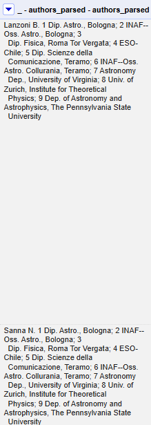
- La columna comments contiene datos diversos relativos al artículo, aunque en algunos de ellos se observa un patrón: se indican el número de páginas y figuras.
  - Gracias a esto se han podido obtener dos nuevas columnas:
    - figures: aplicando la siguiente transformación sobre la columna comments: ``value.find(/[0-9]* figures/)[0].replace("figures", " "), to number``
    - pages: aplicando la siguiente transformación sobre la columna comments: ``value.find(/[0-9]* figures/)[0].replace("pages", " "), to number``
- Existen valores nulos en algunas columnas, como journal-ref, license o doi, siendo esta última un posible candidato a valor identificativo de los artículos que debe ser descartado.
- Además de la columna comments, otras columnas presentan formatos distintos, como report-no o journal-ref.

Otros datos a destacar, que han podido observar aplicando facetas:
- La columna authors es bastante heterogénea, aunque sí que se encuentran diversos artículos escritos por el mismo autor
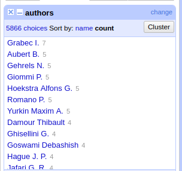

### Proceso de reconciliación
A través de la herramienta de OpenRefine para el reconciliado de los datos, se ha podido reconciliar las siguientes columnas respecto a la base de datos de WikiData:
- authors: tipo Q5 (human)
- publisher: tipo Q5 (human)
- doi: tipo Q13442814 (scholarly article)
- license: tipo Q284742 (Creative Commons license)

El proceso de reconciliación requiere que la herramienta OpenRefine trate de encontrar las mejores coincidencias para cada uno de los valores de las columnas. Dada la heterogeneidad de los datos (doi es un valor único por registro y author cuenta con poca duplicidad como se vió anteriormente), este proceso fue muy largo y obligó a la reducción final del dataset en 2000 valores.

Una vez hecho este proceso, se pueden comprobar los datos obtenidos. Para alguna de las reconciliaciones, se puede "ayudar" a la herramienta a encontrar el candidato más adecuado o simplemente seleccionar la opción de escoger el candidato mejor valorado. Se puede también hacer una búsqueda manual:
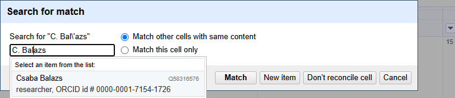.

Tras obtener este "matching" de los datos, se ha añadido una columna para contener la referencia a WikiData para cada uno de los valores reconciliados:
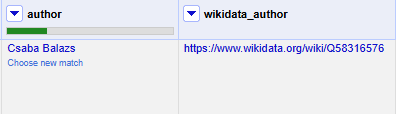

## 3. Estrategia de nombrado
En cuanto a la estrategia de nombrado, se utilizarán slash uris.
El dominio será http://www.arxiv.org , por lo que el nombrado será:
- http://www.arxiv.org/resource para los artículos
- http://www.arxiv.org/resource/{id} para un artículo
- http://www.arxiv.org/resource/{id}/{version} para una version de un articulo
- http://www.arxiv.org/researcher/ para los autores
- http://www.arxiv.org/resource/{nombre} para un autor
- http://www.arxiv.org/submitter/{nombre} para un publisher
- http://www.arxiv.org/category/{label} para las categorías
- http://www.arxiv.org/ont para la ontología
- http://www.arxic.org/ont#{termino} para terminos de la ontología

## 4. Desarrollo del vocabulario

### 4.1 Requisitos
El primer paso será la definición de requisitos del vocabulario:

Requisitos funcionales:
RF1. Representar de artículos científicos y sus propiedades
RF2. Representar versiones de artículos
RF3. Representar autores
RF4. Representar categorías temáticas
RF5. Representar relaciones entre entidades

Requisitos no funcionales:
RNF1. Simplicidad
RNF2. Reutilización de vocabularios existentes
RNF3. Interoperabilidad
RNF4. Claridad y legibilidad
RNF5. Extensibilidad
RNF6. Implementación en RDF

### Glosario de términos
Observando los datos existentes podemos extraer el siguiente glosario de términos:

- Artículo
- Id
- Publicador
- Título
- Comentarios
- Número de figuras
- Número de páginas
- Referencia del journal
- DOI
- Categoría
- Licencia
- Abstract
- Fecha de actualización
- Autor
- Versión

### Ontologías existentes escogidas

Los principales vocabularios reutilizados son los siguientes, encontrados a través de https://lov.linkeddata.es/dataset/lov/:

* **Dublin Core Terms (`dcterms`)**: utilizado para describir metadatos bibliográficos como el título, el resumen, el creador (autor), la fecha de creación, la licencia y el editor del recurso.
* **FOAF (`foaf`)**: empleado para representar la información básica de las personas autoras, especialmente el nombre completo.
* **BIBO (`bibo`)**: utilizado para describir referencias bibliográficas. Usa como base la ontología dcterms.

Cada término definido en el glosario anterior se conecta mediante propiedades que describen sus atributos o las relaciones entre ellas. A continuación se resumen las propiedades principales utilizadas en el modelo:

* Artículo: `dcterms:BibliographicResource`: clase artículo. Esta clase tiene las siguientes características:
  * Id: `dcterms:identifier`: identificador del artículo.
  * Publicador: `dcterms:publisher`: persona publicadora del artículo. Serán objetos de la clase `foaf:Person`. Esta clase tiene las siguientes características:
      * `owl:sameAs`: enlace a la entidad reconciliada de Wikidata
      * `foaf:name`: el nombre de la persona.
  * Título: `dcterms:title`: título del artículo.
  * Comentarios: `:comments`: comentarios (metadatos) del artículo.
  * Número de figuras: `:figures`: número de figuras contenidas en el artículo.
  * Número de páginas: `bibo:numPages`: número de páginas del artículo. 
  * Referencia del journal: `:journal-ref`: referencia.
  * DOI: `:doi`: DOI del artículo.
  * Categoría: `dcterms:subject`: categoría en la que se clasifica el artículo. Serán objetos de la clase `:Category`. Esta clase tiene las siguientes características:
      * `rdfs:label`: denominación de la categoría.
  * Licencia: `dcterms:license`: licencia bajo la cual se distribuye el documento. Serán objetos de la clase `dcterms:LicenseDocument`. Esta clase tiene las siguientes características:
      * `owl:sameAs`: enlace a la entidad reconciliada de Wikidata
  * Abstract: `dcterms:abstract`: resumen del artículo.
  * Fecha de actualización: `:update_date`: fecha de última modificación del artículo. Tipo `xsd:date`.
  * Autor: `dcterms:contributor`: autor del artículo. Serán objetos de la clase `foaf:Person`. Esta clase tiene las siguientes características:
      * `owl:sameAs`: enlace a la entidad reconciliada de Wikidata
      * `foaf:name`: el nombre de la persona.
  * Versión: `dcterms:hasVersion`: version del artículo. Cuenta con la característica `dcterms:dateSubmitted`, que se trata de la fecha de publicación de la version, en formato `xsd:date`.
  * `owl:sameAs`: enlace a la entidad reconciliada de Wikidata

### Estructura y jerarquía del modelo

* La clase `dcterms:BibliographicResource` es la entidad principal del modelo. A partir de ella se estructuran las relaciones con autores, versiones, licencias, editor, referencias, etc.
* Cada artículo puede estar relacionado con:
  * Un publicador (`foaf:Person`), mediante `dcterms:publisher`.
  * Una o más categorías (`Category`), mediante `dcterms:subject`.
  * Una licencia (`dcterms:LicenseDocument`), mediante `dcterms:license`.
  * Uno o más autores (`foaf:Person`), mediante `dcterms:contributor`.
  * Un artículo `dcterms:BibliographicResource` de wikidata a través de la relación `owl:sameAs`.

Las fechas, tanto de versiones como de actualización del artículo, se representan en formato `xsd:date`.

### Reglas semánticas y restricciones

El vocabulario está acompañado de una serie de reglas y restricciones que garantizan la coherencia del modelo:

1. **Cada artículo debe tener al menos un autor**.
3. **El número de páginas y de figuras (si existen) debe representarse como números enteros positivos** (`xsd:integer`).
4. **El identificador DOI (si existe) debe ser único para cada artículo**.
5. **Las fechas deben ser fechas válidas**.
6. **La información de autor debe incluir al menos el nombre completo (`foaf:name`)**.

### Elaboración de la ontología
Se ha elaborado la ontología a través de **REFERENCIA** la extensión RDF Transform. 
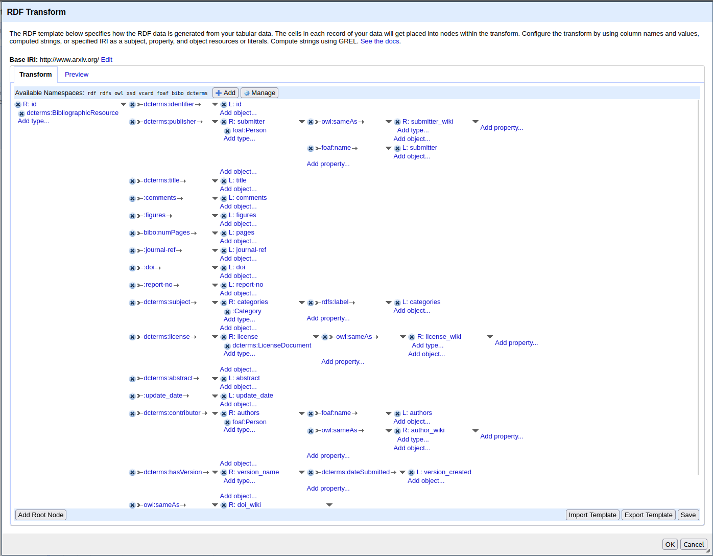
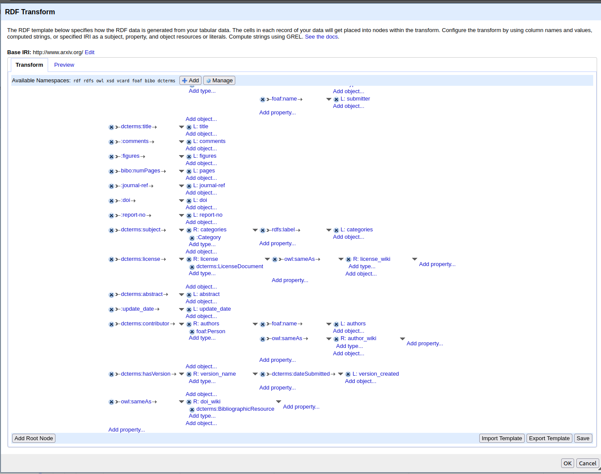

A continuación se muestra un ejemplo del RDF obtenido tras esta transformación. Este ejemplo se encuentra de forma más extensa en `data/sample.rdf`.
```
<?xml version="1.0" encoding="utf-8"?>
<rdf:RDF
  xmlns:dcterms="http://purl.org/dc/terms/"
  xmlns="http://www.arxiv.org/"
  xmlns:rdfs="http://www.w3.org/2000/01/rdf-schema#"
  xmlns:bibo="http://purl.org/ontology/bibo/"
  xmlns:foaf="http://xmlns.com/foaf/0.1/"
  xmlns:owl="http://www.w3.org/2002/07/owl#"
  xmlns:rdf="http://www.w3.org/1999/02/22-rdf-syntax-ns#"
>
  <dcterms:BibliographicResource rdf:about="http://www.arxiv.org/resource/0704.0020">
    <dcterms:abstract>  The shape of the hadronic form factor f+(q2) in the decay D0 --&gt; K- e+ nue
has been measured in a model independent analysis and compared with theoretical
calculations. We use 75 fb(-1) of data recorded by the BABAR detector at the
PEPII electron-positron collider. The corresponding decay branching fraction,
relative to the decay D0 --&gt; K- pi+, has also been measured to be RD = BR(D0
--&gt; K- e+ nue)/BR(D0 --&gt; K- pi+) = 0.927 +/- 0.007 +/- 0.012. From these
results, and using the present world average value for BR(D0 --&gt; K- pi+), the
normalization of the form factor at q2=0 is determined to be f+(0)=0.727 +/-
0.007 +/- 0.005 +/- 0.007 where the uncertainties are statistical, systematic,
and from external inputs, respectively.
</dcterms:abstract>
    <dcterms:contributor>
      <foaf:Person rdf:about="http://www.arxiv.org/researcher/AubertB.">
        <owl:sameAs rdf:resource="https://www.wikidata.org/wiki/Q21505422"/>
        <foaf:name>Aubert B.</foaf:name>
      </foaf:Person>
    </dcterms:contributor>
    <dcterms:contributor>
      <foaf:Person rdf:about="http://www.arxiv.org/researcher/TheBABARCollaboration">
        <foaf:name>The BABAR Collaboration</foaf:name>
      </foaf:Person>
    </dcterms:contributor>
    <dcterms:hasVersion>
      <rdf:Description rdf:about="http://www.arxiv.org/0704.0020/v1">
        <dcterms:dateSubmitted rdf:datatype="http://www.w3.org/2001/XMLSchema#date">2007-03-31T09:49:10Z</dcterms:dateSubmitted>
      </rdf:Description>
    </dcterms:hasVersion>
    <dcterms:identifier>0704.0020</dcterms:identifier>
    <dcterms:publisher>
      <foaf:Person rdf:about="http://www.arxiv.org/submitter/PatrickRoudeau">
        <owl:sameAs rdf:resource="https://www.wikidata.org/wiki/Q52321720"/>
        <foaf:name>Patrick Roudeau</foaf:name>
      </foaf:Person>
    </dcterms:publisher>
    <dcterms:subject>
      <Category rdf:about="http://www.arxiv.org/category/hep-ex">
        <rdfs:label>hep-ex</rdfs:label>
      </Category>
    </dcterms:subject>
    <dcterms:title>Measurement of the Hadronic Form Factor in D0 --&gt; K- e+ nue Decays</dcterms:title>
    <bibo:numPages>21</bibo:numPages>
    <comments>21 pages, 13 postscript figures, submitted to Phys. Rev. D,
  contributed to 42nd Rencontres de Moriond: QCD and Hadronic Interactions</comments>
    <doi>10.1103/PhysRevD.76.052005</doi>
    <figures>  </figures>
    <journal-ref>Phys.Rev.D76:052005,2007</journal-ref>
    <report-no>BABAR-PUB-07/015, SLAC-PUB-12417</report-no>
    <update_date rdf:datatype="http://www.w3.org/2001/XMLSchema#date">2015-06-30T00:00Z</update_date>
    <owl:sameAs>
      <dcterms:BibliographicResource rdf:about="https://www.wikidata.org/wiki/Q57019144"/>
    </owl:sameAs>
  </dcterms:BibliographicResource>
```

Se ha exportado el dataset completo en formato TriG, y por su tamaño se ha comprimido y se puede encontrar en `data/data_transform.zip`. Tambiéne puede encontrar una muestra en `data/sample.trig`.

## 7. Análisis de la ontología 
Se ha utilizado la herramienta RDF Validation (https://www.w3.org/RDF/Validator/rdfval) y se ha encontrado un resultado positivo:
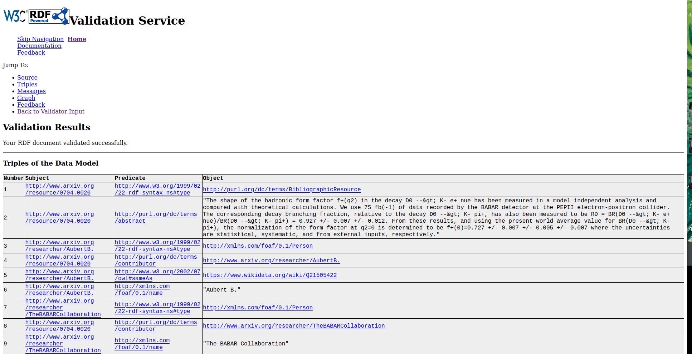
## 6. Aplicación y explotación

La solución desarrollada permite la exploración y explotación de los datos RDF generados a partir del dataset de **arXiv**, enriquecidos y enlazados con vocabularios y fuentes externas. Para comprobar su funcionalidad, se ha desplegado un servidor **Apache Jena Fuseki**, que actúa como endpoint de consulta SPARQL sobre el conjunto de datos RDF.

### Funcionalidades principales

La solución ofrece diversas funcionalidades, entre las que destacan:

- Exploración temática** de publicaciones por categoría científica.
- Identificación de autores relevantes en determinadas áreas del conocimiento.
- Análisis temporal de la evolución de publicaciones por disciplina.
- Navegación entre datos enlazados, accediendo a información externa asociada mediante URIs y propiedades como `owl:sameAs`.


### Consultas SPARQL y resultados

A continuación se presentan algunas de las consultas SPARQL ejecutadas sobre el endpoint de Fuseki, junto con sus resultados. 

#### Artículos de astro física publicados desde 2019

```
PREFIX dcterms: <http://purl.org/dc/terms/>
PREFIX rdfs: <http://www.w3.org/2000/01/rdf-schema#>
PREFIX : <http://www.arxiv.org/>

SELECT ?article ?updateDate ?subject
FROM NAMED <http://www.arxiv.org>
WHERE {
  GRAPH <http://www.arxiv.org> {
    ?article :update_date ?updateDate .
    ?article dcterms:subject ?subject .
    ?subject rdfs:label "astro-ph" .
    FILTER ( STR(?updateDate) >= "2019-01-01" )
  }
}
```

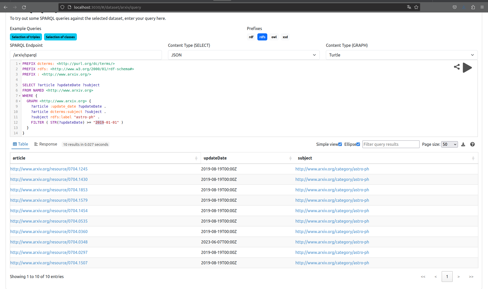

#### Numero de articulos por autor

```
PREFIX dcterms: <http://purl.org/dc/terms/>
PREFIX foaf: <http://xmlns.com/foaf/0.1/>

SELECT ?authorName (COUNT(?article) AS ?numArticles)
FROM NAMED <http://www.arxiv.org>
WHERE {
  GRAPH <http://www.arxiv.org> {
    ?article dcterms:contributor ?author .
    ?author foaf:name ?authorName .
  }
}
GROUP BY ?authorName
ORDER BY DESC(?numArticles)
```

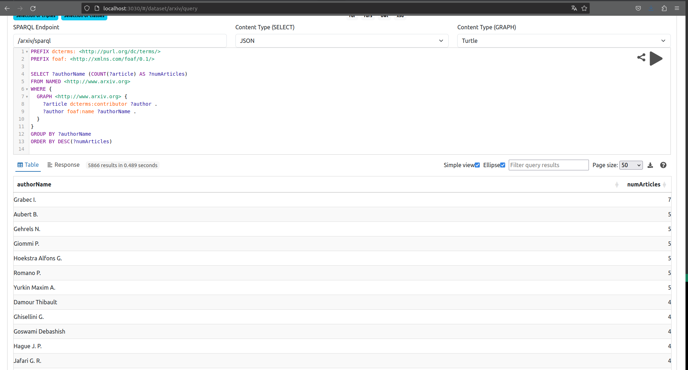

#### Artículos del autor Grabec I.

```
PREFIX dcterms: <http://purl.org/dc/terms/>
PREFIX foaf: <http://xmlns.com/foaf/0.1/>

SELECT ?article ?name
FROM NAMED <http://www.arxiv.org>
WHERE {
  GRAPH <http://www.arxiv.org> {
    ?article dcterms:contributor ?author .
    ?author foaf:name "Grabec I." .
    ?article dcterms:title ?name .
  }
}
```

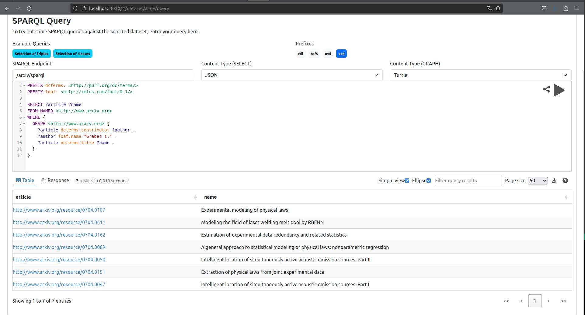

#### Colaboradores del autor Gehrels N.

```
PREFIX dcterms: <http://purl.org/dc/terms/>
PREFIX foaf: <http://xmlns.com/foaf/0.1/>

SELECT DISTINCT ?collaboratorName
FROM NAMED <http://www.arxiv.org>
WHERE {
  GRAPH <http://www.arxiv.org> {
    ?article dcterms:contributor ?author .
    ?author foaf:name "Gehrels N." .
    ?article dcterms:contributor ?collaborator .
    ?collaborator foaf:name ?collaboratorName .
    FILTER(?collaborator != ?author)
    
  }
}
ORDER BY DESC(?collaboratorName)
```


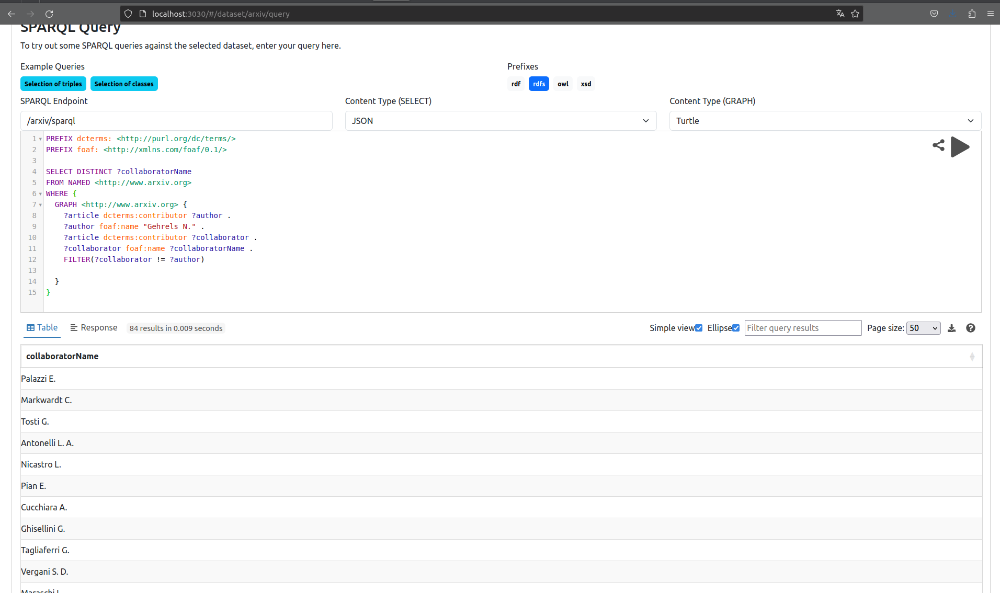


#### Años en los que se publicaron artículos de la categoría High Energy Physics - Theory

```
PREFIX rdfs: <http://www.w3.org/2000/01/rdf-schema#>
PREFIX : <http://www.arxiv.org/>
PREFIX dcterms: <http://purl.org/dc/terms/>

SELECT ?year (COUNT(?article) AS ?numArticles)
FROM NAMED <http://www.arxiv.org>
WHERE {
  GRAPH <http://www.arxiv.org> {
    ?article dcterms:subject ?subject .
    ?subject rdfs:label "hep-th" .
    ?article :update_date ?date .
    
    BIND(SUBSTR(STR(?date), 1, 4) AS ?year)
  }
}
GROUP BY ?year
ORDER BY DESC(?numArticles)
```


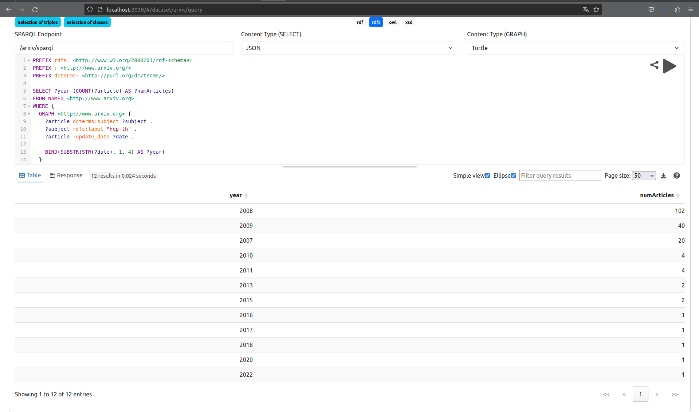


### 6. Artículos que mencionan la ecuación de Euler-Lagrange

```
PREFIX dcterms: <http://purl.org/dc/terms/>

SELECT ?article ?abstract
FROM NAMED <http://www.arxiv.org>
WHERE {
  GRAPH <http://www.arxiv.org> {
    ?article dcterms:abstract ?abstract .
    FILTER(CONTAINS(LCASE(STR(?abstract)), "euler-lagrange equation"))
  }
}
```
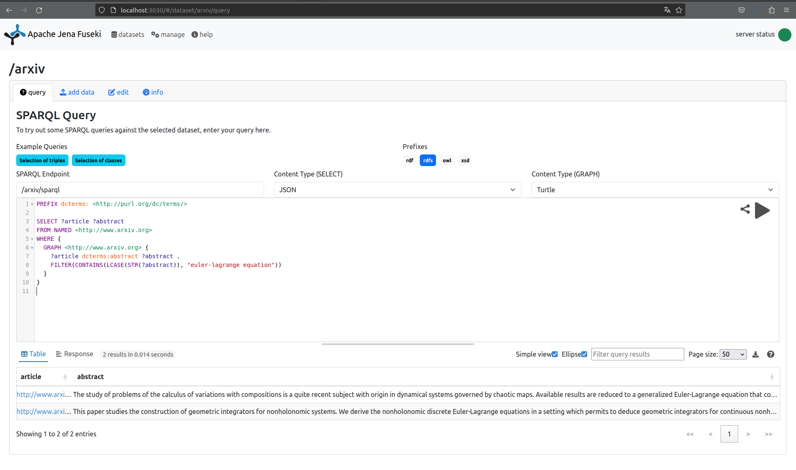

Quiza añadir mejoras posibles:
- mas datos
- querys a wikidata
- publicacion